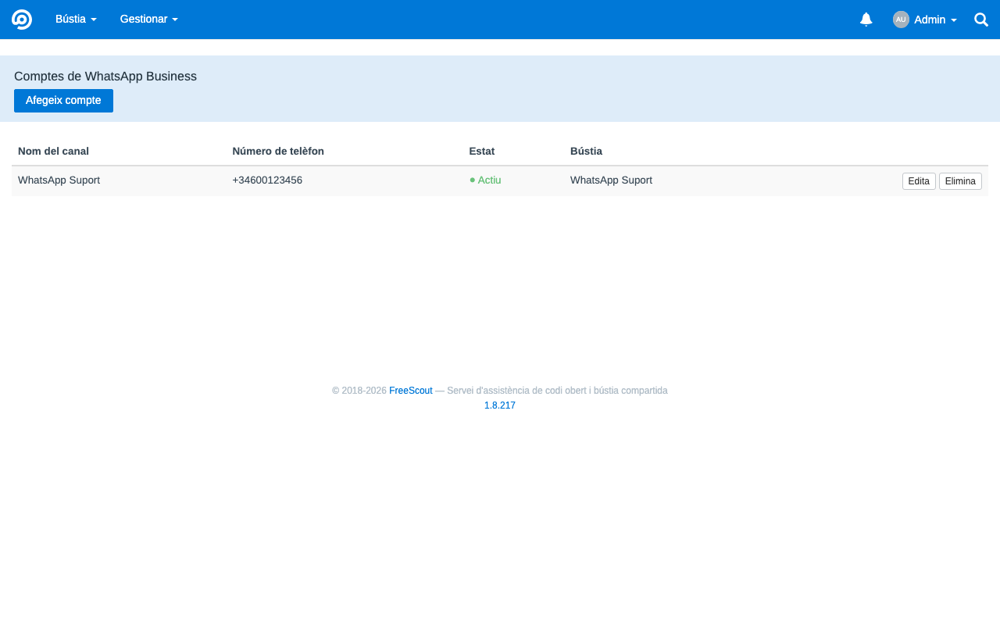
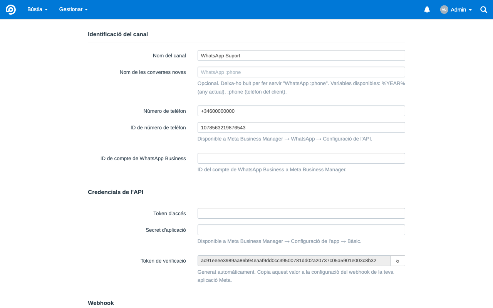
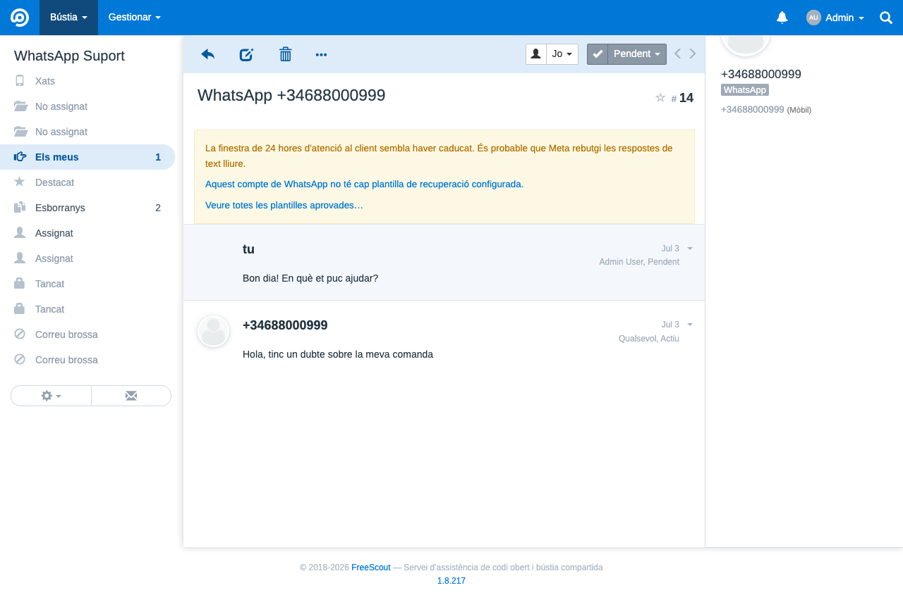
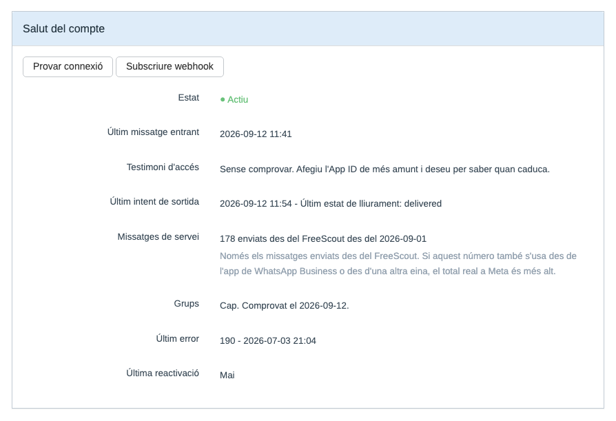
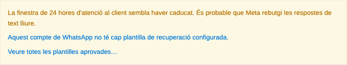

# MetaWhatsApp — WhatsApp Business per a FreeScout via Meta Cloud API

[Català](README.ca.md) · [English](README.md) · [Castellano](README.es.md) · [Nederlands](README.nl.md)

Mòdul per a FreeScout que integra **WhatsApp Business directament amb la Meta Cloud API**, sense intermediaris de pagament com 1msg.io o Twilio. Els missatges van de Meta a la teva instal·lació de FreeScout, amb control complet de credencials, dades i flux operatiu.

El projecte és públic i porta en ús real de producció des de la v1.0, iterant a partir d'incidències reportades per usuaris en lloc d'un roadmap fixat: plantilles, multimèdia, stickers, contactes, missatges de ubicació i reacció, monitoratge de l'estat de connexió i reactivació guiada de comptes s'han afegit tots en resposta a l'ús real del dia a dia, no planificats per endavant. És estable, però encara evoluciona activament — vegeu [Limitacions conegudes](#limitacions-conegudes) més avall per als buits detectats així que encara no estan resolts.

## Característiques principals

- **Channel-first**: configures un canal WhatsApp, no una bústia de correu.
- **Zero-core**: no modifica cap fitxer del core de FreeScout.
- **Fail-closed**: el webhook rebutja qualsevol petició sense signatura HMAC vàlida.
- **Integració directa amb Meta**: sense passarel·les de tercers.
- **Interfície neta de correu**: a les vistes del canal, el mòdul amaga els artefactes d'email del core (toggle Cc/Bcc, adreça tècnica interna), sense afectar les bústies de correu normals.
- **Compatible amb FreeScout 1.8.x** sobre Laravel 5.8 i PHP 8.x.

## Captures de pantalla

*Llistat de canals WhatsApp configurats:*



*Alta d'un canal nou (formulari channel-first):*



*Una conversa de WhatsApp tal com la veu un agent, amb el distintiu de canal que pinta el mateix FreeScout:*



*Salut del compte, amb els botons de prova de connexió i subscripció del webhook:*



*Avís a la conversa quan la finestra de 24 hores del client sembla caducada:*



## Abast de funcionalitats

Actualment cobreix:

- Missatges de **text pla** inbound i outbound.
- Un o més números WhatsApp, cadascun com a compte independent del mòdul.
- Creació automàtica de converses a FreeScout a partir de missatges entrants.
- Resposta des de FreeScout cap a WhatsApp respectant la finestra d'undo del core.
- Actualització best-effort dels estats `delivered` i `read` a la base de dades del mòdul; des de la v1.2.0, l'estat `read` de Meta també marca el thread outbound com a obert, amb l'indicador natiu "obert" de FreeScout.
- Des de la v1.3.0, recuperació manual d'una finestra caducada amb una plantilla HSM pre-aprovada — vegeu [Recuperació de finestra caducada](#recuperació-de-finestra-caducada-v130) més avall.
- Des de la v1.4.0, missatges multimèdia (imatge, vídeo, àudio, document): descàrrega i adjunció entrant, previsualització en miniatura d'imatges, enviament sortint limitat a la finestra oberta de 24h — vegeu [Suport multimèdia](#suport-multimèdia-v140) més avall.
- Des de la v1.5.0, missatges entrants d'ubicació i reacció (amb context del missatge citat), i un panell d'estat de connexió per compte (últim inbound/outbound, últim error, botó "Test connection").
- Des de la v1.5.1, els IDs de canal oficials de Meta (`103`/`104`).
- Des de la v1.6.0: fins a 5 plantilles de recuperació configurades estàticament per compte (a més del flux d'una sola plantilla de la v1.3.0), o qualsevol plantilla aprovada per Meta obtinguda en viu via un selector dinàmic; stickers i targetes de contacte entrants; visibilitat de fallades de lliurament asíncrones (s'afegeix una nota si Meta informa que un missatge ha fallat després d'haver estat acceptat inicialment); registre automàtic del webhook des del formulari del compte (sense pas manual al Meta Business Manager).
- Des de la v1.6.1, reactivació guiada d'un compte inactiu directament des de "Test connection", amb traçabilitat (qui/quan) al panell d'estat.
- Des de la v1.7.0: el format de text entrant de WhatsApp es renderitza en lloc de mostrar-se literal; les converses porten el canal informat, de manera que apareixen l'etiqueta de WhatsApp i el botó de Chat Mode propis de FreeScout; l'últim missatge del client es marca com a llegit quan un agent respon; i una fallida de lliurament reobre la conversa citant un extracte del missatge que no ha arribat.

Queda fora d'abast:

- Transformació o redimensionament d'imatge/vídeo, vistes de galeria o carrusel.
- Un adaptador d'emmagatzematge al núvol (S3, etc.) per a multimèdia — els adjunts usen l'emmagatzematge local ja existent de FreeScout.
- Indicadors visuals de `delivered/read` a la conversa (el `read` només obre el thread — vegeu més amunt).
- Chatbots, automatitzacions avançades o integracions multicanal compartides.

## Novetats a la v1.9.1

- **Correcció**: cada bústia creada pel mòdul duia dues còpies de cada carpeta compartida a la barra lateral (No assignat, Esborranys, Assignat, Tancat, Suprimit, Correu brossa). El formulari del compte creava aquestes carpetes després de desar la bústia, sense saber que el `MailboxObserver` del propi FreeScout ja ho fa a l'esdeveniment `created`. Les carpetes personals (Els meus, Destacat) se'n van salvar, perquè el nucli salta els usuaris que ja en tenen, i per això la barra lateral mostrava una barreja d'entrades simples i dobles. Hi era des de la primera versió, i es veia fins ara a la captura de conversa d'aquest mateix README (#30).
- **Migració de reparació**: s'eliminen les còpies de les bústies vinculades a un compte de WhatsApp, i qualsevol conversa que estigués a la còpia que marxa es trasllada a la que es queda, de manera que no es perd res. Les bústies que el mòdul no ha creat mai no es toquen.
- **Traducció al neerlandès**, aportada per [@jeroenedig](https://github.com/jeroenedig) (#31). La interfície del mòdul ja està disponible en anglès, català, castellà i neerlandès.

## Novetats a la v1.9.0

- **Una sola font de plantilles.** La plantilla heretada (`template_name` / `template_lang`) i les cinc ranures eren un o l'altre: amb una ranura vàlida, el parell antic no es llegia mai, mentre que el formulari li donava el lloc principal. Una migració plega el valor que quedi a la primera ranura lliure i elimina les dues columnes. Mai sobreescriu una ranura amb contingut, i deixa el valor al registre si totes cinc estan plenes, cas en què ja era inabastable.
- **Els botons i el selector en viu ja no surten alhora.** Amb plantilles configurades, l'agent veu només aquells botons; sense cap, només el selector. Els administradors conserven el selector en tots dos casos, perquè el WhatsApp Manager és incòmode per consultar què té Meta aprovat.
- **La secció de plantilles explica quina configuració guanya** i què veurà l'agent, cosa que fins ara només se sabia llegint el codi.
- **Correcció**: amb el canal inactiu no s'enviava res i només les plantilles ho deien. Les respostes de text i el multimèdia, que són el cas habitual, sortien en silenci. Ara tots els camins comparteixen una sola comprovació, registren la fallida i deixen nota a la conversa, i el banner avisa encara que la finestra del client sigui oberta.
- **Correcció**: el banner oferia als agents enllaços a la configuració del canal, que és només d'administrador, i seguir-los donava un 403. Ara reben la mateixa informació com a text dient què ha de fer un administrador.

## Novetats a la v1.8.1

- **Correcció**: els últims missatges de registre que encara sortien en català ara són en anglès. La correcció original va traduir les crides a `Log::` i es va deixar els missatges de les excepcions, que arriben igualment al `laravel-*.log`, tant perquè el worker registra l'excepció no capturada com pel `failed()` del propi mòdul. Com que només salten en errors transitoris, van passar desapercebuts dos mesos.
- **Correcció**: enviar una plantilla amb el compte inactiu no deixava cap rastre, mentre que la conversa continuava aparentant que el missatge havia sortit. Ara l'intent es registra com a fallida i es loguetja, el banner de la conversa ja no ofereix botons d'enviament amb el canal aturat, i el panell de salut per fi diu si el canal està actiu.

## Novetats a la v1.8.0

- **Les fallides de lliurament es registren vingui com vingui l'error de Meta.** Meta retorna els errors de la Cloud API o bé a la resposta de l'enviament, o bé més tard pel webhook d'estats, i el canal documentat no és fiable: el `131047` figura com a síncron però arriba pel webhook. El mòdul només tenia la semàntica d'errors al camí de la resposta, així que per als missatges de text la branca del `131047` no s'executava mai, i el camí del webhook, que sí que s'executa, no escrivia res al registre. Per això la correcció de registre de la v1.6.2 semblava no canviar res. Ara tots els jobs de sortida i el webhook comparteixen un únic gestor de fallides.
- **Un segon codi d'error diferent per al mateix missatge es reporta** en lloc de substituir el primer en silenci, i un estat posterior sense clau `errors` ja no pot buidar un codi ja registrat.
- **S'aprofita l'`error_data.details` de Meta** per al text de la fallida quan hi és, que és on hi ha la informació accionable; abans només es llegia el `title` curt.
- **Correcció**: un compte amb el token rebutjat per Meta pel webhook ja no es desactiva. Això només passa quan el rebuig arriba a la nostra pròpia crida, que és inequívoc. La fallida es continua registrant i el codi es continua desant.
- **Correcció**: les targetes del tauler de les bústies de WhatsApp ja no conserven el fons gris d'inactiu. Ensenyar els comptadors damunt d'una targeta amb aspecte d'inactiva era mitja correcció.
- **Documentació**: si tens més d'un número, han de ser del mateix portfolio de negoci, o una mateixa persona rep un identificador diferent per número i no es pot reconèixer com un únic client. Documentat com a requisit previ.

## Novetats a la v1.7.0

- **Format de WhatsApp als missatges entrants**: `*negreta*`, `_cursiva_`, `~ratllat~` i `` ```monoespaiat``` `` ara es renderitzen en lloc de mostrar-se literalment. Se segueixen les regles de WhatsApp, no les de CommonMark, així que un delimitador només val dins d'una mateixa línia.
- **Distintiu de canal i botó de Chat Mode natius**: les converses ara porten el canal informat, que era l'únic que li faltava a FreeScout per mostrar la seva pròpia etiqueta de WhatsApp i el botó de Chat Mode, tant a la vista de conversa com al llistat. Les converses creades abans d'aquesta versió no reben el distintiu de manera retroactiva.
- **Marcar com a llegits els missatges del client**: quan surt la resposta d'un agent, l'últim missatge del client es marca com a llegit (els tics blaus de WhatsApp). Si no hi ha cap missatge entrant per marcar, no es fa res.
- **Les fallides de lliurament reobren la conversa**: un missatge que WhatsApp reporta com a fallit torna a posar la conversa en estat `Activa`, de manera que reapareix en lloc de passar desapercebuda la nota. Les converses marcades com a correu brossa o esborrades no es toquen, i mai es canvia l'agent assignat.
- **Les notes de fallida citen el missatge**: la nota de lliurament fallit ara cita un extracte de 60 caràcters del missatge que no ha arribat, en lloc del `wamid` cru. El multimèdia enviat sense caption manté el `wamid`, perquè no hi ha text per citar.
- **Correcció**: els comptadors de bústia del tauler (No assignat/Els meus/Destacat) quedaven amagats a les bústies de WhatsApp, perquè el core les pinta com a inactives quan no tenen servidor de correu entrant. Tornen a ser visibles, sense tocar la guarda de recollida de correu del core.
- **Correcció**: els camps Cc/Bcc podien aparèixer un instant abans de quedar amagats a les bústies de WhatsApp. El CSS del mòdul s'injectava al final de la pàgina en lloc de dins el `<head>`.

## Novetats a la v1.6.2

- **Fix**: la nota de "missatge no lliurat" per a l'error `131047` (finestra de 24h) es registrava al log amb nivell `warning` en lloc de `error`, per la qual cosa podia desaparèixer silenciosament de `laravel-*.log` en instal·lacions amb `log_level` per sobre de warning, encara que la nota a la conversa sí que apareixia. Ara es registra com a `error`, igual que la resta de fallades de lliurament (text i multimèdia).
- **Cosmètic**: eliminats guions llargs erronis de cadenes visibles per l'usuari (traduccions i vistes de compte/plantilla); substituïts per guions normals.

## Novetats a la v1.6.1

- **Reactivació guiada de compte**: si un compte s'havia desactivat automàticament (p. ex. després d'un error de token invàlid), un "Test connection" amb èxit ara el reactiva automàticament, amb traçabilitat (qui i quan) mostrada al panell d'estat del compte — ja no cal editar la base de dades manualment per recuperar-lo.

## Novetats a la v1.6.0

- **Plantilles de missatge, multi-plantilla**: el banner de finestra caducada ara admet fins a 5 plantilles configurades (nom, idioma, text del botó, text de recuperació) en lloc d'una de sola — útil per a comptes multiidioma. Les configuracions d'una sola plantilla existents continuen funcionant sense canvis.
- **Plantilles de missatge, selector dinàmic**: una nova opció "Veure totes les plantilles aprovades…" obté en viu les plantilles APPROVED reals del vostre WhatsApp Business Account des de Meta, mostra el text del cos i permet omplir variables `{{n}}` — sense configuració estàtica necessària. Complementa la llista estàtica anterior, no la substitueix.
- **Stickers**: els missatges `type:sticker` ara són compatibles, es mostren com qualsevol altre adjunt multimèdia.
- **Targetes de contacte**: els missatges `type:contacts` ara mostren el nom i el(s) número(s) de telèfon del contacte compartit.
- **Les reaccions ara citen a què han reaccionat**: en lloc d'un simple "Reacted: 👍", el mòdul busca i cita un extracte curt del missatge original.
- **Visibilitat de fallades de lliurament**: si Meta accepta un missatge i després l'informa com a fallat de forma asíncrona, ara es mostra com una nota visible a la conversa en lloc d'un canvi d'estat silenciós.
- **Registre automàtic de webhook**: afegir un compte de WhatsApp ara el subscriu automàticament als webhooks de Meta (amb un botó manual "Subscribe webhook" de reintent a la pàgina del compte).
- **Fix de log de depuració**: els payloads inbound/outbound ja no es truncaven a "Over 9 levels deep..." als logs de debug (un problema de límit de profunditat de Monolog). El log de depuració també es pot limitar només a aquest mòdul (`METAWHATSAPP_DEBUG=true` a l'`.env` de FreeScout), escrivint al seu propi fitxer de log amb rotació diària, independent del nivell de log global de l'aplicació.
- **Fix**: la pàgina "Add new WhatsApp account" podia donar un 500 a PHP 8.1+ per un `null` passat a `htmlspecialchars()`.

## Novetats a la v1.5.1

- **IDs de canal oficials**: el mòdul ara usa els IDs de canal assignats oficialment per l'equip de FreeScout (`103`/`104`) en lloc dels provisionals `100`/`101`. Les instal·lacions existents es migren automàticament i de forma transparent — no cal fer res.
- **Fix crític**: la v1.5.0 va publicar un `require_once` col·locat abans de la declaració `namespace` del fitxer, cosa que és PHP invàlid i feia que el mòdul no carregués. Corregit; si vau instal·lar la v1.5.0, actualitzeu a la v1.5.1 immediatament.

## Novetats a la v1.5

- **Missatges d'ubicació i reacció**: els missatges d'ubicació entrants ara es mostren com un enllaç de Google Maps, i les reaccions (incloent-hi eliminar-ne una) es mostren com a text.
- **Test de connexió i panell d'estat**: panell per compte amb un test de connexió en viu i informació de l'última activitat.
- Els missatges multimèdia sense peu de foto ja no es descarten directament quan el text de marcador de posició és buit — només es descarten els missatges sense text ni multimèdia.
- Afegida una [matriu de capacitats](docs/capability-matrix.md) que documenta exactament què és compatible, planificat o fora d'abast.

## Instal·lació

Segueix la [guia oficial d'instal·lació de mòduls personalitzats de FreeScout](https://github.com/freescout-help-desk/freescout/wiki/FreeScout-Modules#3-installing-custom-modules):

1. Descarrega el zip del mòdul des de la [pàgina de Releases](https://github.com/losimo/freescout-meta-whatsapp/releases) (o copia/enllaça el codi font) dins de `Modules/MetaWhatsApp` a la instal·lació de FreeScout.
2. Ves a **Gestionar → Mòduls** a FreeScout i activa **MetaWhatsApp**. FreeScout executa les migracions del mòdul i neteja la memòria cau automàticament.
3. El mòdul apareixerà a **Gestionar → WhatsApp** per a usuaris administradors.

Si prefereixes la línia d'ordres (per exemple, en un servidor sense accés a la interfície del gestor de mòduls), els passos equivalents són:

```bash
php artisan module:enable MetaWhatsApp
php artisan module:migrate MetaWhatsApp
php artisan freescout:clear-cache
```

El mòdul crea dues taules pròpies:

- `meta_whatsapp_accounts`
- `meta_whatsapp_messages`

No fa cap `ALTER` sobre taules del core de FreeScout.

## Requisits previs a Meta

Abans de configurar el canal a FreeScout, cal tenir preparat un entorn mínim a [Meta for Developers](https://developers.facebook.com):

1. Una **App** de tipus Business amb el producte **WhatsApp** afegit.
2. Un **número de telèfon** registrat al producte WhatsApp.
3. Les dades següents:

| Valor | On trobar-lo |
|---|---|
| **Phone Number ID** | App Dashboard → WhatsApp → API Setup |
| **WABA ID** | App Dashboard → WhatsApp → API Setup |
| **Access Token** | Vegeu la nota sobre token permanent |
| **App Secret** | App Dashboard → App Settings → Basic |

> **Important sobre el token**
>
> El token que mostra la pantalla d'**API Setup** és temporal i sol caducar en 24 hores. Per a un entorn real, cal generar un **token permanent de System User** des de Meta Business Manager, assignant-li l'App i el WABA, amb els permisos:
>
> - `whatsapp_business_messaging`
> - `whatsapp_business_management`

> **Si tens més d'un número, mantén-los al mateix portfolio de negoci**
>
> Els identificadors d'usuari amb àmbit de negoci (BSUID) estan lligats al portfolio, així que una mateixa persona que escrigui a dos números teus rep **un sol** identificador si tots dos números són del mateix WABA, i **un identificador per número** si són de portfolios separats. Amb els números repartits, el mòdul no pot reconèixer aquella persona com un únic client i la resolució de contactes que es descriu més avall no es comporta com esperaries. Consulta la [nota de Meta sobre els BSUID](https://developers.facebook.com/documentation/business-messaging/whatsapp/business-scoped-user-ids/#business-scoped-user-id).

## Configuració del canal

### A FreeScout

Des de **Gestionar → WhatsApp → Afegeix compte**:

1. Introdueix el **nom del canal**.
2. Introdueix el **número de telèfon** en format E.164 (`+34...`).
3. Omple **Phone Number ID**, **WABA ID**, **Access Token** i **App Secret**.
4. Copia el **token de verificació** generat automàticament.
5. Copia la **URL del webhook** mostrada pel mòdul (sempre té la forma `https://el-teu-domini/meta-whatsapp/webhook`, compartida per tots els comptes).
6. Tria si vols:
   - crear una bústia nova (recomanat), o
   - associar-ne una d'existent compatible (sense servidors de correu configurats i no vinculada a cap altre compte WhatsApp; el desplegable només mostra les vàlides).
7. Desa el compte.

### A Meta

Des de **App Dashboard → WhatsApp → Configuration → Webhook**:

1. A **Callback URL**, enganxa la URL del webhook del mòdul.
2. A **Verify Token**, enganxa el token de verificació generat a FreeScout.
3. Prem **Verify and save**.
4. A **Webhook fields**, activa com a mínim el camp **messages**.

> **Requisit important**
>
> La URL del webhook ha de ser pública, accessible per HTTPS i amb certificat vàlid. Meta no accepta certificats autosignats.

Quan la configuració és correcta, un missatge enviat al número de WhatsApp crearà una conversa a la bústia associada.

## Funcionament diari

- Els missatges entrants creen una conversa nova o s'afegeixen a la conversa activa del mateix client.
- La identitat del client es resol pel seu telèfon.
- Respondre des de FreeScout envia la resposta a WhatsApp **després dels 15 segons** de la finestra de desfer del core.
- Si l'agent desfà la resposta dins d'aquest marge, el missatge no s'envia.
- Les **notes internes no s'envien mai** al client.

### Finestra de 24 hores

La Meta Cloud API només permet enviar missatges lliures dins de les 24 hores posteriors a l'últim missatge del client.

Si s'intenta respondre fora de finestra:

- Meta retorna l'error `131047`.
- El missatge queda registrat com a fallit.
- El client no rep cap resposta.

Des de la v1.3.0, una finestra caducada es pot recuperar manualment amb una plantilla HSM pre-aprovada — vegeu més avall.

### Recuperació de finestra caducada (v1.3.0)

Quan la finestra del client sembla caducada, apareix un banner a la conversa que permet enviar **una única plantilla de WhatsApp pre-aprovada**, configurada per compte (nom + idioma). L'enviament és sempre **manual**: un agent prem el botó del banner; no hi ha cap reintent automàtic de plantilla.

- Només s'admet **una** plantilla per compte; no hi ha selector de plantilles ni variables/paràmetres.
- Que aparegui el banner depèn d'un **llindar operatiu intern configurable** (`template_threshold_minutes`, per defecte **1435 minuts**). Aquest llindar només determina quan el mòdul comença a tractar la finestra com a caducada per a la seva pròpia UI — no canvia la regla real de les 24 hores de Meta. Consulta la [documentació de Meta](https://developers.facebook.com/documentation/business-messaging/whatsapp/messages/send-messages).
- Abans d'enviar la plantilla de debò, el servidor torna a comprovar la finestra i rebutja la petició si el client ha tornat a escriure mentrestant (finestra reoberta) o si ja s'ha enviat una plantilla per a la mateixa conversa en els últims 60 segons (protecció contra doble clic / doble enviament).
- Meta **factura** els missatges de plantilla igual que qualsevol altra plantilla HSM, de manera independent a aquest mòdul.

### Token invàlid o caducat

Si Meta retorna l'error `190`:

- el compte passa a estat **Inactiu**,
- el canal deixa d'enviar i rebre correctament,
- i cal actualitzar el token d'accés des de l'edició del compte.

### Suport multimèdia (v1.4.0)

Els missatges entrants d'imatge, vídeo, àudio i document es descarreguen de la Meta Cloud API i es guarden com a adjunts normals de FreeScout al thread de la conversa. Les imatges, a més, tenen una previsualització en miniatura; la resta de tipus es mostren com un adjunt descarregable estàndard (la fila per defecte de FreeScout).

L'enviament sortint de multimèdia segueix la mateixa regla que el text: només s'envia **dins la finestra oberta de 24h** (vegeu més amunt) — no hi ha alternativa amb plantilla per a multimèdia. Quan un agent respon amb adjunts:

- S'envia un missatge de WhatsApp **per adjunt** (Meta no admet més d'un objecte multimèdia per missatge).
- El text de la resposta viatja com a **caption** del primer adjunt, tret que aquest sigui **àudio** (Meta no admet caption en àudio) — en aquest cas el text s'envia com a missatge de text a part.
- Cada adjunt es valida de mida contra els límits propis de Meta abans de pujar-lo: **5 MB** per a imatges, **16 MB** per a vídeo/àudio, **100 MB** per a documents. Els adjunts massa grans no s'envien i es registren com a fallats.

El multimèdia s'emmagatzema amb l'emmagatzematge local ja existent de FreeScout — no s'introdueix cap adaptador d'emmagatzematge nou.

## Limitacions conegudes

Aquestes limitacions són conegudes i acceptades dins l'abast actual de funcionalitats:

- Els tipus de missatge diferents de text, multimèdia (incl. stickers), botó, ubicació, reacció i contactes (p. ex. `order`, respostes de llista `interactive`) es continuen descartant (es registren al log, no es mostren a la conversa).
- La descàrrega de multimèdia entrant no té validació de mida pròpia del mòdul més enllà de la que Meta ja aplica abans d'entregar el webhook.
- No hi ha vista de galeria o carrusel per a imatges/vídeos — cada adjunt apareix com una fila/miniatura independent, igual que qualsevol altre adjunt de FreeScout.
- Fins a 5 plantilles configurades estàticament per compte, o qualsevol plantilla APPROVED obtinguda en viu via el selector dinàmic (amb variables `{{n}}`); sense sincronització/cache automàtica de la llista estàtica des del catàleg de Meta.
- L'enviament de la plantilla de recuperació és sempre **manual**, iniciat per un agent des del banner de la conversa; no hi ha reintent automàtic fora de finestra.
- Els estats `delivered` i `read` s'actualitzen a la base de dades del mòdul; només el `read` es mostra visualment (via l'indicador natiu "obert" del thread) — el `delivered` no es mostra a la conversa.
- Si Meta agrupa en un sol enviament de webhook esdeveniments de **números diferents**, només es processen els del compte corresponent al primer; la resta es descarta amb un avís al log. En la pràctica Meta sol enviar webhooks separats per número, però amb diversos números sota la mateixa App convé tenir-ho present.
- En mode xat, el core de FreeScout pot generar **esborranys buits** a la conversa per l'autodesat de l'editor; són innocus i es poden descartar manualment.
- La **bústia tècnica** del canal continua sent visible a **Gestionar → Bústies**.
- El webhook no implementa rate limiting propi; la barrera principal és la signatura HMAC.
- El lookup del `verify_token` al handshake no és constant-time.

## Checklist per passar a compte real

Abans de fer el pas de proves a producció:

1. ☐ Comprova que la instal·lació és accessible públicament per HTTPS.
2. ☐ Fes servir un certificat vàlid.
3. ☐ Genera un **token permanent de System User**.
4. ☐ Elimina comptes i converses de prova si ja no et calen.
5. ☐ Crea el compte real al mòdul amb les credencials definitives.
6. ☐ Configura el webhook real a Meta amb la URL i el verify token correctes.
7. ☐ Verifica que la subscripció al camp `messages` està activa.
8. ☐ Envia un missatge real al número i comprova que entra a FreeScout.
9. ☐ Respon des de FreeScout dins de la finestra de 24 hores i comprova que arriba al mòbil.
10. ☐ Verifica que el worker de cues està funcionant de manera contínua.
11. ☐ Revisa els logs després de les primeres proves reals.

## Resolució de problemes

| Símptoma | Causa probable |
|---|---|
| Meta no verifica el webhook | URL no accessible públicament, certificat invàlid o verify token incorrecte |
| Meta retorna 403 als POST del webhook | `phone_number_id` desconegut, compte inactiu o signatura HMAC invàlida |
| Els missatges entren però no surten | Error `131047` per finestra de 24 hores o error `190` per token caducat |
| El compte surt com a `⚠ Bústia desvinculada` | La bústia associada s'ha eliminat o ja no és resoluble |
| No es processa res | El worker de cues està aturat (`php artisan queue:work`) |
| Un fix d'una actualització del mòdul no sembla aplicar-se | El worker de cues continua executant codi antic en memòria. Reiniciar el cron no el recarrega; cal `php artisan queue:restart` |

Tots els logs del mòdul porten el prefix `[MetaWhatsApp]`.

```bash
grep MetaWhatsApp storage/logs/laravel-$(date +%Y-%m-%d).log
```

## Tests

La suite de tests del mòdul es pot executar amb:

```bash
vendor/bin/phpunit --no-configuration --bootstrap vendor/autoload.php Modules/MetaWhatsApp/Tests
```

Els tests treballen contra la base de dades de la instal·lació amb rollback per test i no deixen dades persistents.

## Llicència

AGPL-3.0, igual que FreeScout.
