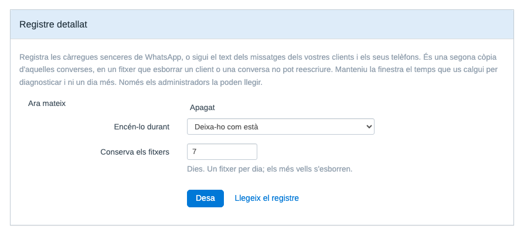

# MetaWhatsApp — WhatsApp Business per a FreeScout via Meta Cloud API

[Català](README.ca.md) · [English](README.md) · [Castellano](README.es.md) · [Nederlands](README.nl.md)

> [!IMPORTANT]
> **A partir de l'1 d'octubre del 2026, Meta cobra els missatges de servei.**
>
> Fins ara, respondre en text lliure dins de la finestra de 24 hores no tenia cost. A partir d'aquesta data es factura per missatge lliurat, i les plantilles d'utilitat enviades dins de la finestra també passen a ser de pagament. Meta ja ho diu a [la seva pàgina](https://developers.facebook.com/documentation/business-messaging/whatsapp/pricing/non-template-messages): "Effective October 1, 2026, Meta will charge for service messages, which have not been charged since November 2024."
>
> El que Meta no publica enlloc és la franquícia. La xifra de **1.000 missatges de servei per número de telèfon i mes**, que es reinicia cada mes i no s'acumula, la donen coincidint les fonts del sector, i us la traslladem exactament com això.
>
> Dues pàgines de Meta es contradiuen mentre escrivim això. La que hem enllaçat a dalt porta la data; la [pàgina de tarifes](https://whatsappbusiness.com/products/platform-pricing/#rates) encara diu que les converses de servei són gratis, i les plantilles d'utilitat dins de la finestra també. Feu servir la primera per saber què canvia i la segona per a les tarifes del vostre mercat i la vostra moneda, on cada categoria té un preu diferent.
>
> Venen setmanes de canvis per part de Meta. Aquí hi anirem traslladant el que afecti aquest mòdul, dit com ho digui Meta, i sense afegir-hi res que no puguem sostenir.
>
> És un canvi de tarifes de Meta, no del mòdul. El mòdul no cobra res ni rep cap comissió, i les seves guardes d'idempotència eviten que un reintent de la cua torni a enviar un missatge que ja havia sortit.

> [!NOTE]
> **Val la pena comprovar-ho abans del 30 de setembre: el vostre compte de WhatsApp Business té un mètode de pagament donat d'alta?**
>
> Fonts del sector diuen que els comptes que no en tinguin deixaran de tenir els missatges de servei **entregats** a partir de l'1 d'octubre, en comptes de rebre'n la factura després. Com la xifra de mil de més amunt, això no surt a cap pàgina de Meta, i no és una cosa que aquest mòdul us pugui comprovar. Ho esmentem aquí perquè la fallada seria silenciosa: els clients continuen escrivint i les respostes deixen d'arribar.

<!-- Retirar tots dos avisos quan la pàgina de preus de Meta reculli el canvi amb
     normalitat i hagin passat unes quantes versions des de l'1 d'octubre del 2026. -->

Mòdul per a FreeScout que integra **WhatsApp Business directament amb la Meta Cloud API**, sense intermediaris de pagament com 1msg.io o Twilio. Els missatges van de Meta a la teva instal·lació de FreeScout, amb control complet de credencials, dades i flux operatiu.

El projecte és públic i porta en ús real de producció des de la v1.0, iterant a partir d'incidències reportades per usuaris en lloc d'un roadmap fixat: plantilles, multimèdia, stickers, contactes, missatges de ubicació i reacció, monitoratge de l'estat de connexió i reactivació guiada de comptes s'han afegit tots en resposta a l'ús real del dia a dia, no planificats per endavant. És estable, però encara evoluciona activament — vegeu [Limitacions conegudes](#limitacions-conegudes) més avall per als buits detectats així que encara no estan resolts.

## Característiques principals

- **Channel-first**: configures un canal WhatsApp, no una bústia de correu.
- **Zero-core**: no modifica cap fitxer del core de FreeScout.
- **Fail-closed**: el webhook rebutja qualsevol petició sense signatura HMAC vàlida.
- **Integració directa amb Meta**: sense passarel·les de tercers.
- **Interfície neta de correu**: a les vistes del canal, el mòdul amaga els artefactes d'email del core (toggle Cc/Bcc, adreça tècnica interna), sense afectar les bústies de correu normals.
- **Compatible amb FreeScout 1.8.x**, que corre sobre Laravel 5.5 i PHP 7.1 o superior.

## Captures de pantalla

*Llistat de canals WhatsApp configurats:*


*Alta d'un canal nou (formulari channel-first):*


*Una conversa de WhatsApp tal com la veu un agent, amb el distintiu de canal que pinta el mateix FreeScout:*


*Salut del compte, amb els botons de prova de connexió i subscripció del webhook:*


*Registre detallat, que s'encén durant una finestra i es conserva uns dies, des de la pantalla de configuració:*



*Avís a la conversa quan la finestra de 24 hores del client sembla caducada:*


## Abast de funcionalitats

Actualment cobreix:

- Missatges de **text pla** inbound i outbound.
- Un o més números WhatsApp, cadascun com a compte independent del mòdul.
- Creació automàtica de converses a FreeScout a partir de missatges entrants.
- Resposta des de FreeScout cap a WhatsApp respectant la finestra d'undo del core.
- Actualització best-effort dels estats `delivered` i `read` a la base de dades del mòdul; des de la v1.2.0, l'estat `read` de Meta també marca el thread outbound com a obert, amb l'indicador natiu "obert" de FreeScout.
- Des de la v1.3.0, recuperació manual d'una finestra caducada amb una plantilla HSM pre-aprovada — vegeu [Recuperació de finestra caducada](#recuperació-de-finestra-caducada-v130) més avall.
- Des de la v1.4.0, missatges multimèdia (imatge, vídeo, àudio, document): descàrrega i adjunció entrant, previsualització en miniatura d'imatges, enviament sortint limitat a la finestra oberta de 24h — vegeu [Suport multimèdia](#suport-multimèdia-v140) més avall.
- Des de la v1.5.0, missatges entrants d'ubicació i reacció (amb context del missatge citat), i un panell d'estat de connexió per compte (últim inbound/outbound, últim error, botó "Test connection").
- Des de la v1.5.1, els IDs de canal oficials de Meta (`103`/`104`).
- Des de la v1.6.0: fins a 5 plantilles de recuperació configurades estàticament per compte (a més del flux d'una sola plantilla de la v1.3.0), o qualsevol plantilla aprovada per Meta obtinguda en viu via un selector dinàmic; stickers i targetes de contacte entrants; visibilitat de fallades de lliurament asíncrones (s'afegeix una nota si Meta informa que un missatge ha fallat després d'haver estat acceptat inicialment); registre automàtic del webhook des del formulari del compte (sense pas manual al Meta Business Manager).
- Des de la v1.6.1, reactivació guiada d'un compte inactiu directament des de "Test connection", amb traçabilitat (qui/quan) al panell d'estat.
- Des de la v1.7.0: el format de text entrant de WhatsApp es renderitza en lloc de mostrar-se literal; les converses porten el canal informat, de manera que apareixen l'etiqueta de WhatsApp i el botó de Chat Mode propis de FreeScout; l'últim missatge del client es marca com a llegit quan un agent respon; i una fallida de lliurament reobre la conversa citant un extracte del missatge que no ha arribat.

Queda fora d'abast:

- Transformació o redimensionament d'imatge/vídeo, vistes de galeria o carrusel.
- Un adaptador d'emmagatzematge al núvol (S3, etc.) per a multimèdia — els adjunts usen l'emmagatzematge local ja existent de FreeScout.
- Indicadors visuals de `delivered/read` a la conversa (el `read` només obre el thread — vegeu més amunt).
- Chatbots, automatitzacions avançades o integracions multicanal compartides.

## Novetats a la v1.14.0

Aquesta versió surt d'una auditoria amb una sola pregunta: què dona per fet aquest mòdul sobre la màquina on s'executa? El bug del subdirectori de la v1.13.0 era una d'aquelles respostes, i el va haver de trobar un usuari. Aquestes són la resta, trobades abans que ho hagués de reportar ningú.

- **Correcció**: una línia demanava PHP 7.4 mentre el README en prometia 7.1, que és el terra que declara el mateix FreeScout. Amb 7.1, 7.2 o 7.3, el fitxer que processa els webhooks ni es parsejava: la pantalla de configuració anava bé, el canal es desava i el handshake de Meta passava, mentre cada missatge entrant moria amb un 500 invisible des de dins del FreeScout.
- **Correcció**: la columna `wamid` admetia 100 caràcters i Meta no en documenta cap màxim. El FreeScout desactiva el mode estricte del MySQL, així que un identificador més llarg no es rebutjava sinó que es retallava i es desava: els acusaments de rebuda deixaven de casar, i dos identificadors amb els mateixos primers 100 caràcters xocaven a l'índex únic, on l'error es llegeix com a "ja processat".
- **La pantalla de configuració ara diu què falla de l'entorn**, que el mòdul no pot arreglar però sí veure: un worker de cua que no corre, el controlador `sync`, el curl que falta, un `APP_URL` que no és https, un directori de registres on no es pot escriure, i un límit de memòria curt per als adjunts que accepta WhatsApp. El vermell vol dir que la instal·lació no pot funcionar i el groc que funciona amb un matís. El de la cua és el que més pesa: si ningú processa la cua, una resposta sembla enviada a la conversa i no surt mai, sense cap error enlloc.
- **Quan canvia l'`APP_KEY` del FreeScout**, després de moure de servidor o d'un `key:generate` tret d'un fòrum, el mòdul ho diu en comptes de fallar a tot arreu alhora. Les credencials s'hi xifren, i fins ara la llista de canals es pintava perfecta mentre cada entrega responia 500, cosa que Meta acaba responent desactivant el webhook.
- **Engegar el registre detallat ja no atura el canal** quan no es pot escriure a `storage/logs`. El registre s'escriu abans de processar el missatge, així que l'eina de diagnòstic matava el que havia de diagnosticar. Apagar-lo sempre funciona.
- **El mèdia entrant massa gros es refusa amb els números a la vista** en comptes d'endur-se el missatge sencer. El fitxer es guardava en memòria mentre es baixava, i un document més gran que el límit tombava el worker i perdia el missatge, no només l'adjunt.
- **L'avís de preus enllaça la pàgina de Meta**, que per fi documenta el canvi de l'1 d'octubre. El matís queda només on toca: la xifra de 1.000 segueix sense sortir a cap pàgina de Meta, i dues pàgines seves es contradiuen mentre escrivim això.
- **Un apartat nou per al que no és cosa del mòdul**, amb què comprovar i què enviar-nos si voleu ajuda.
- **Neerlandès al dia**, aportat per [@jeroenedig](https://github.com/jeroenedig) (#37), amb una cadena que va trobar ell i que havia quedat endarrerida sense que la clau canviés.

## Novetats a la v1.13.0

Dos fils en aquesta versió: el que Meta diu del vostre compte ara us arriba en comptes de perdre's, i un client que escriu sense número de telèfon ja no és un desconegut ni, en un cas, un missatge perdut.

- **Correcció**: en un FreeScout instal·lat sota l'arrel del domini, per exemple a `/tickets`, no es podia arribar a res del mòdul. El FreeScout registra les seves rutes dins del prefix de la subcarpeta i les d'un mòdul es carreguen fora, així que totes les d'aquí feien 404: la pantalla de configuració, i el webhook també, o sigui que les entregues de Meta tampoc arribaven. Trobat per [@SenseiFreak](https://github.com/SenseiFreak) (#33).
- **Correcció**: un identificador de negoci (BSUID) de més de 100 caràcters es llençava, i si aquell missatge no portava número de telèfon, el missatge se n'anava amb ell. El client escrivia i no apareixia res enlloc. El sostre de Meta és de 131 i la columna ara n'admet 191. **Si heu tingut missatges que no van arribar mai, aquest és un candidat.**
- **Un client que escriu sense número de telèfon ara es mostra amb el seu nom d'usuari de WhatsApp**, en comptes de l'identificador cru, que no deia res a l'agent sobre qui hi havia a l'altra banda. Meta envia el nom d'usuari al mateix missatge i no es llegia.
- **Que Meta rebutgi, pausi o desactivi una plantilla aprovada ara surt al panell de salut del compte**, dient quina plantilla, en quin idioma i què li ha passat, en comptes d'aparèixer per primer cop com un enviament fallit. La fila desapareix quan Meta torna a aprovar la mateixa plantilla.
- **Els canvis de categoria de les plantilles queden registrats**, tant l'avís que Meta envia 24 hores abans com el canvi mateix: la categoria és el que fixa el preu d'una plantilla. Quan passa no es trenca res, així que això va al registre d'esdeveniments del compte i no al panell, que és on van les avaries.
- **Un registre opcional del que Meta explica del compte**, desactivat per defecte i que s'activa un sol cop per a tota la instal·lació, amb una pantalla per llegir-lo. Es conserva 90 dies. Només hi ha dades del compte i mai res que identifiqui un client.
- Tots els camps de webhook que no són missatges passen ara per un sol encaminador, en comptes de registrar-se i descartar-se, que és d'on penjaran les famílies que queden.
- La nota del comptador de missatges de servei ja no llista des d'on més podria estar enviant un número. Dir l'aplicació de WhatsApp Business i "una altra eina" era alhora massa estret i massa ampli: sense la Coexistència de Meta, que demana ser proveïdor, un número a la Cloud API no es pot fer servir des de l'aplicació. Ara diu des de qualsevol altre lloc.
- **Neerlandès posat al dia** per a la v1.12.0, aportat per [@jeroenedig](https://github.com/jeroenedig) (#36).

## Novetats a la v1.12.1

- **Correcció crítica**: desar un canal de WhatsApp des del seu formulari tornava un error 500 i l'edició es perdia. La v1.12.0 cridava un mètode que no existeix a la versió de Laravel sobre la qual corre el FreeScout, o sigui que fallava qualsevol desat d'un canal existent. **Si teniu la v1.12.0 instal·lada, actualitzeu.** No canvia res més. Cap test passava per aquella ruta, i per això va sortir; ara n'hi passen dos.

Les versions anteriors són a la [pàgina de releases](https://github.com/losimo/freescout-meta-whatsapp/releases).

## Compatibilitat amb FreeScout

| Versió del mòdul | FreeScout que espera |
|---|---|
| 1.10.0 i posteriors | 1.8.234 o superior |
| fins a la 1.9.1 | qualsevol 1.8.x |

Des de la 1.10.0 el mòdul fa servir l'API d'estats de conversa que FreeScout va afegir a la 1.8.234, perquè un estat aportat per un altre mòdul s'entengui en comptes de quedar classificat com a desconegut. En versions anteriors torna al comportament de sempre, que allà és exactament el correcte, perquè un nucli sense aquella API tampoc pot tenir estats personalitzats. No es trenca res, i la pantalla de configuració del canal us diu què ha trobat.

Anar per sobre de la 1.8.234 val la pena pel seu compte: les 1.8.235, 1.8.236 i 1.8.237 tanquen problemes de seguretat del propi FreeScout.

## Instal·lació

Segueix la [guia oficial d'instal·lació de mòduls personalitzats de FreeScout](https://github.com/freescout-help-desk/freescout/wiki/FreeScout-Modules#3-installing-custom-modules):

1. Descarrega el zip del mòdul des de la [pàgina de Releases](https://github.com/losimo/freescout-meta-whatsapp/releases) (o copia/enllaça el codi font) dins de `Modules/MetaWhatsApp` a la instal·lació de FreeScout.
2. Ves a **Gestionar → Mòduls** a FreeScout i activa **MetaWhatsApp**. FreeScout executa les migracions del mòdul i neteja la memòria cau automàticament.
3. El mòdul apareixerà a **Gestionar → WhatsApp** per a usuaris administradors.
4. Comproveu que hi arriba de debò: obriu `https://el-vostre-freescout/meta-whatsapp/webhook` al navegador. Hi heu de veure una línia de text pla dient que el MetaWhatsApp està instal·lat i que el punt d'entrada respon. És el mateix URL que després enganxareu a Meta, i contesta sense estar identificat, així que funciona encara que hi hagi algun problema de sessions o de permisos.

> Si al pas 4 us surt una pàgina no trobada, les rutes del mòdul no arriben al FreeScout. Mireu la secció de resolució de problemes abans de configurar res a Meta.

Si prefereixes la línia d'ordres (per exemple, en un servidor sense accés a la interfície del gestor de mòduls), els passos equivalents són:

```bash
php artisan module:enable MetaWhatsApp
php artisan module:migrate MetaWhatsApp
php artisan freescout:clear-cache
```

El mòdul crea dues taules pròpies:

- `meta_whatsapp_accounts`
- `meta_whatsapp_messages`

No fa cap `ALTER` sobre taules del core de FreeScout.

## Requisits previs a Meta

Abans de configurar el canal a FreeScout, cal tenir preparat un entorn mínim a [Meta for Developers](https://developers.facebook.com):

1. Una **App** de tipus Business amb el producte **WhatsApp** afegit.
2. Un **número de telèfon** registrat al producte WhatsApp.
3. Les dades següents:

| Valor | On trobar-lo |
|---|---|
| **Phone Number ID** | App Dashboard → WhatsApp → API Setup |
| **WABA ID** | App Dashboard → WhatsApp → API Setup |
| **Access Token** | Vegeu la nota sobre token permanent |
| **App Secret** | App Dashboard → App Settings → Basic |
| **App ID** (opcional) | La mateixa pantalla, just al costat de l'App Secret. Amb ell el mòdul us pot dir quan caduca el testimoni d'accés |

> **Important sobre el token**
>
> El token que mostra la pantalla d'**API Setup** és temporal i sol caducar en 24 hores. Per a un entorn real, cal generar un **token permanent de System User** des de Meta Business Manager, assignant-li l'App i el WABA, amb els permisos:
>
> - `whatsapp_business_messaging`
> - `whatsapp_business_management`

> **Si tens més d'un número, mantén-los al mateix portfolio de negoci**
>
> Els identificadors d'usuari amb àmbit de negoci (BSUID) estan lligats al portfolio, així que una mateixa persona que escrigui a dos números teus rep **un sol** identificador si tots dos números són del mateix WABA, i **un identificador per número** si són de portfolios separats. Amb els números repartits, el mòdul no pot reconèixer aquella persona com un únic client i la resolució de contactes que es descriu més avall no es comporta com esperaries. Consulta la [nota de Meta sobre els BSUID](https://developers.facebook.com/documentation/business-messaging/whatsapp/business-scoped-user-ids/#business-scoped-user-id).

## Configuració del canal

### A FreeScout

Des de **Gestionar → WhatsApp → Afegeix compte**:

1. Introdueix el **nom del canal**.
2. Introdueix el **número de telèfon** en format E.164 (`+34...`).
3. Omple **Phone Number ID**, **WABA ID**, **Access Token** i **App Secret**.
4. Copia el **token de verificació** generat automàticament.
5. Copia la **URL del webhook** mostrada pel mòdul (sempre té la forma `https://el-teu-domini/meta-whatsapp/webhook`, compartida per tots els comptes).
6. Tria si vols:
   - crear una bústia nova (recomanat), o
   - associar-ne una d'existent compatible (sense servidors de correu configurats i no vinculada a cap altre compte WhatsApp; el desplegable només mostra les vàlides).
7. Desa el compte.

### A Meta

Des de **App Dashboard → WhatsApp → Configuration → Webhook**:

1. A **Callback URL**, enganxa la URL del webhook del mòdul.
2. A **Verify Token**, enganxa el token de verificació generat a FreeScout.
3. Prem **Verify and save**.
4. A **Webhook fields**, activa com a mínim el camp **messages**.

> **Requisit important**
>
> La URL del webhook ha de ser pública, accessible per HTTPS i amb certificat vàlid. Meta no accepta certificats autosignats.

Quan la configuració és correcta, un missatge enviat al número de WhatsApp crearà una conversa a la bústia associada.

## Funcionament diari

- Els missatges entrants creen una conversa nova o s'afegeixen a la conversa activa del mateix client.
- La identitat del client es resol pel seu telèfon.
- Respondre des de FreeScout envia la resposta a WhatsApp **després dels 15 segons** de la finestra de desfer del core.
- Si l'agent desfà la resposta dins d'aquest marge, el missatge no s'envia.
- Les **notes internes no s'envien mai** al client.

### Finestra de 24 hores

La Meta Cloud API només permet enviar missatges lliures dins de les 24 hores posteriors a l'últim missatge del client.

Si s'intenta respondre fora de finestra:

- Meta retorna l'error `131047`.
- El missatge queda registrat com a fallit.
- El client no rep cap resposta.

Des de la v1.3.0, una finestra caducada es pot recuperar manualment amb una plantilla HSM pre-aprovada — vegeu més avall.

### Recuperació de finestra caducada (v1.3.0)

Quan la finestra del client sembla caducada, apareix un banner a la conversa que permet enviar **una única plantilla de WhatsApp pre-aprovada**, configurada per compte (nom + idioma). L'enviament és sempre **manual**: un agent prem el botó del banner; no hi ha cap reintent automàtic de plantilla.

- Només s'admet **una** plantilla per compte; no hi ha selector de plantilles ni variables/paràmetres.
- Que aparegui el banner depèn d'un **llindar operatiu intern configurable** (`template_threshold_minutes`, per defecte **1435 minuts**). Aquest llindar només determina quan el mòdul comença a tractar la finestra com a caducada per a la seva pròpia UI — no canvia la regla real de les 24 hores de Meta. Consulta la [documentació de Meta](https://developers.facebook.com/documentation/business-messaging/whatsapp/messages/send-messages).
- Abans d'enviar la plantilla de debò, el servidor torna a comprovar la finestra i rebutja la petició si el client ha tornat a escriure mentrestant (finestra reoberta) o si ja s'ha enviat una plantilla per a la mateixa conversa en els últims 60 segons (protecció contra doble clic / doble enviament).
- Meta **factura** els missatges de plantilla igual que qualsevol altra plantilla HSM, de manera independent a aquest mòdul.

### Token invàlid o caducat

Si Meta retorna l'error `190`:

- el compte passa a estat **Inactiu**,
- el canal deixa d'enviar i rebre correctament,
- i cal actualitzar el token d'accés des de l'edició del compte.

### Suport multimèdia (v1.4.0)

Els missatges entrants d'imatge, vídeo, àudio i document es descarreguen de la Meta Cloud API i es guarden com a adjunts normals de FreeScout al thread de la conversa. Les imatges, a més, tenen una previsualització en miniatura; la resta de tipus es mostren com un adjunt descarregable estàndard (la fila per defecte de FreeScout).

L'enviament sortint de multimèdia segueix la mateixa regla que el text: només s'envia **dins la finestra oberta de 24h** (vegeu més amunt) — no hi ha alternativa amb plantilla per a multimèdia. Quan un agent respon amb adjunts:

- S'envia un missatge de WhatsApp **per adjunt** (Meta no admet més d'un objecte multimèdia per missatge).
- El text de la resposta viatja com a **caption** del primer adjunt, tret que aquest sigui **àudio** (Meta no admet caption en àudio) — en aquest cas el text s'envia com a missatge de text a part.
- Cada adjunt es valida de mida contra els límits propis de Meta abans de pujar-lo: **5 MB** per a imatges, **16 MB** per a vídeo/àudio, **100 MB** per a documents. Els adjunts massa grans no s'envien i es registren com a fallats.

El multimèdia s'emmagatzema amb l'emmagatzematge local ja existent de FreeScout — no s'introdueix cap adaptador d'emmagatzematge nou.

## Dades personals

[Què guarda aquest mòdul dels vostres clients, on ho guarda, i què s'esborra quan elimineu un client o una conversa](docs/personal-data.md). També hi diu clarament els forats que té, inclòs l'únic lloc on l'esborrat no arriba: el fitxer de registre detallat. El document és en anglès.

## Limitacions conegudes

Aquestes limitacions són conegudes i acceptades dins l'abast actual de funcionalitats:

- Els tipus de missatge diferents de text, multimèdia (incl. stickers), botó, ubicació, reacció i contactes (p. ex. `order`, respostes de llista `interactive`) es continuen descartant (es registren al log, no es mostren a la conversa).
- La descàrrega de multimèdia entrant no té validació de mida pròpia del mòdul més enllà de la que Meta ja aplica abans d'entregar el webhook.
- No hi ha vista de galeria o carrusel per a imatges/vídeos — cada adjunt apareix com una fila/miniatura independent, igual que qualsevol altre adjunt de FreeScout.
- Fins a 5 plantilles configurades estàticament per compte, o qualsevol plantilla APPROVED obtinguda en viu via el selector dinàmic (amb variables `{{n}}`); sense sincronització/cache automàtica de la llista estàtica des del catàleg de Meta.
- L'enviament de la plantilla de recuperació és sempre **manual**, iniciat per un agent des del banner de la conversa; no hi ha reintent automàtic fora de finestra.
- Els estats `delivered` i `read` s'actualitzen a la base de dades del mòdul; només el `read` es mostra visualment (via l'indicador natiu "obert" del thread) — el `delivered` no es mostra a la conversa.
- Si Meta agrupa diversos esdeveniments en un sol enviament de webhook, cadascun s'encamina segons què és realment: un missatge s'atribueix pel seu propi número de telèfon i es descarta si en porta un altre; un fet de nivell de compte (estat de plantilla, qualitat, restriccions) arriba a tots els canals actius de la WABA a què pertany, i es descarta si porta una altra WABA. En la pràctica Meta sol enviar webhooks separats per número, però amb diversos números sota la mateixa App convé tenir-ho present.
- En mode xat, el core de FreeScout pot generar **esborranys buits** a la conversa per l'autodesat de l'editor; són innocus i es poden descartar manualment.
- La **bústia tècnica** del canal continua sent visible a **Gestionar → Bústies**.
- El webhook no implementa rate limiting propi; la barrera principal és la signatura HMAC.
- El lookup del `verify_token` al handshake no és constant-time.

## Checklist per passar a compte real

Abans de fer el pas de proves a producció:

1. ☐ Comprova que la instal·lació és accessible públicament per HTTPS.
2. ☐ Fes servir un certificat vàlid.
3. ☐ Genera un **token permanent de System User**.
4. ☐ Elimina comptes i converses de prova si ja no et calen.
5. ☐ Crea el compte real al mòdul amb les credencials definitives.
6. ☐ Configura el webhook real a Meta amb la URL i el verify token correctes.
7. ☐ Verifica que la subscripció al camp `messages` està activa.
8. ☐ Envia un missatge real al número i comprova que entra a FreeScout.
9. ☐ Respon des de FreeScout dins de la finestra de 24 hores i comprova que arriba al mòbil.
10. ☐ Verifica que el worker de cues està funcionant de manera contínua.
11. ☐ Revisa els logs després de les primeres proves reals.

## Resolució de problemes

| Símptoma | Causa probable |
|---|---|
| Meta no verifica el webhook | URL no accessible públicament, certificat invàlid o verify token incorrecte |
| Meta retorna 403 als POST del webhook | `phone_number_id` o WABA desconegut, compte inactiu o signatura HMAC invàlida |
| Els missatges entren però no surten | Error `131047` per finestra de 24 hores o error `190` per token caducat |
| El compte surt com a `⚠ Bústia desvinculada` | La bústia associada s'ha eliminat o ja no és resoluble |
| No es processa res | El worker de cues està aturat (`php artisan queue:work`) |
| **Gestionar → WhatsApp** dona "pàgina no trobada" | Les rutes del mòdul no arriben al FreeScout. Obriu `/meta-whatsapp/webhook`: si respon, les rutes són vives i el problema és un altre; si també dona 404, no hi arriben. Tingueu present que `/meta-whatsapp` és una ruta i no una carpeta, així que no hi ha res a buscar al disc, i que un 404 no s'escriu mai a cap registre, per tant un registre buit no vol dir res |
| Un fix d'una actualització del mòdul no sembla aplicar-se | El worker de cues continua executant codi antic en memòria. Reiniciar el cron no el recarrega; cal `php artisan queue:restart` |

Tots els logs del mòdul porten el prefix `[MetaWhatsApp]`.

```bash
grep MetaWhatsApp storage/logs/laravel-$(date +%Y-%m-%d).log
```

## Quan no és cosa del mòdul

Part del que impedeix que aquest mòdul funcioni no és al mòdul: un cron que no s'executa mai, un controlador de cues que canvia en silenci què vol dir "enviat", un directori on el servidor web no pot escriure. La pantalla de configuració ara les comprova i diu les que troba, en vermell quan la instal·lació no pot funcionar i en groc quan funciona amb un matís.

Preferim donar-vos el diagnòstic que deixar-vos endevinant, i per això hi són aquestes comprovacions. El que el mòdul no pot fer és canviar el vostre servidor: unes quantes d'aquestes són opcions que només podeu tocar vosaltres o el vostre proveïdor d'allotjament. Si el vostre no les pot canviar, val la pena saber-ho igualment, perquè mou la pregunta de què esteu fent malament a què permet l'allotjament.

| Què veieu | Què cal mirar |
|---|---|
| No surt ni entra res, i no hi ha cap error enlloc | El worker de cua. Una resposta s'encua, així que sembla enviada a la conversa i no surt mai. Comproveu que el cron executi el planificador del FreeScout cada minut, i quantes files té la taula `jobs` |
| Tot anava bé i de cop res, normalment després de canviar de servidor | L'`APP_KEY` del FreeScout. Les credencials s'hi xifren, o sigui que una clau nova les fa il·legibles. Torneu a introduir el token i el secret a la pàgina del canal |
| Meta no verifica el webhook | La URL ha de ser exactament la que surt a la pàgina del canal, en https amb certificat públic vàlid, i el domini ha de coincidir amb l'`APP_URL` |
| El canal ha emmudit just després d'engegar el registre detallat | El `storage/logs` no és escrivible, normalment després d'executar comandes artisan com a root. Restaureu-ne el propietari. El mòdul ara es nega a engegar el registre en aquest estat en comptes d'aturar el canal |
| El test de connexió dona error 60, o esgota el temps | El CA bundle o un tallafocs de sortida del vostre allotjament, no les credencials |
| Els adjunts grossos no arriben mai i els petits sí | El `memory_limit` del PHP. El mèdia entrant es guarda en memòria i WhatsApp accepta documents de fins a 100 MB. El mòdul ara refusa un fitxer massa gros i conserva el missatge, en comptes de perdre'ls tots dos |

Si voleu que hi mirem, les dues coses útils són el text de qualsevol avís de la pantalla de configuració i les línies de registre del mòdul:

```bash
grep MetaWhatsApp storage/logs/laravel-$(date +%Y-%m-%d).log
```

Traieu-ne els telèfons dels clients i el text dels missatges abans de publicar-les.

## Tests

La suite de tests del mòdul es pot executar amb:

```bash
vendor/bin/phpunit --no-configuration --bootstrap vendor/autoload.php Modules/MetaWhatsApp/Tests
```

Els tests treballen contra la base de dades de la instal·lació amb rollback per test i no deixen dades persistents.

## Llicència

AGPL-3.0, igual que FreeScout.
