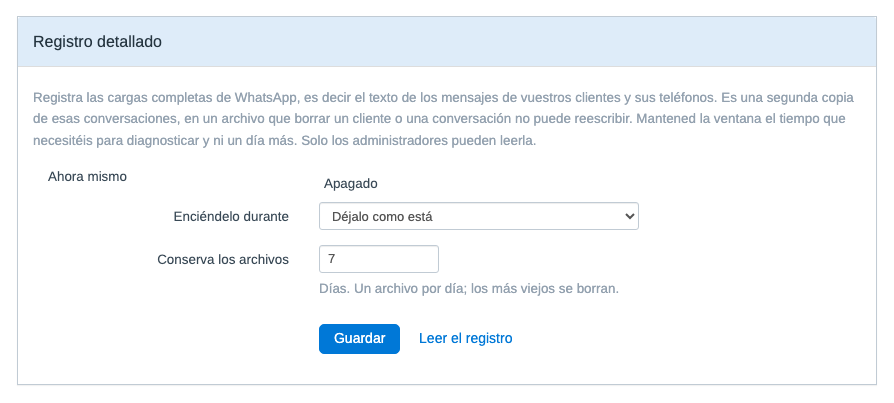

# MetaWhatsApp — WhatsApp Business para FreeScout vía Meta Cloud API

[Català](README.ca.md) · [English](README.md) · [Castellano](README.es.md) · [Nederlands](README.nl.md)

> [!IMPORTANT]
> **A partir del 1 de octubre de 2026, Meta cobra los mensajes de servicio.**
>
> Hasta ahora, responder con texto libre dentro de la ventana de 24 horas no tenía coste. A partir de esa fecha se factura por mensaje entregado, con una franquicia de **1.000 mensajes de servicio por número de teléfono y mes**, que se reinicia cada mes y no se acumula. Las plantillas de utilidad enviadas dentro de la ventana también pasan a ser de pago, y estas sin franquicia. La cifra de 1.000 la dan coincidiendo las fuentes del sector; no aparece en ninguna página de Meta.
>
> Consulta las tarifas en la [página de precios de Meta](https://whatsappbusiness.com/products/platform-pricing/#rates), eligiendo tu mercado y tu moneda: cada categoría (autenticación, marketing, utilidad y servicio) tiene un precio distinto. La tabla ya lleva la fila de servicio, pero el texto que la acompaña todavía describe la política de ahora y no da ninguna fecha, así que no os extrañe leer allí que es gratis.
>
> Vienen semanas de cambios por parte de Meta. Aquí iremos trasladando lo que afecte a este módulo, dicho como lo diga Meta, y sin añadir nada que no podamos sostener.
>
> Es un cambio de tarifas de Meta, no del módulo. El módulo no cobra nada ni recibe ninguna comisión, y sus guardas de idempotencia evitan que un reintento de la cola vuelva a enviar un mensaje que ya había salido.

> [!NOTE]
> **Conviene comprobarlo antes del 30 de septiembre: ¿su cuenta de WhatsApp Business tiene un método de pago dado de alta?**
>
> Fuentes del sector afirman que las cuentas que no lo tengan dejarán de tener los mensajes de servicio **entregados** a partir del 1 de octubre, en lugar de recibir la factura después. Como la cifra de mil de más arriba, esto no aparece en ninguna página de Meta, y no es algo que este módulo pueda comprobar por usted. Se menciona aquí porque el fallo sería silencioso: los clientes siguen escribiendo y las respuestas dejan de llegar.

<!-- Retirar ambos avisos cuando la página de precios de Meta recoja el cambio con
     normalidad y hayan pasado unas cuantas versiones desde el 1 de octubre de 2026. -->

Módulo para FreeScout que integra **WhatsApp Business directamente con la Meta Cloud API**, sin intermediarios de pago como 1msg.io o Twilio. Los mensajes van de Meta a tu instalación de FreeScout, con control completo de credenciales, datos y flujo operativo.

El proyecto es público y lleva en uso real de producción desde la v1.0, iterando a partir de incidencias reportadas por usuarios en lugar de un roadmap fijado: plantillas, multimedia, stickers, contactos, mensajes de ubicación y reacción, monitorización del estado de conexión y reactivación guiada de cuentas se han añadido en respuesta al uso real del día a día, no planificados de antemano. Es estable, pero sigue evolucionando activamente — ver [Limitaciones conocidas](#limitaciones-conocidas) más abajo para los huecos detectados así que aún no están resueltos.

## Características principales

- **Channel-first**: configuras un canal de WhatsApp, no un buzón de correo.
- **Zero-core**: no modifica ningún fichero del core de FreeScout.
- **Fail-closed**: el webhook rechaza cualquier petición sin firma HMAC válida.
- **Integración directa con Meta**: sin pasarelas de terceros.
- **Interfaz limpia de correo**: en las vistas del canal, el módulo oculta los artefactos de email del core (toggle Cc/Bcc, dirección técnica interna) sin afectar a los buzones de correo normales.
- **Compatible con FreeScout 1.8.x**, que corre sobre Laravel 5.5 y PHP 7.1 o superior.

## Capturas de pantalla

*Listado de canales de WhatsApp configurados:*


*Alta de un canal nuevo (formulario channel-first):*


*Una conversación de WhatsApp tal como la ve un agente, con el distintivo de canal que pinta el propio FreeScout:*


*Salud de la cuenta, con los botones de prueba de conexión y suscripción del webhook:*


*Registro detallado, que se enciende durante una ventana y se conserva unos días, desde la pantalla de configuración:*



*Aviso en la conversación cuando la ventana de 24 horas del cliente parece caducada:*


## Alcance de funcionalidades

Actualmente cubre:

- Mensajes de **texto plano** entrantes y salientes.
- Uno o más números de WhatsApp, cada uno como cuenta independiente del módulo.
- Creación automática de conversaciones en FreeScout a partir de mensajes entrantes.
- Respuesta desde FreeScout hacia WhatsApp respetando la ventana de deshacer del core.
- Actualización best-effort de los estados `delivered` y `read` en la base de datos del módulo; desde la v1.2.0, un `read` de Meta también marca el thread outbound como abierto, con el indicador nativo "abierto" de FreeScout.
- Desde la v1.3.0, recuperación manual de una ventana caducada con una plantilla HSM preaprobada — ver [Recuperación de ventana caducada](#recuperación-de-ventana-caducada-v130) más abajo.
- Desde la v1.4.0, mensajes multimedia (imagen, vídeo, audio, documento): descarga y adjunción entrante, previsualización en miniatura de imágenes, envío saliente limitado a la ventana abierta de 24h — ver [Soporte multimedia](#soporte-multimedia-v140) más abajo.
- Desde la v1.5.0, mensajes entrantes de ubicación y reacción (incluyendo contexto del mensaje citado), y un panel de estado de conexión por cuenta (último inbound/outbound, último error, botón "Test connection").
- Desde la v1.5.1, los IDs de canal oficiales de Meta (`103`/`104`).
- Desde la v1.6.0: hasta 5 plantillas de recuperación configuradas estáticamente por cuenta (además del flujo de una sola plantilla de la v1.3.0), o cualquier plantilla aprobada por Meta obtenida en vivo mediante un selector dinámico; stickers y tarjetas de contacto entrantes; visibilidad de fallos de entrega asíncronos (se añade una nota si Meta informa de que un mensaje ha fallado tras haber sido aceptado inicialmente); registro automático del webhook desde el formulario de la cuenta (sin paso manual en Meta Business Manager).
- Desde la v1.6.1, reactivación guiada de una cuenta inactiva directamente desde "Test connection", con trazabilidad (quién/cuándo) en el panel de estado.
- Desde la v1.7.0: el formato de texto entrante de WhatsApp se renderiza en lugar de mostrarse literal; las conversaciones llevan el canal informado, de modo que aparecen la etiqueta de WhatsApp y el botón de Chat Mode propios de FreeScout; el último mensaje del cliente se marca como leído cuando un agente responde; y un fallo de entrega reabre la conversación citando un extracto del mensaje que no ha llegado.

Queda fuera de alcance:

- Transformación o redimensionado de imagen/vídeo, vistas de galería o carrusel.
- Un adaptador de almacenamiento en la nube (S3, etc.) para multimedia — los adjuntos usan el almacenamiento local ya existente de FreeScout.
- Indicadores visuales de `delivered/read` en la conversación (el `read` solo abre el thread — ver arriba).
- Chatbots, automatizaciones avanzadas o integraciones multicanal compartidas.

## Novedades en la v1.13.0

Dos hilos en esta versión: lo que Meta dice de su cuenta ahora le llega en lugar de perderse, y un cliente que escribe sin número de teléfono ya no es un desconocido ni, en un caso, un mensaje perdido.

- **Corrección**: en un FreeScout instalado bajo la raíz del dominio, por ejemplo en `/tickets`, no se podía llegar a nada del módulo. FreeScout registra sus rutas dentro del prefijo de la subcarpeta y las de un módulo se cargan fuera, así que todas las de aquí daban 404: la pantalla de configuración, y el webhook también, o sea que las entregas de Meta tampoco llegaban. Encontrado por [@SenseiFreak](https://github.com/SenseiFreak) (#33).
- **Corrección**: un identificador de negocio (BSUID) de más de 100 caracteres se descartaba, y si aquel mensaje no traía número de teléfono, el mensaje se iba con él. El cliente escribía y no aparecía nada en ninguna parte. El techo de Meta es de 131 y la columna admite ahora 191. **Si ha tenido mensajes que nunca llegaron, este es un candidato.**
- **Un cliente que escribe sin número de teléfono aparece ahora con su nombre de usuario de WhatsApp**, en lugar del identificador en crudo, que no le decía nada al agente sobre quién había al otro lado. Meta envía el nombre de usuario en el mismo mensaje y no se estaba leyendo.
- **Que Meta rechace, pause o desactive una plantilla aprobada aparece ahora en el panel de salud de la cuenta**, indicando qué plantilla, en qué idioma y qué le ha ocurrido, en lugar de aparecer por primera vez como un envío fallido. La fila desaparece cuando Meta vuelve a aprobar la misma plantilla.
- **Los cambios de categoría de las plantillas quedan registrados**, tanto el aviso que Meta envía 24 horas antes como el cambio en sí: la categoría es lo que fija el precio de una plantilla. Cuando ocurre no se rompe nada, así que esto va al registro de eventos de la cuenta y no al panel, que es donde van las averías.
- **Un registro opcional de lo que Meta cuenta sobre la cuenta**, desactivado por defecto y que se activa una sola vez para toda la instalación, con una pantalla para leerlo. Se conserva 90 días. Solo contiene datos de la cuenta y nunca nada que identifique a un cliente.
- Todos los campos de webhook que no son mensajes pasan ahora por un único enrutador, en lugar de registrarse y descartarse, que es de donde colgarán las familias que quedan.
- La nota del contador de mensajes de servicio ya no enumera desde dónde más podría estar enviando un número. Nombrar la aplicación de WhatsApp Business y "otra herramienta" era a la vez demasiado estrecho y demasiado amplio: sin la Coexistencia de Meta, que exige ser proveedor, un número en la Cloud API no puede usarse desde la aplicación. Ahora dice desde cualquier otro sitio.
- **Neerlandés puesto al día** para la v1.12.0, aportado por [@jeroenedig](https://github.com/jeroenedig) (#36).

## Novedades en la v1.12.1

- **Corrección crítica**: guardar un canal de WhatsApp desde su formulario devolvía un error 500 y la edición se perdía. La v1.12.0 llamaba a un método que no existe en la versión de Laravel sobre la que corre FreeScout, así que fallaba cualquier guardado de un canal existente. **Si tenéis la v1.12.0 instalada, actualizad.** No cambia nada más. Ningún test pasaba por esa ruta, y por eso salió; ahora pasan dos.

## Novedades en la v1.12.0

Esta versión va de lo que Meta empieza a cobrar el 1 de octubre de 2026, y de un tipo de mensaje que el módulo archivaba como otra cosa.

- **Un recuento mensual de los mensajes de servicio enviados desde este canal**, en el panel de salud de la cuenta y apagado por defecto. A partir del 1 de octubre Meta factura las respuestas en texto libre enviadas dentro de la ventana de 24 horas, con una franquicia mensual por número de teléfono, y hasta ahora nada aquí os podía decir cuántos habíais enviado. Cuenta lo que ha salido de FreeScout, que es lo único que puede ver honestamente, y lo dice en pantalla: si ese número también se usa desde otro sitio, el total en Meta es más alto. Un envío fallido no se cuenta, porque Meta cobra por mensaje entregado.
- **Los mensajes de salida ahora guardan con qué categoría los factura Meta**, servicio o plantilla. Esta es la parte que sobrevive a la versión: el registro no sabía distinguir una respuesta de una plantilla, así que no se podía construir ningún número honesto sobre él, y el reloj de ventana previsto para la 2.0 necesita la misma distinción. No se rellena nada del pasado, así que los mensajes anteriores a esta versión se quedan sin categoría y no se cuentan nunca.
- **Un mensaje enviado en un grupo de WhatsApp se rechaza y se registra** en lugar de archivarse como una conversación privada con quien lo ha escrito. Un mensaje de grupo identifica al participante, no al grupo, así que un agente que respondiera lo dicho delante de otros habría contestado a esa persona sola, sin nada en pantalla que lo dijera. En el registro va el identificador del grupo y nunca el teléfono del participante, porque un grupo trae números de gente que no os ha escrito nunca.
- **El panel de salud dice a cuántos grupos pertenece el número**, comprobado durante el test de conexión y no en cada carga de página. El módulo no crea nunca grupos, así que cualquier cosa por encima de cero se ha hecho por la API desde otro sitio.
- **Corrección**: todos los eventos de webhook que no son mensajes se registraban como un desajuste de `phone_number_id`, que es el nombre de un problema grave entre canales, por algo que solo es un tipo de evento que este módulo no trata. Suscribir un número a los webhooks de Meta lo suscribe a todos los campos, así que los cambios de estado de plantillas, las valoraciones de calidad y los avisos de cuenta también llegan aquí. Ahora dicen qué son, por su nombre.
- El aviso de núcleo antiguo ya no enumera qué versiones de FreeScout cerraron problemas de seguridad. Esa lista se desactualiza cada vez que FreeScout publica un parche, y ya lo había hecho.
- **Neerlandés puesto al día**, aportado por [@jeroenedig](https://github.com/jeroenedig): el aviso de precios en el README neerlandés, las 28 cadenas que habían quedado atrasadas desde la v1.10.0, y las secciones del README que habían cambiado desde que entró esa página (#34, #35).

Ved el aviso de arriba del todo de esta página para saber qué cambia el 1 de octubre y dónde consultar las tarifas.

Las versiones anteriores están en la [página de releases](https://github.com/losimo/freescout-meta-whatsapp/releases).

## Compatibilidad con FreeScout

| Versión del módulo | FreeScout que espera |
|---|---|
| 1.10.0 y posteriores | 1.8.234 o superior |
| hasta la 1.9.1 | cualquier 1.8.x |

Desde la 1.10.0 el módulo usa la API de estados de conversación que FreeScout añadió en la 1.8.234, para que un estado aportado por otro módulo se entienda en lugar de quedar clasificado como desconocido. En versiones anteriores vuelve al comportamiento de siempre, que allí es exactamente el correcto, porque un núcleo sin esa API tampoco puede tener estados personalizados. No se rompe nada, y la pantalla de configuración del canal os dice qué ha encontrado.

Ir por encima de la 1.8.234 vale la pena por su cuenta: las 1.8.235, 1.8.236 y 1.8.237 cierran problemas de seguridad del propio FreeScout.

## Instalación

Sigue la [guía oficial de instalación de módulos personalizados de FreeScout](https://github.com/freescout-help-desk/freescout/wiki/FreeScout-Modules#3-installing-custom-modules):

1. Descarga el zip del módulo desde la [página de Releases](https://github.com/losimo/freescout-meta-whatsapp/releases) (o copia/enlaza el código fuente) dentro de `Modules/MetaWhatsApp` en la instalación de FreeScout.
2. Ve a **Gestionar → Módulos** en FreeScout y activa **MetaWhatsApp**. FreeScout ejecuta las migraciones del módulo y limpia la caché automáticamente.
3. El módulo aparecerá en **Gestionar → WhatsApp** para usuarios administradores.
4. Comprobad que llega de verdad: abrid `https://vuestro-freescout/meta-whatsapp/webhook` en el navegador. Tenéis que ver una línea de texto plano diciendo que MetaWhatsApp está instalado y que el punto de entrada responde. Es la misma URL que después pegaréis en Meta, y contesta sin estar identificado, así que funciona aunque haya algún problema de sesiones o de permisos.

> Si en el paso 4 os sale una página no encontrada, las rutas del módulo no llegan a FreeScout. Mirad la sección de resolución de problemas antes de configurar nada en Meta.

Si prefieres la línea de comandos (por ejemplo, en un servidor sin acceso a la interfaz del gestor de módulos), los pasos equivalentes son:

```bash
php artisan module:enable MetaWhatsApp
php artisan module:migrate MetaWhatsApp
php artisan freescout:clear-cache
```

El módulo crea dos tablas propias:

- `meta_whatsapp_accounts`
- `meta_whatsapp_messages`

No hace ningún `ALTER` sobre tablas del core de FreeScout.

## Requisitos previos en Meta

Antes de configurar el canal en FreeScout, prepara un entorno mínimo en [Meta for Developers](https://developers.facebook.com):

1. Una **App** de tipo Business con el producto **WhatsApp** añadido.
2. Un **número de teléfono** registrado en el producto WhatsApp.
3. Los datos siguientes:

| Valor | Dónde encontrarlo |
|---|---|
| **Phone Number ID** | App Dashboard → WhatsApp → API Setup |
| **WABA ID** | App Dashboard → WhatsApp → API Setup |
| **Access Token** | Ver la nota sobre el token permanente |
| **App Secret** | App Dashboard → App Settings → Basic |
| **App ID** (opcional) | La misma pantalla, justo al lado del App Secret. Con él el módulo os puede decir cuándo caduca el token de acceso |

> **Importante sobre el token**
>
> El token que muestra la pantalla de **API Setup** es temporal y suele caducar en 24 horas. Para un entorno real, genera un **token permanente de System User** desde Meta Business Manager, asignándole la App y el WABA, con los permisos:
>
> - `whatsapp_business_messaging`
> - `whatsapp_business_management`

> **Si tienes más de un número, mantenlos en el mismo portfolio de negocio**
>
> Los identificadores de usuario con ámbito de negocio (BSUID) están ligados al portfolio, así que una misma persona que escriba a dos números tuyos recibe **un solo** identificador si ambos números son del mismo WABA, y **un identificador por número** si están en portfolios separados. Con los números repartidos, el módulo no puede reconocer a esa persona como un único cliente y la resolución de contactos que se describe más abajo no se comporta como esperarías. Consulta la [nota de Meta sobre los BSUID](https://developers.facebook.com/documentation/business-messaging/whatsapp/business-scoped-user-ids/#business-scoped-user-id).

## Configuración del canal

### En FreeScout

Desde **Gestionar → WhatsApp → Añadir cuenta**:

1. Introduce el **nombre del canal**.
2. Introduce el **número de teléfono** en formato E.164 (`+34...`).
3. Rellena **Phone Number ID**, **WABA ID**, **Access Token** y **App Secret**.
4. Copia el **token de verificación** generado automáticamente.
5. Copia la **URL del webhook** mostrada por el módulo (siempre tiene la forma `https://tu-dominio/meta-whatsapp/webhook`, compartida por todas las cuentas).
6. Elige si quieres:
   - crear un buzón nuevo (recomendado), o
   - asociar uno existente compatible (sin servidores de correo configurados y no vinculado a otra cuenta de WhatsApp; el desplegable solo muestra los válidos).
7. Guarda la cuenta.

### En Meta

Desde **App Dashboard → WhatsApp → Configuration → Webhook**:

1. En **Callback URL**, pega la URL del webhook del módulo.
2. En **Verify Token**, pega el token de verificación generado en FreeScout.
3. Pulsa **Verify and save**.
4. En **Webhook fields**, activa como mínimo el campo **messages**.

> **Requisito importante**
>
> La URL del webhook debe ser pública, accesible por HTTPS y con certificado válido. Meta no acepta certificados autofirmados.

Cuando la configuración es correcta, un mensaje enviado al número de WhatsApp creará una conversación en el buzón asociado.

## Funcionamiento diario

- Los mensajes entrantes crean una conversación nueva o se añaden a la conversación activa del mismo cliente.
- La identidad del cliente se resuelve por su teléfono.
- Responder desde FreeScout envía la respuesta a WhatsApp **pasados los 15 segundos** de la ventana de deshacer del core.
- Si el agente deshace la respuesta dentro de ese margen, el mensaje no se envía.
- Las **notas internas nunca se envían** al cliente.

### Ventana de 24 horas

La Meta Cloud API solo permite enviar mensajes libres dentro de las 24 horas posteriores al último mensaje del cliente.

Si se intenta responder fuera de ventana:

- Meta devuelve el error `131047`.
- El mensaje queda registrado como fallido.
- El cliente no recibe ninguna respuesta.

Desde la v1.3.0, una ventana caducada se puede recuperar manualmente con una plantilla HSM preaprobada — ver más abajo.

### Recuperación de ventana caducada (v1.3.0)

Cuando la ventana del cliente parece caducada, aparece un banner en la conversación que permite enviar **una única plantilla de WhatsApp preaprobada**, configurada por cuenta (nombre + idioma). El envío es siempre **manual**: un agente pulsa el botón del banner; no hay ningún reintento automático de plantilla.

- Solo se admite **una** plantilla por cuenta; no hay selector de plantillas ni variables/parámetros.
- Que aparezca el banner depende de un **umbral operativo interno configurable** (`template_threshold_minutes`, por defecto **1435 minutos**). Este umbral solo determina cuándo el módulo empieza a tratar la ventana como caducada para su propia UI — no cambia la regla real de las 24 horas de Meta. Consulta la [documentación de Meta](https://developers.facebook.com/documentation/business-messaging/whatsapp/messages/send-messages).
- Antes de enviar la plantilla de verdad, el servidor vuelve a comprobar la ventana y rechaza la petición si el cliente ha vuelto a escribir mientras tanto (ventana reabierta) o si ya se ha enviado una plantilla para la misma conversación en los últimos 60 segundos (protección contra doble clic / doble envío).
- Meta **factura** los mensajes de plantilla igual que cualquier otra plantilla HSM, de forma independiente a este módulo.

### Token inválido o caducado

Si Meta devuelve el error `190`:

- la cuenta pasa a estado **Inactivo**,
- el canal deja de enviar y recibir correctamente,
- y hay que actualizar el token de acceso desde la edición de la cuenta.

### Soporte multimedia (v1.4.0)

Los mensajes entrantes de imagen, vídeo, audio y documento se descargan de la Meta Cloud API y se guardan como adjuntos normales de FreeScout en el thread de la conversación. Las imágenes, además, tienen una previsualización en miniatura; el resto de tipos se muestran como un adjunto descargable estándar (la fila por defecto de FreeScout).

El envío saliente de multimedia sigue la misma regla que el texto: solo se envía **dentro de la ventana abierta de 24h** (ver arriba) — no hay alternativa con plantilla para multimedia. Cuando un agente responde con adjuntos:

- Se envía un mensaje de WhatsApp **por adjunto** (Meta no admite más de un objeto multimedia por mensaje).
- El texto de la respuesta viaja como **caption** del primer adjunto, salvo que este sea **audio** (Meta no admite caption en audio) — en ese caso el texto se envía como mensaje de texto aparte.
- Cada adjunto se valida de tamaño contra los límites propios de Meta antes de subirlo: **5 MB** para imágenes, **16 MB** para vídeo/audio, **100 MB** para documentos. Los adjuntos demasiado grandes no se envían y se registran como fallidos.

El multimedia se almacena con el almacenamiento local ya existente de FreeScout — no se introduce ningún adaptador de almacenamiento nuevo.

## Datos personales

[Qué guarda este módulo de vuestros clientes, dónde lo guarda, y qué se borra cuando eliminéis un cliente o una conversación](docs/personal-data.md). También dice claramente los huecos que tiene, incluido el único sitio donde el borrado no llega: el archivo de registro detallado. El documento está en inglés.

## Limitaciones conocidas

Estas limitaciones son conocidas y aceptadas dentro del alcance actual de funcionalidades:

- Los tipos de mensaje distintos de texto, multimedia (incl. stickers), botón, ubicación, reacción y contactos (p. ej. `order`, respuestas de lista `interactive`) se siguen descartando (se registran en el log, no se muestran en la conversación).
- La descarga de multimedia entrante no tiene validación de tamaño propia del módulo más allá de la que Meta ya aplica antes de entregar el webhook.
- No hay vista de galería o carrusel para imágenes/vídeos — cada adjunto aparece como una fila/miniatura independiente, igual que cualquier otro adjunto de FreeScout.
- Hasta 5 plantillas configuradas estáticamente por cuenta, o cualquier plantilla APPROVED obtenida en vivo mediante el selector dinámico (con variables `{{n}}`); sin sincronización/caché automática de la lista estática desde el catálogo de Meta.
- El envío de la plantilla de recuperación es siempre **manual**, iniciado por un agente desde el banner de la conversación; no hay reintento automático fuera de ventana.
- Los estados `delivered` y `read` se actualizan en la base de datos del módulo; solo el `read` se muestra visualmente (vía el indicador nativo "abierto" del thread) — el `delivered` no se muestra en la conversación.
- Si Meta agrupa varios eventos en un solo envío de webhook, cada uno se encamina según lo que realmente es: un mensaje se atribuye por su propio número de teléfono y se descarta si nombra uno distinto, mientras que un hecho de nivel de cuenta (estado de plantilla, calidad, restricciones) llega a todos los canales activos de la WABA a la que pertenece, y se descarta si nombra otra WABA. En la práctica Meta suele enviar webhooks separados por número, pero conviene tenerlo presente con varios números bajo la misma App.
- En modo chat, el core de FreeScout puede generar **borradores vacíos** en la conversación por el autoguardado del editor; son inocuos y se pueden descartar manualmente.
- El **buzón técnico** del canal sigue siendo visible en **Gestionar → Buzones**.
- El webhook no implementa rate limiting propio; la barrera principal es la firma HMAC.
- El lookup del `verify_token` en el handshake no es constant-time.

## Checklist para pasar a cuenta real

Antes de pasar de pruebas a producción:

1. ☐ Comprueba que la instalación es accesible públicamente por HTTPS.
2. ☐ Usa un certificado válido.
3. ☐ Genera un **token permanente de System User**.
4. ☐ Elimina cuentas y conversaciones de prueba si ya no las necesitas.
5. ☐ Crea la cuenta real en el módulo con las credenciales definitivas.
6. ☐ Configura el webhook real en Meta con la URL y el verify token correctos.
7. ☐ Verifica que la suscripción al campo `messages` está activa.
8. ☐ Envía un mensaje real al número y comprueba que entra en FreeScout.
9. ☐ Responde desde FreeScout dentro de la ventana de 24 horas y comprueba que llega al móvil.
10. ☐ Verifica que el worker de colas funciona de manera continua.
11. ☐ Revisa los logs después de las primeras pruebas reales.

## Resolución de problemas

| Síntoma | Causa probable |
|---|---|
| Meta no verifica el webhook | URL no accesible públicamente, certificado inválido o verify token incorrecto |
| Meta recibe 403 en los POST del webhook | `phone_number_id` o WABA desconocido, cuenta inactiva o firma HMAC inválida |
| Los mensajes entran pero no salen | Error `131047` por ventana de 24 horas o error `190` por token caducado |
| La cuenta aparece como `⚠ Buzón desvinculado` | El buzón asociado se ha eliminado o ya no es resoluble |
| No se procesa nada | El worker de colas está parado (`php artisan queue:work`) |
| **Gestionar → WhatsApp** da "página no encontrada" | Las rutas del módulo no llegan a FreeScout. Abrid `/meta-whatsapp/webhook`: si responde, las rutas están vivas y el problema es otro; si también da 404, no llegan. Tened presente que `/meta-whatsapp` es una ruta y no una carpeta, así que no hay nada que buscar en el disco, y que un 404 no se escribe nunca en ningún registro, por lo que un registro vacío no significa nada |
| Un fix de una actualización del módulo no parece aplicarse | El worker de colas sigue ejecutando código antiguo en memoria. Reiniciar el cron no lo recarga; hace falta `php artisan queue:restart` |

Todos los logs del módulo llevan el prefijo `[MetaWhatsApp]`.

```bash
grep MetaWhatsApp storage/logs/laravel-$(date +%Y-%m-%d).log
```

## Tests

La suite de tests del módulo se puede ejecutar con:

```bash
vendor/bin/phpunit --no-configuration --bootstrap vendor/autoload.php Modules/MetaWhatsApp/Tests
```

Los tests trabajan contra la base de datos de la instalación con rollback por test y no dejan datos persistentes.

## Licencia

AGPL-3.0, igual que FreeScout.
