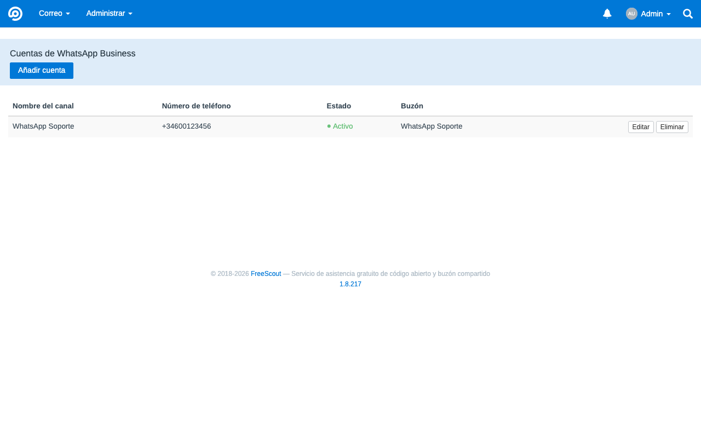
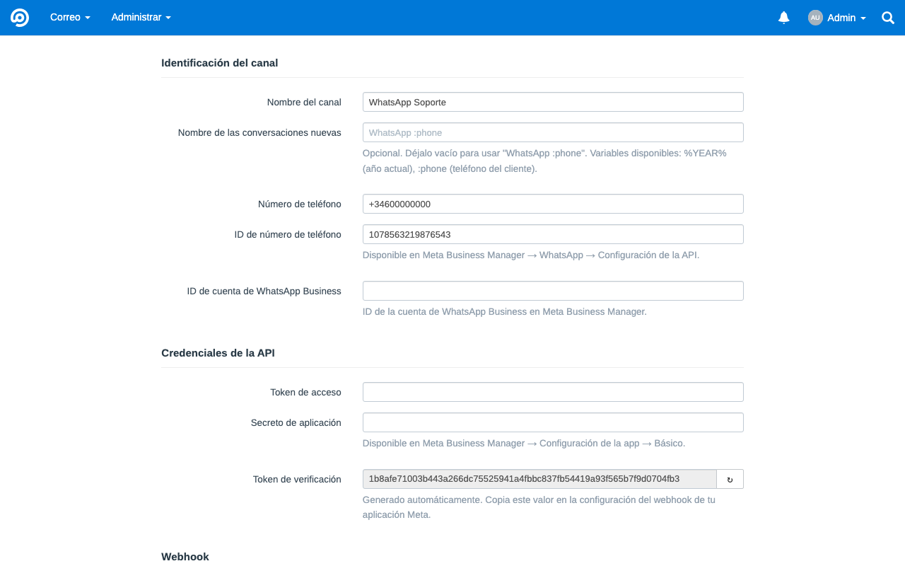
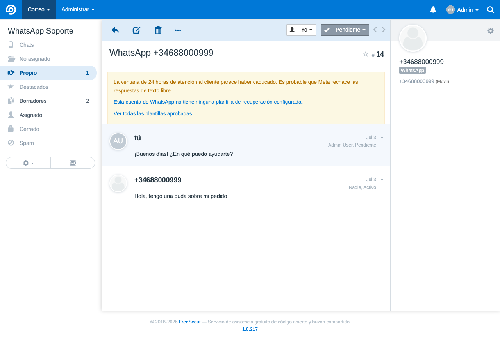
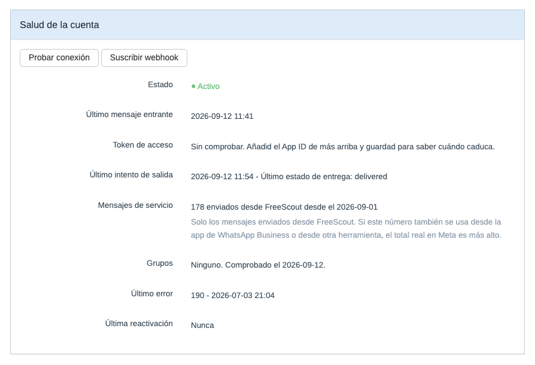
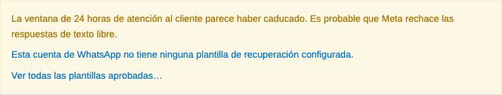

# MetaWhatsApp — WhatsApp Business para FreeScout vía Meta Cloud API

[Català](README.ca.md) · [English](README.md) · [Castellano](README.es.md) · [Nederlands](README.nl.md)

Módulo para FreeScout que integra **WhatsApp Business directamente con la Meta Cloud API**, sin intermediarios de pago como 1msg.io o Twilio. Los mensajes van de Meta a tu instalación de FreeScout, con control completo de credenciales, datos y flujo operativo.

El proyecto es público y lleva en uso real de producción desde la v1.0, iterando a partir de incidencias reportadas por usuarios en lugar de un roadmap fijado: plantillas, multimedia, stickers, contactos, mensajes de ubicación y reacción, monitorización del estado de conexión y reactivación guiada de cuentas se han añadido en respuesta al uso real del día a día, no planificados de antemano. Es estable, pero sigue evolucionando activamente — ver [Limitaciones conocidas](#limitaciones-conocidas) más abajo para los huecos detectados así que aún no están resueltos.

## Características principales

- **Channel-first**: configuras un canal de WhatsApp, no un buzón de correo.
- **Zero-core**: no modifica ningún fichero del core de FreeScout.
- **Fail-closed**: el webhook rechaza cualquier petición sin firma HMAC válida.
- **Integración directa con Meta**: sin pasarelas de terceros.
- **Interfaz limpia de correo**: en las vistas del canal, el módulo oculta los artefactos de email del core (toggle Cc/Bcc, dirección técnica interna) sin afectar a los buzones de correo normales.
- **Compatible con FreeScout 1.8.x** sobre Laravel 5.8 y PHP 8.x.

## Capturas de pantalla

*Listado de canales de WhatsApp configurados:*



*Alta de un canal nuevo (formulario channel-first):*



*Una conversación de WhatsApp tal como la ve un agente, con el distintivo de canal que pinta el propio FreeScout:*



*Salud de la cuenta, con los botones de prueba de conexión y suscripción del webhook:*



*Aviso en la conversación cuando la ventana de 24 horas del cliente parece caducada:*



## Alcance de funcionalidades

Actualmente cubre:

- Mensajes de **texto plano** entrantes y salientes.
- Uno o más números de WhatsApp, cada uno como cuenta independiente del módulo.
- Creación automática de conversaciones en FreeScout a partir de mensajes entrantes.
- Respuesta desde FreeScout hacia WhatsApp respetando la ventana de deshacer del core.
- Actualización best-effort de los estados `delivered` y `read` en la base de datos del módulo; desde la v1.2.0, un `read` de Meta también marca el thread outbound como abierto, con el indicador nativo "abierto" de FreeScout.
- Desde la v1.3.0, recuperación manual de una ventana caducada con una plantilla HSM preaprobada — ver [Recuperación de ventana caducada](#recuperación-de-ventana-caducada-v130) más abajo.
- Desde la v1.4.0, mensajes multimedia (imagen, vídeo, audio, documento): descarga y adjunción entrante, previsualización en miniatura de imágenes, envío saliente limitado a la ventana abierta de 24h — ver [Soporte multimedia](#soporte-multimedia-v140) más abajo.
- Desde la v1.5.0, mensajes entrantes de ubicación y reacción (incluyendo contexto del mensaje citado), y un panel de estado de conexión por cuenta (último inbound/outbound, último error, botón "Test connection").
- Desde la v1.5.1, los IDs de canal oficiales de Meta (`103`/`104`).
- Desde la v1.6.0: hasta 5 plantillas de recuperación configuradas estáticamente por cuenta (además del flujo de una sola plantilla de la v1.3.0), o cualquier plantilla aprobada por Meta obtenida en vivo mediante un selector dinámico; stickers y tarjetas de contacto entrantes; visibilidad de fallos de entrega asíncronos (se añade una nota si Meta informa de que un mensaje ha fallado tras haber sido aceptado inicialmente); registro automático del webhook desde el formulario de la cuenta (sin paso manual en Meta Business Manager).
- Desde la v1.6.1, reactivación guiada de una cuenta inactiva directamente desde "Test connection", con trazabilidad (quién/cuándo) en el panel de estado.
- Desde la v1.7.0: el formato de texto entrante de WhatsApp se renderiza en lugar de mostrarse literal; las conversaciones llevan el canal informado, de modo que aparecen la etiqueta de WhatsApp y el botón de Chat Mode propios de FreeScout; el último mensaje del cliente se marca como leído cuando un agente responde; y un fallo de entrega reabre la conversación citando un extracto del mensaje que no ha llegado.

Queda fuera de alcance:

- Transformación o redimensionado de imagen/vídeo, vistas de galería o carrusel.
- Un adaptador de almacenamiento en la nube (S3, etc.) para multimedia — los adjuntos usan el almacenamiento local ya existente de FreeScout.
- Indicadores visuales de `delivered/read` en la conversación (el `read` solo abre el thread — ver arriba).
- Chatbots, automatizaciones avanzadas o integraciones multicanal compartidas.

## Novedades en la v1.9.1

- **Corrección**: cada buzón creado por el módulo llevaba dos copias de cada carpeta compartida en la barra lateral (No asignado, Borradores, Asignado, Cerrado, Eliminado, Spam). El formulario de la cuenta creaba esas carpetas después de guardar el buzón, sin saber que el `MailboxObserver` del propio FreeScout ya lo hace en el evento `created`. Las carpetas personales (Propio, Destacados) se salvaron, porque el núcleo salta a los usuarios que ya las tienen, y por eso la barra lateral mostraba una mezcla de entradas simples y dobles. Estaba desde la primera versión, y se veía hasta ahora en la captura de conversación de este mismo README (#30).
- **Migración de reparación**: se eliminan las copias de los buzones vinculados a una cuenta de WhatsApp, y cualquier conversación que estuviera en la copia que desaparece se traslada a la que se queda, de modo que no se pierde nada. Los buzones que el módulo nunca ha creado no se tocan.
- **Traducción al neerlandés**, aportada por [@jeroenedig](https://github.com/jeroenedig) (#31). La interfaz del módulo ya está disponible en inglés, catalán, castellano y neerlandés.

## Novedades en la v1.9.0

- **Una sola fuente de plantillas.** La plantilla heredada (`template_name` / `template_lang`) y las cinco ranuras eran una u otra: con una ranura válida, el par antiguo no se leía nunca, mientras el formulario le daba el lugar principal. Una migración pliega el valor que quede en la primera ranura libre y elimina ambas columnas. Nunca sobrescribe una ranura con contenido, y deja el valor en el registro si las cinco están llenas, caso en que ya era inalcanzable.
- **Los botones y el selector en vivo ya no salen a la vez.** Con plantillas configuradas, el agente ve solo esos botones; sin ninguna, solo el selector. Los administradores conservan el selector en ambos casos, porque WhatsApp Manager es incómodo para consultar qué tiene Meta aprobado.
- **La sección de plantillas explica qué configuración gana** y qué verá el agente, algo que hasta ahora solo se sabía leyendo el código.
- **Corrección**: con el canal inactivo no se enviaba nada y solo las plantillas lo decían. Las respuestas de texto y el multimedia, que son el caso habitual, salían en silencio. Ahora todos los caminos comparten una sola comprobación, registran el fallo y dejan nota en la conversación, y el banner avisa aunque la ventana del cliente esté abierta.
- **Corrección**: el banner ofrecía a los agentes enlaces a la configuración del canal, que es solo de administrador, y seguirlos daba un 403. Ahora reciben la misma información como texto diciendo qué debe hacer un administrador.

## Novedades en la v1.8.1

- **Corrección**: los últimos mensajes de registro que aún salían en catalán ahora están en inglés. La corrección original tradujo las llamadas a `Log::` y dejó los mensajes de las excepciones, que llegan igualmente al `laravel-*.log`, tanto porque el worker registra la excepción no capturada como por el `failed()` del propio módulo. Como solo saltan en errores transitorios, pasaron desapercibidos dos meses.
- **Corrección**: enviar una plantilla con la cuenta inactiva no dejaba ningún rastro, mientras que la conversación seguía aparentando que el mensaje había salido. Ahora el intento se registra como fallo y se loguea, el banner de la conversación ya no ofrece botones de envío con el canal parado, y el panel de salud por fin dice si el canal está activo.

## Novedades en la v1.8.0

- **Los fallos de entrega se registran venga como venga el error de Meta.** Meta devuelve los errores de la Cloud API o bien en la respuesta del envío, o bien más tarde por el webhook de estados, y el canal documentado no es fiable: el `131047` figura como síncrono pero llega por el webhook. El módulo solo tenía la semántica de errores en el camino de la respuesta, así que para los mensajes de texto la rama del `131047` no se ejecutaba nunca, y el camino del webhook, que sí se ejecuta, no escribía nada en el registro. Por eso la corrección de registro de la v1.6.2 parecía no cambiar nada. Ahora todos los jobs de salida y el webhook comparten un único gestor de fallos.
- **Un segundo código de error distinto para el mismo mensaje se reporta** en lugar de sustituir al primero en silencio, y un estado posterior sin clave `errors` ya no puede vaciar un código ya registrado.
- **Se aprovecha el `error_data.details` de Meta** para el texto del fallo cuando está presente, que es donde está la información accionable; antes solo se leía el `title` corto.
- **Corrección**: una cuenta con el token rechazado por Meta a través del webhook ya no se desactiva. Eso solo ocurre cuando el rechazo llega a nuestra propia llamada, que es inequívoco. El fallo se sigue registrando y el código se sigue guardando.
- **Corrección**: las tarjetas del panel de los buzones de WhatsApp ya no conservan el fondo gris de inactivo. Mostrar los contadores sobre una tarjeta con aspecto de inactiva era media corrección.
- **Documentación**: si tienes más de un número, deben ser del mismo portfolio de negocio, o una misma persona recibe un identificador distinto por número y no se puede reconocer como un único cliente. Documentado como requisito previo.

## Novedades en la v1.7.0

- **Formato de WhatsApp en los mensajes entrantes**: `*negrita*`, `_cursiva_`, `~tachado~` y `` ```monoespaciado``` `` ahora se renderizan en lugar de mostrarse literalmente. Se siguen las reglas de WhatsApp, no las de CommonMark, así que un delimitador solo vale dentro de una misma línea.
- **Distintivo de canal y botón de Chat Mode nativos**: las conversaciones ahora llevan el canal informado, que era lo único que le faltaba a FreeScout para mostrar su propia etiqueta de WhatsApp y el botón de Chat Mode, tanto en la vista de conversación como en el listado. Las conversaciones creadas antes de esta versión no reciben el distintivo de forma retroactiva.
- **Marcar como leídos los mensajes del cliente**: cuando sale la respuesta de un agente, el último mensaje del cliente se marca como leído (los ticks azules de WhatsApp). Si no hay ningún mensaje entrante que marcar, no se hace nada.
- **Los fallos de entrega reabren la conversación**: un mensaje que WhatsApp reporta como fallido vuelve a poner la conversación en estado `Activa`, de modo que reaparece en lugar de pasar desapercibida la nota. Las conversaciones marcadas como spam o eliminadas no se tocan, y nunca se cambia el agente asignado.
- **Las notas de fallo citan el mensaje**: la nota de entrega fallida ahora cita un extracto de 60 caracteres del mensaje que no ha llegado, en lugar del `wamid` crudo. El multimedia enviado sin caption mantiene el `wamid`, porque no hay texto que citar.
- **Corrección**: los contadores de buzón del panel (Sin asignar/Míos/Destacado) quedaban ocultos en los buzones de WhatsApp, porque el core los pinta como inactivos cuando no tienen servidor de correo entrante. Vuelven a ser visibles, sin tocar la guarda de recogida de correo del core.
- **Corrección**: los campos Cc/Bcc podían aparecer un instante antes de quedar ocultos en los buzones de WhatsApp. El CSS del módulo se inyectaba al final de la página en lugar de dentro del `<head>`.

## Novedades en la v1.6.2

- **Fix**: la nota de "mensaje no entregado" para el error `131047` (ventana de 24h) se registraba en el log con nivel `warning` en lugar de `error`, por lo que podía desaparecer silenciosamente de `laravel-*.log` en instalaciones con `log_level` por encima de warning, aunque la nota en la conversación sí aparecía. Ahora se registra como `error`, igual que el resto de fallos de entrega (texto y multimedia).
- **Cosmético**: eliminados guiones largos erróneos de cadenas visibles para el usuario (traducciones y vistas de cuenta/plantilla); sustituidos por guiones normales.

## Novedades en la v1.6.1

- **Reactivación guiada de cuenta**: si una cuenta se había desactivado automáticamente (p. ej. tras un error de token inválido), un "Test connection" con éxito ahora la reactiva automáticamente, con trazabilidad (quién y cuándo) mostrada en el panel de estado de la cuenta — ya no hace falta editar la base de datos manualmente para recuperarla.

## Novedades en la v1.6.0

- **Plantillas de mensaje, multi-plantilla**: el banner de ventana caducada ahora admite hasta 5 plantillas configuradas (nombre, idioma, texto del botón, texto de recuperación) en lugar de una sola — útil para cuentas multiidioma. Las configuraciones de una sola plantilla existentes siguen funcionando sin cambios.
- **Plantillas de mensaje, selector dinámico**: una nueva opción "Ver todas las plantillas aprobadas…" obtiene en vivo las plantillas APPROVED reales de tu WhatsApp Business Account desde Meta, muestra el texto del cuerpo y permite rellenar variables `{{n}}` — sin configuración estática necesaria. Complementa la lista estática anterior, no la sustituye.
- **Stickers**: los mensajes `type:sticker` ahora son compatibles, se muestran como cualquier otro adjunto multimedia.
- **Tarjetas de contacto**: los mensajes `type:contacts` ahora muestran el nombre y el/los número(s) de teléfono del contacto compartido.
- **Las reacciones ahora citan a qué han reaccionado**: en lugar de un simple "Reacted: 👍", el módulo busca y cita un extracto corto del mensaje original.
- **Visibilidad de fallos de entrega**: si Meta acepta un mensaje y luego lo informa como fallido de forma asíncrona, ahora se muestra como una nota visible en la conversación en lugar de un cambio de estado silencioso.
- **Registro automático de webhook**: añadir una cuenta de WhatsApp ahora la suscribe automáticamente a los webhooks de Meta (con un botón manual "Subscribe webhook" de reintento en la página de la cuenta).
- **Fix de log de depuración**: los payloads inbound/outbound ya no se truncaban a "Over 9 levels deep..." en los logs de debug (un problema de límite de profundidad de Monolog). El log de depuración también se puede limitar solo a este módulo (`METAWHATSAPP_DEBUG=true` en el `.env` de FreeScout), escribiendo en su propio fichero de log con rotación diaria, independiente del nivel de log global de la aplicación.
- **Fix**: la página "Add new WhatsApp account" podía dar un 500 en PHP 8.1+ por un `null` pasado a `htmlspecialchars()`.

## Novedades en la v1.5.1

- **IDs de canal oficiales**: el módulo ahora usa los IDs de canal asignados oficialmente por el equipo de FreeScout (`103`/`104`) en lugar de los provisionales `100`/`101`. Las instalaciones existentes se migran automáticamente y de forma transparente — no hace falta hacer nada.
- **Fix crítico**: la v1.5.0 publicó un `require_once` colocado antes de la declaración `namespace` del fichero, lo cual es PHP inválido y hacía que el módulo no cargara. Corregido; si instalaste la v1.5.0, actualiza a la v1.5.1 inmediatamente.

## Novedades en la v1.5

- **Mensajes de ubicación y reacción**: los mensajes de ubicación entrantes ahora se muestran como un enlace de Google Maps, y las reacciones (incluyendo eliminar una) se muestran como texto.
- **Test de conexión y panel de estado**: panel por cuenta con un test de conexión en vivo e información de la última actividad.
- Los mensajes multimedia sin pie de foto ya no se descartan directamente cuando el texto de marcador de posición está vacío — solo se descartan los mensajes sin texto ni multimedia.
- Añadida una [matriz de capacidades](docs/capability-matrix.md) que documenta exactamente qué está soportado, planificado o fuera de alcance.

## Instalación

Sigue la [guía oficial de instalación de módulos personalizados de FreeScout](https://github.com/freescout-help-desk/freescout/wiki/FreeScout-Modules#3-installing-custom-modules):

1. Descarga el zip del módulo desde la [página de Releases](https://github.com/losimo/freescout-meta-whatsapp/releases) (o copia/enlaza el código fuente) dentro de `Modules/MetaWhatsApp` en la instalación de FreeScout.
2. Ve a **Gestionar → Módulos** en FreeScout y activa **MetaWhatsApp**. FreeScout ejecuta las migraciones del módulo y limpia la caché automáticamente.
3. El módulo aparecerá en **Gestionar → WhatsApp** para usuarios administradores.

Si prefieres la línea de comandos (por ejemplo, en un servidor sin acceso a la interfaz del gestor de módulos), los pasos equivalentes son:

```bash
php artisan module:enable MetaWhatsApp
php artisan module:migrate MetaWhatsApp
php artisan freescout:clear-cache
```

El módulo crea dos tablas propias:

- `meta_whatsapp_accounts`
- `meta_whatsapp_messages`

No hace ningún `ALTER` sobre tablas del core de FreeScout.

## Requisitos previos en Meta

Antes de configurar el canal en FreeScout, prepara un entorno mínimo en [Meta for Developers](https://developers.facebook.com):

1. Una **App** de tipo Business con el producto **WhatsApp** añadido.
2. Un **número de teléfono** registrado en el producto WhatsApp.
3. Los datos siguientes:

| Valor | Dónde encontrarlo |
|---|---|
| **Phone Number ID** | App Dashboard → WhatsApp → API Setup |
| **WABA ID** | App Dashboard → WhatsApp → API Setup |
| **Access Token** | Ver la nota sobre el token permanente |
| **App Secret** | App Dashboard → App Settings → Basic |

> **Importante sobre el token**
>
> El token que muestra la pantalla de **API Setup** es temporal y suele caducar en 24 horas. Para un entorno real, genera un **token permanente de System User** desde Meta Business Manager, asignándole la App y el WABA, con los permisos:
>
> - `whatsapp_business_messaging`
> - `whatsapp_business_management`

> **Si tienes más de un número, mantenlos en el mismo portfolio de negocio**
>
> Los identificadores de usuario con ámbito de negocio (BSUID) están ligados al portfolio, así que una misma persona que escriba a dos números tuyos recibe **un solo** identificador si ambos números son del mismo WABA, y **un identificador por número** si están en portfolios separados. Con los números repartidos, el módulo no puede reconocer a esa persona como un único cliente y la resolución de contactos que se describe más abajo no se comporta como esperarías. Consulta la [nota de Meta sobre los BSUID](https://developers.facebook.com/documentation/business-messaging/whatsapp/business-scoped-user-ids/#business-scoped-user-id).

## Configuración del canal

### En FreeScout

Desde **Gestionar → WhatsApp → Añadir cuenta**:

1. Introduce el **nombre del canal**.
2. Introduce el **número de teléfono** en formato E.164 (`+34...`).
3. Rellena **Phone Number ID**, **WABA ID**, **Access Token** y **App Secret**.
4. Copia el **token de verificación** generado automáticamente.
5. Copia la **URL del webhook** mostrada por el módulo (siempre tiene la forma `https://tu-dominio/meta-whatsapp/webhook`, compartida por todas las cuentas).
6. Elige si quieres:
   - crear un buzón nuevo (recomendado), o
   - asociar uno existente compatible (sin servidores de correo configurados y no vinculado a otra cuenta de WhatsApp; el desplegable solo muestra los válidos).
7. Guarda la cuenta.

### En Meta

Desde **App Dashboard → WhatsApp → Configuration → Webhook**:

1. En **Callback URL**, pega la URL del webhook del módulo.
2. En **Verify Token**, pega el token de verificación generado en FreeScout.
3. Pulsa **Verify and save**.
4. En **Webhook fields**, activa como mínimo el campo **messages**.

> **Requisito importante**
>
> La URL del webhook debe ser pública, accesible por HTTPS y con certificado válido. Meta no acepta certificados autofirmados.

Cuando la configuración es correcta, un mensaje enviado al número de WhatsApp creará una conversación en el buzón asociado.

## Funcionamiento diario

- Los mensajes entrantes crean una conversación nueva o se añaden a la conversación activa del mismo cliente.
- La identidad del cliente se resuelve por su teléfono.
- Responder desde FreeScout envía la respuesta a WhatsApp **pasados los 15 segundos** de la ventana de deshacer del core.
- Si el agente deshace la respuesta dentro de ese margen, el mensaje no se envía.
- Las **notas internas nunca se envían** al cliente.

### Ventana de 24 horas

La Meta Cloud API solo permite enviar mensajes libres dentro de las 24 horas posteriores al último mensaje del cliente.

Si se intenta responder fuera de ventana:

- Meta devuelve el error `131047`.
- El mensaje queda registrado como fallido.
- El cliente no recibe ninguna respuesta.

Desde la v1.3.0, una ventana caducada se puede recuperar manualmente con una plantilla HSM preaprobada — ver más abajo.

### Recuperación de ventana caducada (v1.3.0)

Cuando la ventana del cliente parece caducada, aparece un banner en la conversación que permite enviar **una única plantilla de WhatsApp preaprobada**, configurada por cuenta (nombre + idioma). El envío es siempre **manual**: un agente pulsa el botón del banner; no hay ningún reintento automático de plantilla.

- Solo se admite **una** plantilla por cuenta; no hay selector de plantillas ni variables/parámetros.
- Que aparezca el banner depende de un **umbral operativo interno configurable** (`template_threshold_minutes`, por defecto **1435 minutos**). Este umbral solo determina cuándo el módulo empieza a tratar la ventana como caducada para su propia UI — no cambia la regla real de las 24 horas de Meta. Consulta la [documentación de Meta](https://developers.facebook.com/documentation/business-messaging/whatsapp/messages/send-messages).
- Antes de enviar la plantilla de verdad, el servidor vuelve a comprobar la ventana y rechaza la petición si el cliente ha vuelto a escribir mientras tanto (ventana reabierta) o si ya se ha enviado una plantilla para la misma conversación en los últimos 60 segundos (protección contra doble clic / doble envío).
- Meta **factura** los mensajes de plantilla igual que cualquier otra plantilla HSM, de forma independiente a este módulo.

### Token inválido o caducado

Si Meta devuelve el error `190`:

- la cuenta pasa a estado **Inactivo**,
- el canal deja de enviar y recibir correctamente,
- y hay que actualizar el token de acceso desde la edición de la cuenta.

### Soporte multimedia (v1.4.0)

Los mensajes entrantes de imagen, vídeo, audio y documento se descargan de la Meta Cloud API y se guardan como adjuntos normales de FreeScout en el thread de la conversación. Las imágenes, además, tienen una previsualización en miniatura; el resto de tipos se muestran como un adjunto descargable estándar (la fila por defecto de FreeScout).

El envío saliente de multimedia sigue la misma regla que el texto: solo se envía **dentro de la ventana abierta de 24h** (ver arriba) — no hay alternativa con plantilla para multimedia. Cuando un agente responde con adjuntos:

- Se envía un mensaje de WhatsApp **por adjunto** (Meta no admite más de un objeto multimedia por mensaje).
- El texto de la respuesta viaja como **caption** del primer adjunto, salvo que este sea **audio** (Meta no admite caption en audio) — en ese caso el texto se envía como mensaje de texto aparte.
- Cada adjunto se valida de tamaño contra los límites propios de Meta antes de subirlo: **5 MB** para imágenes, **16 MB** para vídeo/audio, **100 MB** para documentos. Los adjuntos demasiado grandes no se envían y se registran como fallidos.

El multimedia se almacena con el almacenamiento local ya existente de FreeScout — no se introduce ningún adaptador de almacenamiento nuevo.

## Limitaciones conocidas

Estas limitaciones son conocidas y aceptadas dentro del alcance actual de funcionalidades:

- Los tipos de mensaje distintos de texto, multimedia (incl. stickers), botón, ubicación, reacción y contactos (p. ej. `order`, respuestas de lista `interactive`) se siguen descartando (se registran en el log, no se muestran en la conversación).
- La descarga de multimedia entrante no tiene validación de tamaño propia del módulo más allá de la que Meta ya aplica antes de entregar el webhook.
- No hay vista de galería o carrusel para imágenes/vídeos — cada adjunto aparece como una fila/miniatura independiente, igual que cualquier otro adjunto de FreeScout.
- Hasta 5 plantillas configuradas estáticamente por cuenta, o cualquier plantilla APPROVED obtenida en vivo mediante el selector dinámico (con variables `{{n}}`); sin sincronización/caché automática de la lista estática desde el catálogo de Meta.
- El envío de la plantilla de recuperación es siempre **manual**, iniciado por un agente desde el banner de la conversación; no hay reintento automático fuera de ventana.
- Los estados `delivered` y `read` se actualizan en la base de datos del módulo; solo el `read` se muestra visualmente (vía el indicador nativo "abierto" del thread) — el `delivered` no se muestra en la conversación.
- Si Meta agrupa en un solo envío de webhook eventos de **números diferentes**, solo se procesan los de la cuenta correspondiente al primero; el resto se descarta con un aviso en el log. En la práctica Meta suele enviar webhooks separados por número, pero conviene tenerlo presente con varios números bajo la misma App.
- En modo chat, el core de FreeScout puede generar **borradores vacíos** en la conversación por el autoguardado del editor; son inocuos y se pueden descartar manualmente.
- El **buzón técnico** del canal sigue siendo visible en **Gestionar → Buzones**.
- El webhook no implementa rate limiting propio; la barrera principal es la firma HMAC.
- El lookup del `verify_token` en el handshake no es constant-time.

## Checklist para pasar a cuenta real

Antes de pasar de pruebas a producción:

1. ☐ Comprueba que la instalación es accesible públicamente por HTTPS.
2. ☐ Usa un certificado válido.
3. ☐ Genera un **token permanente de System User**.
4. ☐ Elimina cuentas y conversaciones de prueba si ya no las necesitas.
5. ☐ Crea la cuenta real en el módulo con las credenciales definitivas.
6. ☐ Configura el webhook real en Meta con la URL y el verify token correctos.
7. ☐ Verifica que la suscripción al campo `messages` está activa.
8. ☐ Envía un mensaje real al número y comprueba que entra en FreeScout.
9. ☐ Responde desde FreeScout dentro de la ventana de 24 horas y comprueba que llega al móvil.
10. ☐ Verifica que el worker de colas funciona de manera continua.
11. ☐ Revisa los logs después de las primeras pruebas reales.

## Resolución de problemas

| Síntoma | Causa probable |
|---|---|
| Meta no verifica el webhook | URL no accesible públicamente, certificado inválido o verify token incorrecto |
| Meta recibe 403 en los POST del webhook | `phone_number_id` desconocido, cuenta inactiva o firma HMAC inválida |
| Los mensajes entran pero no salen | Error `131047` por ventana de 24 horas o error `190` por token caducado |
| La cuenta aparece como `⚠ Buzón desvinculado` | El buzón asociado se ha eliminado o ya no es resoluble |
| No se procesa nada | El worker de colas está parado (`php artisan queue:work`) |
| Un fix de una actualización del módulo no parece aplicarse | El worker de colas sigue ejecutando código antiguo en memoria. Reiniciar el cron no lo recarga; hace falta `php artisan queue:restart` |

Todos los logs del módulo llevan el prefijo `[MetaWhatsApp]`.

```bash
grep MetaWhatsApp storage/logs/laravel-$(date +%Y-%m-%d).log
```

## Tests

La suite de tests del módulo se puede ejecutar con:

```bash
vendor/bin/phpunit --no-configuration --bootstrap vendor/autoload.php Modules/MetaWhatsApp/Tests
```

Los tests trabajan contra la base de datos de la instalación con rollback por test y no dejan datos persistentes.

## Licencia

AGPL-3.0, igual que FreeScout.
