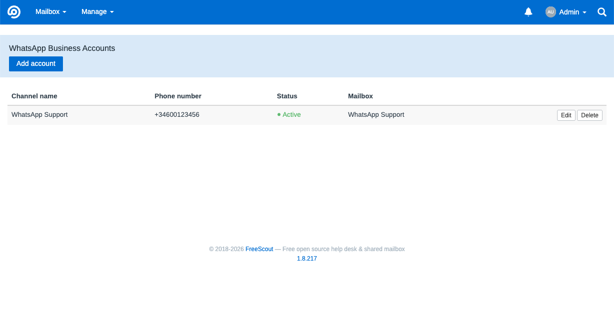
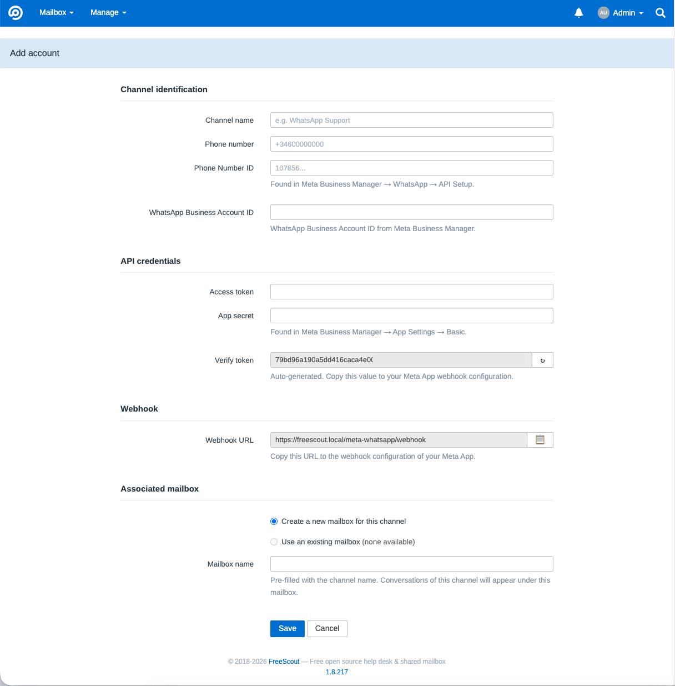

# MetaWhatsApp — WhatsApp Business for FreeScout via Meta Cloud API

[Català](README.ca.md) · [English](README.md) · [Castellano](README.es.md)

FreeScout module that integrates **WhatsApp Business directly with the Meta Cloud API**, without paid intermediaries such as 1msg.io or Twilio. Messages travel from Meta to your FreeScout installation and nowhere else, with full control over credentials, data and the operational flow.

The project is now public, and internal testing is complete, but it would still be especially valuable to find a company or person willing to integrate it and use it for a few days in a real environment to validate production behavior, uncover edge cases, and confirm that the operational flow fits day-to-day use.

## Key features

- **Channel-first**: you configure a WhatsApp channel, not an email mailbox.
- **Zero-core**: no FreeScout core file is modified.
- **Fail-closed**: the webhook rejects any request without a valid HMAC signature.
- **Direct Meta integration**: no third-party gateways.
- **Email-free interface**: on channel pages the module hides the core's email artifacts (Cc/Bcc toggle, internal technical address) without affecting regular email mailboxes.
- **Compatible with FreeScout 1.8.x** on Laravel 5.8 and PHP 8.x.

## Screenshots

*List of configured WhatsApp channels:*



*Adding a new channel (channel-first form):*



## MVP scope

This v1 covers:

- **Plain text** messages, inbound and outbound.
- One or more WhatsApp numbers, each as an independent module account.
- Automatic conversation creation in FreeScout from incoming messages.
- Replies from FreeScout to WhatsApp honoring the core undo window.
- Best-effort tracking of `delivered` and `read` states in the module database.
- Since v1.2.0, a `read` receipt from Meta also marks the outbound thread as opened, using FreeScout's native "opened" indicator.
- Since v1.3.0, manual recovery of an expired window with a single pre-approved HSM template — see [Expired window recovery](#expired-window-recovery-v130) below.
- Since v1.4.0, media messages (image, video, audio, document): inbound download & attachment, image thumbnail preview, outbound send gated to the open 24h window — see [Media support](#media-support-v140) below.

Out of scope in this version:

- Image/video transformation or resizing, image gallery/carousel views.
- A cloud storage adapter (S3, etc.) for media — attachments use FreeScout's existing local storage only.
- Visual `delivered/read` indicators in the conversation (the `read` receipt only opens the thread — see above).
- Chatbots, advanced automations or shared multichannel integrations.

## Installation

1. Copy or symlink the module into `Modules/MetaWhatsApp` of your FreeScout installation.
2. Enable it and run the migrations:

```bash
php artisan module:enable MetaWhatsApp
php artisan module:migrate MetaWhatsApp
php artisan freescout:clear-cache
```

3. The module appears under **Manage → WhatsApp** for administrator users.

The module creates two tables of its own:

- `meta_whatsapp_accounts`
- `meta_whatsapp_messages`

It never runs `ALTER` on FreeScout core tables.

## Meta prerequisites

Before configuring the channel in FreeScout, prepare a minimal setup at [Meta for Developers](https://developers.facebook.com):

1. A Business-type **App** with the **WhatsApp** product added.
2. A **phone number** registered in the WhatsApp product.
3. The following values:

| Value | Where to find it |
|---|---|
| **Phone Number ID** | App Dashboard → WhatsApp → API Setup |
| **WABA ID** | App Dashboard → WhatsApp → API Setup |
| **Access Token** | See the permanent token note |
| **App Secret** | App Dashboard → App Settings → Basic |

> **Important note about the token**
>
> The token shown on the **API Setup** screen is temporary and usually expires in 24 hours. For a real environment, generate a **permanent System User token** from Meta Business Manager, assigning it the App and the WABA, with the permissions:
>
> - `whatsapp_business_messaging`
> - `whatsapp_business_management`

## Channel configuration

### In FreeScout

From **Manage → WhatsApp → Add account**:

1. Enter the **channel name**.
2. Enter the **phone number** in E.164 format (`+34...`).
3. Fill in **Phone Number ID**, **WABA ID**, **Access Token** and **App Secret**.
4. Copy the auto-generated **verify token**.
5. Copy the **webhook URL** shown by the module (it always has the form `https://your-domain/meta-whatsapp/webhook`, shared by all accounts).
6. Choose whether to:
   - create a new mailbox (recommended), or
   - link a compatible existing one (no mail servers configured and not linked to another WhatsApp account; the dropdown only lists valid ones).
7. Save the account.

### In Meta

From **App Dashboard → WhatsApp → Configuration → Webhook**:

1. In **Callback URL**, paste the module's webhook URL.
2. In **Verify Token**, paste the verify token generated in FreeScout.
3. Press **Verify and save**.
4. Under **Webhook fields**, enable at least the **messages** field.

> **Important requirement**
>
> The webhook URL must be public, reachable over HTTPS and carry a valid certificate. Meta does not accept self-signed certificates.

Once configured correctly, a message sent to the WhatsApp number creates a conversation in the linked mailbox.

## Daily operation

- Incoming messages create a new conversation or are appended to the customer's open conversation.
- Customer identity is resolved by phone number.
- Replying from FreeScout sends the reply to WhatsApp **after the 15 seconds** of the core undo window.
- If the agent undoes the reply within that margin, nothing is sent.
- **Internal notes are never sent** to the customer.

### The 24-hour window

The Meta Cloud API only allows free-form messages within 24 hours of the customer's last message.

If a reply is attempted outside the window:

- Meta returns error `131047`.
- The message is recorded as failed.
- The customer receives nothing.

Since v1.3.0, an expired window can be manually recovered with a pre-approved HSM template — see below.

### Expired window recovery (v1.3.0)

When the customer window looks expired, a banner appears in the conversation offering to send a **single pre-approved WhatsApp template**, configured per account (name + language). Sending is always **manual**: an agent clicks the button in the banner, there is no automatic template retry.

- Only **one** template per account is supported; there is no template picker and no variables/parameters.
- Whether the banner appears is governed by a configurable **internal operational threshold** (`template_threshold_minutes`, default **1435 minutes**). This threshold only controls when the module starts treating the window as expired for its own UI — it does **not** change Meta's real 24-hour rule. See the [Meta documentation](https://developers.facebook.com/documentation/business-messaging/whatsapp/messages/send-messages).
- Before actually sending, the server re-checks the window and rejects the request if the customer has written again in the meantime (window re-opened) or if a template was already sent for the same conversation in the last 60 seconds (double-click / double-submit protection).
- Template messages are **billed by Meta** like any other HSM template, independently of this module.

### Invalid or expired token

If Meta returns error `190`:

- the account switches to **Inactive**,
- the channel stops sending and receiving properly,
- and the access token must be updated from the account edit screen.

### Media support (v1.4.0)

Inbound image, video, audio and document messages are downloaded from the Meta Cloud API and stored as regular FreeScout attachments on the conversation thread. Images additionally get an inline thumbnail preview; other types show as a standard downloadable attachment (FreeScout's default file row).

Outbound media follows the same rule as text: it is **only sent within the open 24h customer window** (see above) — there is no template-based fallback for media. When an agent replies with attachments:

- One WhatsApp message is sent **per attachment** (Meta does not support more than one media object per message).
- The reply's text travels as the **caption** of the first attachment, except when that attachment is **audio** (Meta does not support captions on audio) — in that case the text is sent as a separate plain-text message.
- Each attachment is size-checked against Meta's own limits before upload: **5 MB** for images, **16 MB** for video/audio, **100 MB** for documents. Oversized attachments are not sent and are recorded as failed.

Media is stored using FreeScout's existing local attachment storage — no separate storage adapter is introduced.

## Known limitations

These limitations are known and accepted within the MVP scope:

- WhatsApp **reactions** and other unsupported message types are still dropped (logged, not shown in the conversation).
- Inbound media has no size validation on this module's side beyond what Meta itself enforces before delivering the webhook.
- No image/video gallery or carousel view — each attachment appears as its own row/thumbnail, same as any other FreeScout attachment.
- Only **one** pre-approved HSM template per account (set on the account); no template picker, no variables/parameters, no automatic sync with Meta's template catalog.
- Sending the recovery template is always **manual**, triggered by an agent from the conversation banner; there is no automatic retry outside the window.
- `delivered` and `read` states are stored in the module database; only `read` is shown visually (via the thread's native "opened" indicator) — `delivered` is not shown in the conversation.
- If Meta batches webhook events of **different numbers** in a single delivery, only those matching the first resolved account are processed; the rest are discarded with a log warning. In practice Meta usually delivers separate webhooks per number, but keep this in mind with several numbers under the same App.
- In chat mode, the FreeScout core may leave **empty drafts** in the conversation due to editor autosave; they are harmless and can be discarded manually.
- The channel's **technical mailbox** remains visible under **Manage → Mailboxes**.
- The webhook implements no rate limiting of its own; the HMAC signature is the main barrier.
- The `verify_token` lookup during the handshake is not constant-time.

## Go-live checklist

Before moving from testing to production:

1. ☐ Confirm the installation is publicly reachable over HTTPS.
2. ☐ Use a valid certificate.
3. ☐ Generate a **permanent System User token**.
4. ☐ Remove test accounts and conversations you no longer need.
5. ☐ Create the real account in the module with the final credentials.
6. ☐ Configure the real webhook in Meta with the correct URL and verify token.
7. ☐ Confirm the `messages` field subscription is active.
8. ☐ Send a real message to the number and confirm it reaches FreeScout.
9. ☐ Reply from FreeScout within the 24-hour window and confirm it reaches the phone.
10. ☐ Confirm the queue worker runs continuously.
11. ☐ Review the logs after the first real tests.

## Troubleshooting

| Symptom | Likely cause |
|---|---|
| Meta cannot verify the webhook | URL not publicly reachable, invalid certificate or wrong verify token |
| Meta gets 403 on webhook POSTs | Unknown `phone_number_id`, inactive account or invalid HMAC signature |
| Messages come in but replies do not go out | Error `131047` (24-hour window) or error `190` (expired token) |
| Account shows `⚠ Mailbox unlinked` | The linked mailbox was deleted or is no longer resolvable |
| Nothing gets processed | Queue worker stopped (`php artisan queue:work`) |

All module logs carry the `[MetaWhatsApp]` prefix.

```bash
grep MetaWhatsApp storage/logs/laravel-$(date +%Y-%m-%d).log
```

## Tests

Run the module test suite with:

```bash
vendor/bin/phpunit --no-configuration --bootstrap vendor/autoload.php Modules/MetaWhatsApp/Tests
```

Tests run against the installation database with per-test rollback and leave no persistent data.

## License

AGPL-3.0, same as FreeScout.
