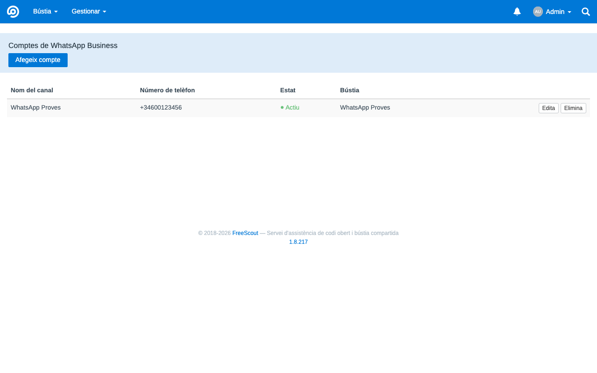
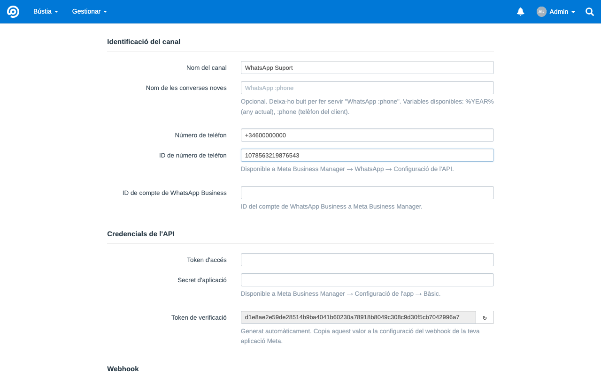

# MetaWhatsApp — WhatsApp Business for FreeScout via Meta Cloud API

[Català](README.ca.md) · [English](README.md) · [Castellano](README.es.md)

FreeScout module that integrates **WhatsApp Business directly with the Meta Cloud API**, without paid intermediaries such as 1msg.io or Twilio. Messages travel from Meta to your FreeScout installation and nowhere else, with full control over credentials, data and the operational flow.

The project is public and has been running in real production use since v1.0, iterating through user-reported issues rather than a fixed roadmap: templates, media, stickers, contacts, location and reaction messages, connection health monitoring and guided account reactivation were all added in response to actual day-to-day use, not planned upfront. It's stable, but still actively evolving — see [Known limitations](#known-limitations) below for gaps found this way that aren't fixed yet.

## Key features

- **Channel-first**: you configure a WhatsApp channel, not an email mailbox.
- **Zero-core**: no FreeScout core file is modified.
- **Fail-closed**: the webhook rejects any request without a valid HMAC signature.
- **Direct Meta integration**: no third-party gateways.
- **Email-free interface**: on channel pages the module hides the core's email artifacts (Cc/Bcc toggle, internal technical address) without affecting regular email mailboxes.
- **Compatible with FreeScout 1.8.x** on Laravel 5.8 and PHP 8.x.

## Screenshots

*List of configured WhatsApp channels:*



*Adding a new channel (channel-first form):*



## Feature scope

Currently covers:

- **Plain text** messages, inbound and outbound.
- One or more WhatsApp numbers, each as an independent module account.
- Automatic conversation creation in FreeScout from incoming messages.
- Replies from FreeScout to WhatsApp honoring the core undo window.
- Best-effort tracking of `delivered` and `read` states in the module database; since v1.2.0, a `read` receipt from Meta also marks the outbound thread as opened, using FreeScout's native "opened" indicator.
- Since v1.3.0, manual recovery of an expired window with a pre-approved HSM template — see [Expired window recovery](#expired-window-recovery-v130) below.
- Since v1.4.0, media messages (image, video, audio, document): inbound download & attachment, image thumbnail preview, outbound send gated to the open 24h window — see [Media support](#media-support-v140) below.
- Since v1.5.0, inbound location and reaction messages (including quoted-message context), and a connection health panel per account (last inbound/outbound, last error, "Test connection" button).
- Since v1.5.1, official Meta channel IDs (`103`/`104`).
- Since v1.6.0: up to 5 statically-configured recovery templates per account (in addition to the single-template flow from v1.3.0) or any Meta-approved template fetched live via a dynamic picker; inbound stickers and shared contact cards; asynchronous delivery-failure visibility (a note is added if Meta reports a message as failed after initial acceptance); automatic webhook subscription from the account form (no manual Meta Business Manager step).
- Since v1.6.1, guided reactivation of an inactive account straight from "Test connection", with an audit trail (who/when) on the health panel.

Out of scope:

- Image/video transformation or resizing, image gallery/carousel views.
- A cloud storage adapter (S3, etc.) for media — attachments use FreeScout's existing local storage only.
- Visual `delivered/read` indicators in the conversation (the `read` receipt only opens the thread — see above).
- Chatbots, advanced automations or shared multichannel integrations.
- FreeScout's **chat mode** button and its own **channel label/tag** on conversations (present in Meta's official WhatsApp module) — not implemented here yet, see [Known limitations](#known-limitations).

## What's new in v1.6.2

- **Fix**: the "message not delivered" note for error `131047` (24h window) was logged at `warning` level instead of `error`, so it could be silently dropped from `laravel-*.log` on installations with `log_level` set above warning, even though the in-conversation note still appeared. Now logged as `error`, consistent with every other delivery failure (text and media).
- **Cosmetic**: removed stray em dashes from user-facing strings (translations and account/template views); replaced with regular hyphens.

## What's new in v1.6.1

- **Guided account reactivation**: if an account was auto-deactivated (e.g. after an invalid-token error), a successful "Test connection" now reactivates it automatically, with an audit trail (who and when) shown on the account health snapshot — no more manual database edits to recover.

## What's new in v1.6.0

- **Message templates, multi-template**: the expired-window banner now supports up to 5 configured templates (name, language, button label, recovery text) instead of a single one — useful for multi-language accounts. Existing single-template setups keep working unchanged.
- **Message templates, dynamic picker**: a new "Browse all approved templates…" option fetches your WhatsApp Business Account's actual APPROVED templates live from Meta, shows the body text, and lets you fill in `{{n}}` variables — no static configuration needed. Complements the static list above, doesn't replace it.
- **Stickers**: `type:sticker` messages are now supported, shown like any other media attachment.
- **Contact cards**: `type:contacts` messages now show the shared contact's name and phone number(s).
- **Reactions now quote what they reacted to**: instead of a bare "Reacted: 👍", the module looks up and quotes a short excerpt of the original message.
- **Delivery failure visibility**: if Meta accepts a message and then reports it as failed asynchronously, that now shows up as a visible note in the conversation instead of a silent status change.
- **Automatic webhook subscription**: adding a WhatsApp account now automatically subscribes it to Meta's webhooks (with a manual "Subscribe webhook" retry button on the account page).
- **Debug logging fix**: inbound/outbound payloads no longer get truncated to "Over 9 levels deep..." in debug logs (a Monolog depth-limit issue). Debug logging can now also be scoped to this module only (`METAWHATSAPP_DEBUG=true` in FreeScout's `.env`), writing to its own daily-rotated log file independent of the app-wide log level.
- **Fix**: the "Add new WhatsApp account" page could 500 on PHP 8.1+ due to a `null` passed into `htmlspecialchars()`.

## What's new in v1.5.1

- **Official channel IDs**: the module now uses the channel IDs officially assigned by the FreeScout team (`103`/`104`) instead of the provisional `100`/`101`. Existing installations are migrated automatically and transparently — no action needed.
- **Critical fix**: v1.5.0 shipped a `require_once` placed before the file's `namespace` declaration, which is invalid PHP and made the module fail to load entirely. Fixed; if you installed v1.5.0, update to v1.5.1 immediately.

## What's new in v1.5

- **Location and reaction messages**: inbound location messages are now shown as a Google Maps link, and reactions (including removing one) are shown as text.
- **Connection test & health snapshot**: per-account panel with a live connection test and last-activity info.
- Media messages without a caption are no longer discarded outright when the placeholder text is empty — only messages with neither text nor media are dropped.
- Added a [capability matrix](docs/capability-matrix.md) documenting exactly what's supported, planned or out of scope.
- Added a lightweight [incident notes](docs/incidents.md) log for operational gotchas worth remembering.

## Installation

Follow FreeScout's [official custom module installation guide](https://github.com/freescout-help-desk/freescout/wiki/FreeScout-Modules#3-installing-custom-modules):

1. Download the module zip from the [Releases page](https://github.com/losimo/freescout-meta-whatsapp/releases) (or copy/symlink the module source) into `Modules/MetaWhatsApp` of your FreeScout installation.

> **Note for manual installs**
>
> If you copy or symlink the module source directly instead of using the zip from the Releases page, run `composer dump-autoload` from the FreeScout root before activating the module. This is required when your installation uses optimized/cached autoloading (e.g. `composer install --optimize-autoloader`) — otherwise FreeScout won't find the module's classes.

2. Go to **Manage → Modules** in FreeScout and activate **MetaWhatsApp**. FreeScout runs the module's migrations and clears the cache automatically.
3. The module appears under **Manage → WhatsApp** for administrator users.

If you prefer the command line (e.g. on a server without UI access to the module manager), the equivalent steps are:

```bash
php artisan module:enable MetaWhatsApp
php artisan module:migrate MetaWhatsApp
php artisan freescout:clear-cache
```

The module creates two tables of its own:

- `meta_whatsapp_accounts`
- `meta_whatsapp_messages`

It never runs `ALTER` on FreeScout core tables.

## Meta prerequisites

Before configuring the channel in FreeScout, prepare a minimal setup at [Meta for Developers](https://developers.facebook.com):

1. A Business-type **App** with the **WhatsApp** product added.
2. A **phone number** registered in the WhatsApp product.
3. The following values:

| Value | Where to find it |
|---|---|
| **Phone Number ID** | App Dashboard → WhatsApp → API Setup |
| **WABA ID** | App Dashboard → WhatsApp → API Setup |
| **Access Token** | See the permanent token note |
| **App Secret** | App Dashboard → App Settings → Basic |

> **Important note about the token**
>
> The token shown on the **API Setup** screen is temporary and usually expires in 24 hours. For a real environment, generate a **permanent System User token** from Meta Business Manager, assigning it the App and the WABA, with the permissions:
>
> - `whatsapp_business_messaging`
> - `whatsapp_business_management`

## Channel configuration

### In FreeScout

From **Manage → WhatsApp → Add account**:

1. Enter the **channel name**.
2. Enter the **phone number** in E.164 format (`+34...`).
3. Fill in **Phone Number ID**, **WABA ID**, **Access Token** and **App Secret**.
4. Copy the auto-generated **verify token**.
5. Copy the **webhook URL** shown by the module (it always has the form `https://your-domain/meta-whatsapp/webhook`, shared by all accounts).
6. Choose whether to:
   - create a new mailbox (recommended), or
   - link a compatible existing one (no mail servers configured and not linked to another WhatsApp account; the dropdown only lists valid ones).
7. Save the account.

### In Meta

From **App Dashboard → WhatsApp → Configuration → Webhook**:

1. In **Callback URL**, paste the module's webhook URL.
2. In **Verify Token**, paste the verify token generated in FreeScout.
3. Press **Verify and save**.
4. Under **Webhook fields**, enable at least the **messages** field.

> **Important requirement**
>
> The webhook URL must be public, reachable over HTTPS and carry a valid certificate. Meta does not accept self-signed certificates.

Once configured correctly, a message sent to the WhatsApp number creates a conversation in the linked mailbox.

## Daily operation

- Incoming messages create a new conversation or are appended to the customer's open conversation.
- Customer identity is resolved by phone number.
- Replying from FreeScout sends the reply to WhatsApp **after the 15 seconds** of the core undo window.
- If the agent undoes the reply within that margin, nothing is sent.
- **Internal notes are never sent** to the customer.

### The 24-hour window

The Meta Cloud API only allows free-form messages within 24 hours of the customer's last message.

If a reply is attempted outside the window:

- Meta returns error `131047`.
- The message is recorded as failed.
- The customer receives nothing.

Since v1.3.0, an expired window can be manually recovered with a pre-approved HSM template — see below.

### Expired window recovery (v1.3.0)

When the customer window looks expired, a banner appears in the conversation offering to send a **single pre-approved WhatsApp template**, configured per account (name + language). Sending is always **manual**: an agent clicks the button in the banner, there is no automatic template retry.

- Only **one** template per account is supported; there is no template picker and no variables/parameters.
- Whether the banner appears is governed by a configurable **internal operational threshold** (`template_threshold_minutes`, default **1435 minutes**). This threshold only controls when the module starts treating the window as expired for its own UI — it does **not** change Meta's real 24-hour rule. See the [Meta documentation](https://developers.facebook.com/documentation/business-messaging/whatsapp/messages/send-messages).
- Before actually sending, the server re-checks the window and rejects the request if the customer has written again in the meantime (window re-opened) or if a template was already sent for the same conversation in the last 60 seconds (double-click / double-submit protection).
- Template messages are **billed by Meta** like any other HSM template, independently of this module.

### Invalid or expired token

If Meta returns error `190`:

- the account switches to **Inactive**,
- the channel stops sending and receiving properly,
- and the access token must be updated from the account edit screen.

### Media support (v1.4.0)

Inbound image, video, audio and document messages are downloaded from the Meta Cloud API and stored as regular FreeScout attachments on the conversation thread. Images additionally get an inline thumbnail preview; other types show as a standard downloadable attachment (FreeScout's default file row).

Outbound media follows the same rule as text: it is **only sent within the open 24h customer window** (see above) — there is no template-based fallback for media. When an agent replies with attachments:

- One WhatsApp message is sent **per attachment** (Meta does not support more than one media object per message).
- The reply's text travels as the **caption** of the first attachment, except when that attachment is **audio** (Meta does not support captions on audio) — in that case the text is sent as a separate plain-text message.
- Each attachment is size-checked against Meta's own limits before upload: **5 MB** for images, **16 MB** for video/audio, **100 MB** for documents. Oversized attachments are not sent and are recorded as failed.

Media is stored using FreeScout's existing local attachment storage — no separate storage adapter is introduced.

## Known limitations

These limitations are known and accepted within the current feature scope:

- Message types other than text, media (incl. stickers), button, location, reaction and contacts (e.g. `order`, `interactive` list replies) are still dropped (logged, not shown in the conversation).
- Inbound media has no size validation on this module's side beyond what Meta itself enforces before delivering the webhook.
- No image/video gallery or carousel view — each attachment appears as its own row/thumbnail, same as any other FreeScout attachment.
- Up to 5 statically-configured templates per account, or any APPROVED template fetched live via the dynamic picker (with `{{n}}` variables); no automatic sync/caching of the static list from Meta's catalog.
- Sending the recovery template is always **manual**, triggered by an agent from the conversation banner; there is no automatic retry outside the window.
- `delivered` and `read` states are stored in the module database; only `read` is shown visually (via the thread's native "opened" indicator) — `delivered` is not shown in the conversation.
- If Meta batches webhook events of **different numbers** in a single delivery, only those matching the first resolved account are processed; the rest are discarded with a log warning. In practice Meta usually delivers separate webhooks per number, but keep this in mind with several numbers under the same App.
- In chat mode, the FreeScout core may leave **empty drafts** in the conversation due to editor autosave; they are harmless and can be discarded manually.
- The channel's **technical mailbox** remains visible under **Manage → Mailboxes**.
- The webhook implements no rate limiting of its own; the HMAC signature is the main barrier.
- The `verify_token` lookup during the handshake is not constant-time.
- FreeScout's **"Chat" button** (the toggle that opens a conversation in chat mode) is not enabled on WhatsApp conversations the way Meta's official module does it; the same view is still reachable manually via the "Chats" item in the mailbox's left menu, or by appending `?chat_mode=1` to the conversation URL.
- Conversations aren't tagged with a dedicated **WhatsApp label/tag** the way Meta's official module does, so they can't be filtered or reported on by channel alone.
- Inbound WhatsApp text formatting (`*bold*`, `_italic_`, `~strikethrough~`, `` ```monospace``` ``) is shown as plain text with the literal markers — not rendered.
- Since mailboxes used for WhatsApp are required to have no incoming e-mail server configured (to avoid mixing e-mail and WhatsApp conversations), FreeScout's mailbox dashboard doesn't show ticket counts (Unassigned/Mine/Starred/…) for those mailboxes.
- A failed/undelivered outbound message doesn't reopen the conversation, and its failure note shows the raw `wamid` rather than a snippet of the message text — the agent has to notice the note manually.

## Go-live checklist

Before moving from testing to production:

1. ☐ Confirm the installation is publicly reachable over HTTPS.
2. ☐ Use a valid certificate.
3. ☐ Generate a **permanent System User token**.
4. ☐ Remove test accounts and conversations you no longer need.
5. ☐ Create the real account in the module with the final credentials.
6. ☐ Configure the real webhook in Meta with the correct URL and verify token.
7. ☐ Confirm the `messages` field subscription is active.
8. ☐ Send a real message to the number and confirm it reaches FreeScout.
9. ☐ Reply from FreeScout within the 24-hour window and confirm it reaches the phone.
10. ☐ Confirm the queue worker runs continuously.
11. ☐ Review the logs after the first real tests.

## Troubleshooting

| Symptom | Likely cause |
|---|---|
| Meta cannot verify the webhook | URL not publicly reachable, invalid certificate or wrong verify token |
| Meta gets 403 on webhook POSTs | Unknown `phone_number_id`, inactive account or invalid HMAC signature |
| Messages come in but replies do not go out | Error `131047` (24-hour window) or error `190` (expired token) |
| Account shows `⚠ Mailbox unlinked` | The linked mailbox was deleted or is no longer resolvable |
| Nothing gets processed | Queue worker stopped (`php artisan queue:work`) |

All module logs carry the `[MetaWhatsApp]` prefix.

```bash
grep MetaWhatsApp storage/logs/laravel-$(date +%Y-%m-%d).log
```

## Tests

Run the module test suite with:

```bash
vendor/bin/phpunit --no-configuration --bootstrap vendor/autoload.php Modules/MetaWhatsApp/Tests
```

Tests run against the installation database with per-test rollback and leave no persistent data.

## License

AGPL-3.0, same as FreeScout.
