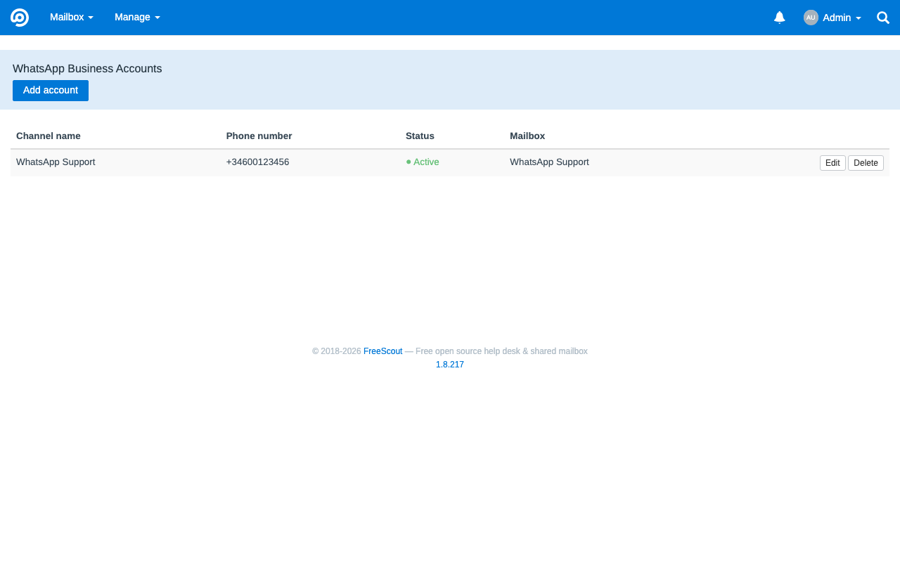
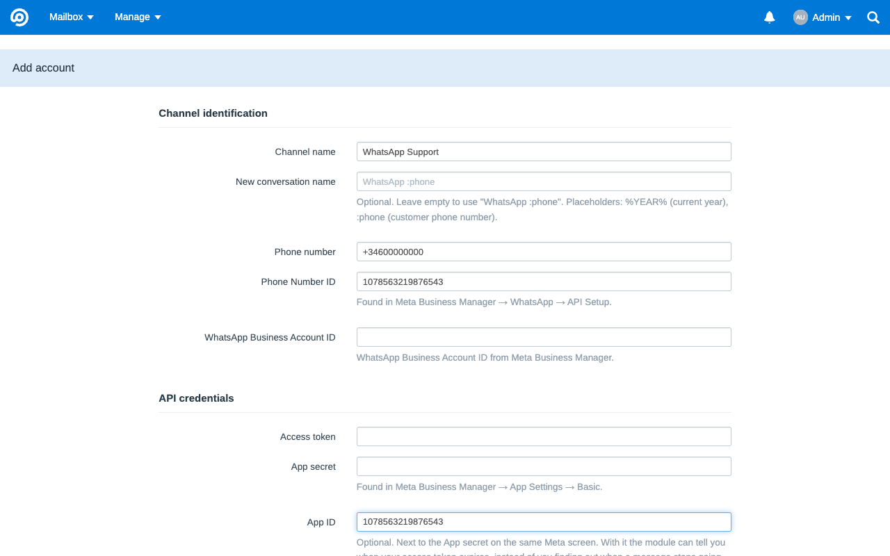
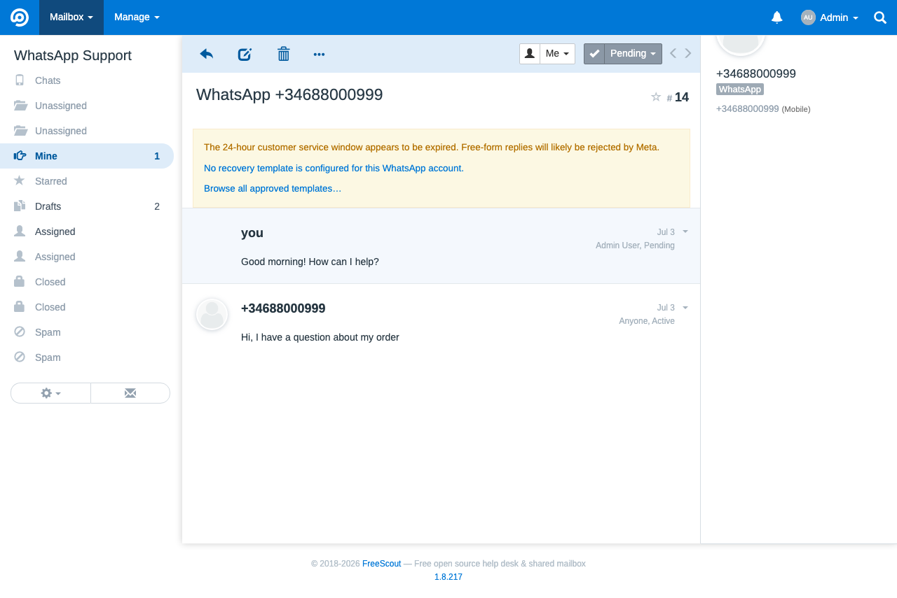
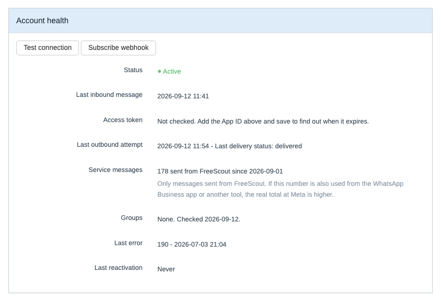
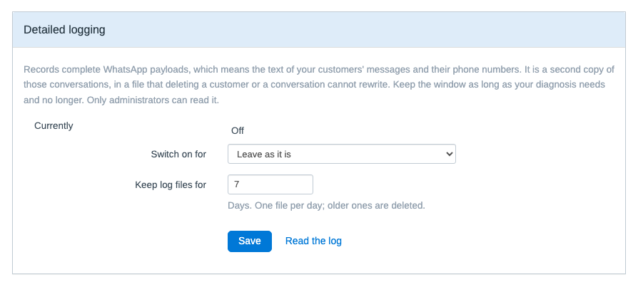
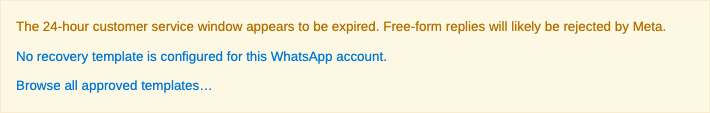

# MetaWhatsApp — WhatsApp Business for FreeScout via Meta Cloud API

[Català](README.ca.md) · [English](README.md) · [Castellano](README.es.md) · [Nederlands](README.nl.md)

> [!IMPORTANT]
> **From 1 October 2026, Meta charges for service messages.**
>
> Until now, replying with free-form text inside the 24-hour window carried no cost. From that date it is billed per delivered message, and utility templates sent inside the window become chargeable too. Meta now says so on [its own page](https://developers.facebook.com/documentation/business-messaging/whatsapp/pricing/non-template-messages): "Effective October 1, 2026, Meta will charge for service messages, which have not been charged since November 2024."
>
> What Meta does not publish anywhere is the allowance. The figure of **1,000 service messages per business phone number per month**, resetting monthly and not rolling over, comes from industry sources that agree on it, and we pass it on as exactly that.
>
> Two of Meta's own pages disagree as we write this. The one linked above carries the date; the [rates page](https://whatsappbusiness.com/products/platform-pricing/#rates) still says service conversations are free, and so are utility templates inside the window. Use the first for what changes and the second for the rates in your market and currency, where each category is priced differently.
>
> More changes are coming from Meta over the next weeks. We will pass on here whatever affects this module, worded as Meta words it, and we will not add anything we cannot stand behind.
>
> This is a Meta pricing change, not a module change. The module charges nothing and takes no commission, and its idempotency guards stop a queue retry from re-sending a message that already went out.

> [!NOTE]
> **Worth checking before 30 September: does your WhatsApp Business Account have a payment method on file?**
>
> Industry sources report that accounts without one stop having their service messages delivered from 1 October, rather than being billed afterwards. Like the figure of 1,000 above, this is on no Meta page, and it is not something this module can check for you. It is mentioned here because the failure would be a quiet one: customers keep writing and replies stop arriving.

<!-- Remove both notices once Meta's pricing page covers the change as routine and
     a few versions have passed since 1 October 2026. -->

FreeScout module that integrates **WhatsApp Business directly with the Meta Cloud API**, without paid intermediaries such as 1msg.io or Twilio. Messages travel from Meta to your FreeScout installation and nowhere else, with full control over credentials, data and the operational flow.

The project is public and has been running in real production use since v1.0, iterating through user-reported issues rather than a fixed roadmap: templates, media, stickers, contacts, location and reaction messages, connection health monitoring and guided account reactivation were all added in response to actual day-to-day use, not planned upfront. It's stable, but still actively evolving — see [Known limitations](#known-limitations) below for gaps found this way that aren't fixed yet.

## Key features

- **Channel-first**: you configure a WhatsApp channel, not an email mailbox.
- **Zero-core**: no FreeScout core file is modified.
- **Fail-closed**: the webhook rejects any request without a valid HMAC signature.
- **Direct Meta integration**: no third-party gateways.
- **Email-free interface**: on channel pages the module hides the core's email artifacts (Cc/Bcc toggle, internal technical address) without affecting regular email mailboxes.
- **Compatible with FreeScout 1.8.x**, which runs on Laravel 5.5 and PHP 7.1 or newer.

## Screenshots

*List of configured WhatsApp channels:*



*Adding a new channel (channel-first form):*



*A WhatsApp conversation as an agent sees it, with the channel badge FreeScout renders natively:*



*Per-account health snapshot, with the live connection test and webhook subscription buttons:*



*Detailed logging, switched on for a window and kept for a number of days, from the settings page:*



*Expired-window banner shown in a conversation when the 24h customer window looks closed:*



## Feature scope

Currently covers:

- **Plain text** messages, inbound and outbound.
- One or more WhatsApp numbers, each as an independent module account.
- Automatic conversation creation in FreeScout from incoming messages.
- Replies from FreeScout to WhatsApp honoring the core undo window.
- Best-effort tracking of `delivered` and `read` states in the module database; since v1.2.0, a `read` receipt from Meta also marks the outbound thread as opened, using FreeScout's native "opened" indicator.
- Since v1.3.0, manual recovery of an expired window with a pre-approved HSM template — see [Expired window recovery](#expired-window-recovery-v130) below.
- Since v1.4.0, media messages (image, video, audio, document): inbound download & attachment, image thumbnail preview, outbound send gated to the open 24h window — see [Media support](#media-support-v140) below.
- Since v1.5.0, inbound location and reaction messages (including quoted-message context), and a connection health panel per account (last inbound/outbound, last error, "Test connection" button).
- Since v1.5.1, official Meta channel IDs (`103`/`104`).
- Since v1.6.0: up to 5 statically-configured recovery templates per account (in addition to the single-template flow from v1.3.0) or any Meta-approved template fetched live via a dynamic picker; inbound stickers and shared contact cards; asynchronous delivery-failure visibility (a note is added if Meta reports a message as failed after initial acceptance); automatic webhook subscription from the account form (no manual Meta Business Manager step).
- Since v1.6.1, guided reactivation of an inactive account straight from "Test connection", with an audit trail (who/when) on the health panel.
- Since v1.7.0: inbound WhatsApp text formatting is rendered rather than shown literally; conversations carry the channel, so FreeScout's own WhatsApp tag and Chat Mode button appear; the customer's last message is marked as read after an agent replies; and a failed delivery reopens the conversation with a quoted excerpt of the message that didn't arrive.

Out of scope:

- Image/video transformation or resizing, image gallery/carousel views.
- A cloud storage adapter (S3, etc.) for media — attachments use FreeScout's existing local storage only.
- Visual `delivered/read` indicators in the conversation (the `read` receipt only opens the thread — see above).
- Chatbots, advanced automations or shared multichannel integrations.

## What's new in v1.14.1

- **Fix**: the message telling an admin to re-enter a channel's token and secret after an `APP_KEY` change was written in Catalan, glued onto an otherwise English log line and exception message in `WebhookController.php` and `WhatsAppAccount.php`. An admin who does not read Catalan could see that credentials were broken, not what to do about it. Found by [@jeroenedig](https://github.com/jeroenedig) reading the code for the Dutch translation (#38).

## What's new in v1.14.0

This release comes out of an audit asking a single question: what does this module take for granted about the machine it runs on? The subdirectory bug in v1.13.0 was one of those answers, and a user had to find it. These are the rest, found before anyone had to report them.

- **Fix**: one line needed PHP 7.4 while the README promised 7.1, which is the floor FreeScout itself declares. On 7.1, 7.2 or 7.3 the file that processes webhooks did not parse, so the settings screen worked, the channel saved and Meta's handshake passed, while every inbound message died with a 500 that is invisible from inside FreeScout.
- **Fix**: the `wamid` column held 100 characters and Meta documents no maximum for it. FreeScout turns MySQL's strict mode off, so a longer id was not refused but cut and stored: receipts stopped matching, and two ids sharing a truncated prefix collided on the unique index, where the error reads as "already processed".
- **The settings screen now names what is wrong with the environment**, which the module cannot fix but can see: a queue worker that is not running, the `sync` driver, missing curl, an `APP_URL` that is not https, a log directory that cannot be written, and a memory limit too small for the attachments WhatsApp accepts. Red means the installation cannot work, yellow that it works with a caveat. The queue one matters most: when nothing processes the queue, a reply looks sent in the conversation and simply never leaves, with no error anywhere.
- **When FreeScout's `APP_KEY` changes**, after a server move or a `key:generate` taken from a forum, the module says so instead of failing everywhere at once. Credentials are encrypted with that key, and until now the channel list rendered perfectly while every delivery answered 500, which Meta eventually responds to by disabling the webhook.
- **Turning on detailed logging no longer stops the channel** when `storage/logs` cannot be written. The log is written before a message is processed, so the diagnostic tool was killing what it was meant to diagnose. Turning it off always works.
- **Oversized incoming media is refused with its numbers** rather than taking the whole message with it. The file was held in memory while downloading, and a document larger than the memory limit killed the worker and lost the message, not just the attachment.
- **The pricing notice links Meta's own page**, which documents the 1 October change at last. The caveat now sits only where it belongs: the figure of 1,000 is still published on no Meta page, and two of Meta's own pages disagree as we write this.
- **A new section for what is not the module**, with what to check and what to send us if you want help.
- **Dutch kept in step**, contributed by [@jeroenedig](https://github.com/jeroenedig) (#37), including one string he found himself that had gone stale without its key changing.

## What's new in v1.13.0

Two threads in this release: what Meta says about your account now reaches you instead of being dropped, and a customer who writes without a phone number is no longer a stranger or, in one case, lost.

- **Fix**: on a FreeScout installed below the domain root, at `/tickets` for example, nothing in this module could be reached. FreeScout registers its own routes inside the subdirectory prefix and a module's routes are loaded outside it, so every route here answered 404: the settings screen, and the webhook too, which means Meta's deliveries never arrived either. Found by [@SenseiFreak](https://github.com/SenseiFreak) (#33).
- **Fix**: a business-scoped ID longer than 100 characters was thrown away, and when that message carried no phone number the message went with it. The customer wrote and nothing appeared anywhere. Meta's ceiling is 131 and the column now holds 191. **If you have had messages that never arrived, this is a candidate.**
- **A customer who writes without a phone number is now named after their WhatsApp username**, instead of the raw business-scoped ID that told the agent nothing about who was on the other side. Meta sends the username in the same payload and it was not being read.
- **Meta rejecting, pausing or disabling an approved template now shows on the account health panel**, naming the template, the language and what happened to it, instead of first appearing as a send that failed. The row goes away when Meta approves the same template again.
- **Template category changes are now recorded**, both the warning Meta sends 24 hours ahead and the change itself: the category is what sets a template's price. Nothing breaks when it happens, so this goes to the account event log rather than the panel, which is where faults go.
- **An optional record of what Meta reports about the account**, off by default and switched on once for the whole instance, with a screen to read it. Kept 90 days. It holds account-level facts only and never anything that identifies a customer.
- Every webhook field other than messages now goes through one router instead of being logged and dropped, which is what the remaining kinds will hang off.
- The service message counter's note no longer lists where else a number might be sending from. Naming the WhatsApp Business app and "another tool" was both too narrow and too wide: without Meta's Coexistence, which needs a provider, a number on the Cloud API cannot be used from the app at all. It now says anywhere else.
- **Dutch brought up to date** for v1.12.0, contributed by [@jeroenedig](https://github.com/jeroenedig) (#36).

Older releases are listed on the [releases page](https://github.com/losimo/freescout-meta-whatsapp/releases).

## FreeScout compatibility

| Module version | FreeScout it expects |
|---|---|
| 1.10.0 and later | 1.8.234 or newer |
| up to 1.9.1 | any 1.8.x |

From 1.10.0 the module uses the conversation status API that FreeScout added in 1.8.234, so that a status contributed by another module is understood rather than filed as unknown. On anything older it falls back to the previous behaviour, which is exactly right there, since a core without that API cannot carry custom statuses either. Nothing breaks; the channel settings screen tells you what it found.

Newer than 1.8.234 is worth having on its own: 1.8.235, 1.8.236 and 1.8.237 each closed security issues in FreeScout.

## Installation

Follow FreeScout's [official custom module installation guide](https://github.com/freescout-help-desk/freescout/wiki/FreeScout-Modules#3-installing-custom-modules):

1. Download the module zip from the [Releases page](https://github.com/losimo/freescout-meta-whatsapp/releases) (or copy/symlink the module source) into `Modules/MetaWhatsApp` of your FreeScout installation.

> **Note for manual installs**
>
> If you copy or symlink the module source directly instead of using the zip from the Releases page, run `composer dump-autoload` from the FreeScout root before activating the module. This is required when your installation uses optimized/cached autoloading (e.g. `composer install --optimize-autoloader`) — otherwise FreeScout won't find the module's classes.

2. Go to **Manage → Modules** in FreeScout and activate **MetaWhatsApp**. FreeScout runs the module's migrations and clears the cache automatically.
3. The module appears under **Manage → WhatsApp** for administrator users.
4. Check it is really reachable: open `https://your-freescout/meta-whatsapp/webhook` in a browser. You should see a plain-text line saying MetaWhatsApp is installed and the endpoint is reachable. That is the same URL you will paste into Meta later, and it answers without logging in, so it works even if something is wrong with sessions or permissions.

> If step 4 gives you a page-not-found instead, the module's routes are not reaching FreeScout. See [Troubleshooting](#troubleshooting) before configuring anything in Meta.

If you prefer the command line (e.g. on a server without UI access to the module manager), the equivalent steps are:

```bash
php artisan module:enable MetaWhatsApp
php artisan module:migrate MetaWhatsApp
php artisan freescout:clear-cache
```

The module creates two tables of its own:

- `meta_whatsapp_accounts`
- `meta_whatsapp_messages`

It never runs `ALTER` on FreeScout core tables.

## Meta prerequisites

Before configuring the channel in FreeScout, prepare a minimal setup at [Meta for Developers](https://developers.facebook.com):

1. A Business-type **App** with the **WhatsApp** product added.
2. A **phone number** registered in the WhatsApp product.
3. The following values:

| Value | Where to find it |
|---|---|
| **Phone Number ID** | App Dashboard → WhatsApp → API Setup |
| **WABA ID** | App Dashboard → WhatsApp → API Setup |
| **Access Token** | See the permanent token note |
| **App Secret** | App Dashboard → App Settings → Basic |
| **App ID** (optional) | The same screen, right next to the App Secret. With it the module can tell you when the access token expires |

> **Important note about the token**
>
> The token shown on the **API Setup** screen is temporary and usually expires in 24 hours. For a real environment, generate a **permanent System User token** from Meta Business Manager, assigning it the App and the WABA, with the permissions:
>
> - `whatsapp_business_messaging`
> - `whatsapp_business_management`

> **If you run more than one number, keep them in the same business portfolio**
>
> Business-scoped user IDs are scoped to a portfolio, so the same person messaging two of your numbers gets **one** ID if both numbers belong to the same WABA, and a **different ID per number** if they sit in separate portfolios. With numbers split across portfolios the module cannot recognise that person as a single customer, and the contact resolution described below will not behave as you expect. See [Meta's note on business-scoped user IDs](https://developers.facebook.com/documentation/business-messaging/whatsapp/business-scoped-user-ids/#business-scoped-user-id).

## Channel configuration

### In FreeScout

From **Manage → WhatsApp → Add account**:

1. Enter the **channel name**.
2. Enter the **phone number** in E.164 format (`+34...`).
3. Fill in **Phone Number ID**, **WABA ID**, **Access Token** and **App Secret**.
4. Copy the auto-generated **verify token**.
5. Copy the **webhook URL** shown by the module (it always has the form `https://your-domain/meta-whatsapp/webhook`, shared by all accounts).
6. Choose whether to:
   - create a new mailbox (recommended), or
   - link a compatible existing one (no mail servers configured and not linked to another WhatsApp account; the dropdown only lists valid ones).
7. Save the account.

### In Meta

From **App Dashboard → WhatsApp → Configuration → Webhook**:

1. In **Callback URL**, paste the module's webhook URL.
2. In **Verify Token**, paste the verify token generated in FreeScout.
3. Press **Verify and save**.
4. Under **Webhook fields**, enable at least the **messages** field.

> **Important requirement**
>
> The webhook URL must be public, reachable over HTTPS and carry a valid certificate. Meta does not accept self-signed certificates.

Once configured correctly, a message sent to the WhatsApp number creates a conversation in the linked mailbox.

## Daily operation

- Incoming messages create a new conversation or are appended to the customer's open conversation.
- Customer identity is resolved by phone number.
- Replying from FreeScout sends the reply to WhatsApp **after the 15 seconds** of the core undo window.
- If the agent undoes the reply within that margin, nothing is sent.
- **Internal notes are never sent** to the customer.

### The 24-hour window

The Meta Cloud API only allows free-form messages within 24 hours of the customer's last message.

If a reply is attempted outside the window:

- Meta returns error `131047`.
- The message is recorded as failed.
- The customer receives nothing.

Since v1.3.0, an expired window can be manually recovered with a pre-approved HSM template — see below.

### Expired window recovery (v1.3.0)

When the customer window looks expired, a banner appears in the conversation offering to send a **single pre-approved WhatsApp template**, configured per account (name + language). Sending is always **manual**: an agent clicks the button in the banner, there is no automatic template retry.

- Only **one** template per account is supported; there is no template picker and no variables/parameters.
- Whether the banner appears is governed by a configurable **internal operational threshold** (`template_threshold_minutes`, default **1435 minutes**). This threshold only controls when the module starts treating the window as expired for its own UI — it does **not** change Meta's real 24-hour rule. See the [Meta documentation](https://developers.facebook.com/documentation/business-messaging/whatsapp/messages/send-messages).
- Before actually sending, the server re-checks the window and rejects the request if the customer has written again in the meantime (window re-opened) or if a template was already sent for the same conversation in the last 60 seconds (double-click / double-submit protection).
- Template messages are **billed by Meta** like any other HSM template, independently of this module.

### Invalid or expired token

If Meta returns error `190`:

- the account switches to **Inactive**,
- the channel stops sending and receiving properly,
- and the access token must be updated from the account edit screen.

### Media support (v1.4.0)

Inbound image, video, audio and document messages are downloaded from the Meta Cloud API and stored as regular FreeScout attachments on the conversation thread. Images additionally get an inline thumbnail preview; other types show as a standard downloadable attachment (FreeScout's default file row).

Outbound media follows the same rule as text: it is **only sent within the open 24h customer window** (see above) — there is no template-based fallback for media. When an agent replies with attachments:

- One WhatsApp message is sent **per attachment** (Meta does not support more than one media object per message).
- The reply's text travels as the **caption** of the first attachment, except when that attachment is **audio** (Meta does not support captions on audio) — in that case the text is sent as a separate plain-text message.
- Each attachment is size-checked against Meta's own limits before upload: **5 MB** for images, **16 MB** for video/audio, **100 MB** for documents. Oversized attachments are not sent and are recorded as failed.

Media is stored using FreeScout's existing local attachment storage — no separate storage adapter is introduced.

## Personal data

[What this module stores about your customers, where, and what is removed when you delete a customer or a conversation](docs/personal-data.md). It also states the gaps plainly, including the one place erasure cannot reach: the detailed log file.

## Known limitations

These limitations are known and accepted within the current feature scope:

- Message types other than text, media (incl. stickers), button, location, reaction and contacts (e.g. `order`, `interactive` list replies) are still dropped (logged, not shown in the conversation).
- Inbound media has no size validation on this module's side beyond what Meta itself enforces before delivering the webhook.
- No image/video gallery or carousel view — each attachment appears as its own row/thumbnail, same as any other FreeScout attachment.
- Up to 5 statically-configured templates per account, or any APPROVED template fetched live via the dynamic picker (with `{{n}}` variables); no automatic sync/caching of the static list from Meta's catalog.
- Sending the recovery template is always **manual**, triggered by an agent from the conversation banner; there is no automatic retry outside the window.
- `delivered` and `read` states are stored in the module database; only `read` is shown visually (via the thread's native "opened" indicator) — `delivered` is not shown in the conversation.
- If Meta batches several events in a single delivery, each is routed by what it actually is: a message is attributed by its own phone number and discarded if it names a different one, while an account level fact (template status, quality, restrictions) reaches every active channel on the WABA it belongs to, and is discarded if it names another WABA. In practice Meta usually delivers separate webhooks per number, but keep this in mind with several numbers under the same App.
- In chat mode, the FreeScout core may leave **empty drafts** in the conversation due to editor autosave; they are harmless and can be discarded manually.
- The channel's **technical mailbox** remains visible under **Manage → Mailboxes**.
- The webhook implements no rate limiting of its own; the HMAC signature is the main barrier.
- The `verify_token` lookup during the handshake is not constant-time.

## Go-live checklist

Before moving from testing to production:

1. ☐ Confirm the installation is publicly reachable over HTTPS.
2. ☐ Use a valid certificate.
3. ☐ Generate a **permanent System User token**.
4. ☐ Remove test accounts and conversations you no longer need.
5. ☐ Create the real account in the module with the final credentials.
6. ☐ Configure the real webhook in Meta with the correct URL and verify token.
7. ☐ Confirm the `messages` field subscription is active.
8. ☐ Send a real message to the number and confirm it reaches FreeScout.
9. ☐ Reply from FreeScout within the 24-hour window and confirm it reaches the phone.
10. ☐ Confirm the queue worker runs continuously.
11. ☐ Review the logs after the first real tests.

## Troubleshooting

| Symptom | Likely cause |
|---|---|
| Meta cannot verify the webhook | URL not publicly reachable, invalid certificate or wrong verify token |
| Meta gets 403 on webhook POSTs | Unknown `phone_number_id` or WABA, inactive account or invalid HMAC signature |
| Messages come in but replies do not go out | Error `131047` (24-hour window) or error `190` (expired token) |
| Account shows `⚠ Mailbox unlinked` | The linked mailbox was deleted or is no longer resolvable |
| Nothing gets processed | Queue worker stopped (`php artisan queue:work`) |
| **Manage → WhatsApp** gives "page could not be found" | The module's routes are not reaching FreeScout. Open `/meta-whatsapp/webhook`: if that answers, the routes are alive and the problem is elsewhere; if it also 404s, they are not. Note that `/meta-whatsapp` is a route, not a folder, so there is nothing to look for on disk, and a 404 is never written to any log, so an empty log tells you nothing |
| A fix from a module update does not seem to apply | Queue worker keeps running with old code in memory. Restarting cron does not reload it; run `php artisan queue:restart` |

All module logs carry the `[MetaWhatsApp]` prefix.

```bash
grep MetaWhatsApp storage/logs/laravel-$(date +%Y-%m-%d).log
```

## When it is not the module

Some of what stops this module working is not in the module at all: a cron that never runs, a queue driver that quietly changes what "sent" means, a directory the web server cannot write to. The settings screen now checks for these and names the ones it can find, in red when the installation cannot work and in yellow when it works with a caveat.

We would rather hand you the diagnosis than leave you guessing, which is what these checks are for. What the module cannot do is change your server: several of these are settings only you or your hosting provider can touch. If yours cannot change them, that is still worth knowing, because it moves the question from what you might be doing wrong to what the host allows.

| What you see | What to check |
|---|---|
| Nothing goes out, nothing comes in, and there is no error anywhere | The queue worker. A reply is queued, so it looks sent in the conversation and never leaves. Check that cron runs FreeScout's scheduler every minute, and how many rows the `jobs` table holds |
| It all worked, then nothing did, usually after moving server | FreeScout's `APP_KEY`. Credentials are encrypted with it, so a new key makes them unreadable. Re-enter the token and the app secret on the channel page |
| Meta will not verify the webhook | The URL has to be exactly the one the channel page prints, on https with a valid public certificate, and its domain has to match `APP_URL` |
| The channel went quiet right after detailed logging was turned on | `storage/logs` is not writable, usually after running artisan commands as root. Restore its owner. The module now refuses to switch logging on in that state instead of stopping the channel |
| Test connection reports error 60, or times out | The CA bundle or an outbound firewall on your host, not your credentials |
| Large attachments never arrive while small ones do | PHP's `memory_limit`. Incoming media is held in memory and WhatsApp accepts documents of up to 100 MB. The module now refuses an oversized file and keeps the message, rather than losing both |

If you would like us to look, the two useful things are the text of any notice on the settings screen and the module's own log lines:

```bash
grep MetaWhatsApp storage/logs/laravel-$(date +%Y-%m-%d).log
```

Please take out customer phone numbers and message text before posting them.

## Tests

Run the module test suite with:

```bash
vendor/bin/phpunit --no-configuration --bootstrap vendor/autoload.php Modules/MetaWhatsApp/Tests
```

Tests run against the installation database with per-test rollback and leave no persistent data.

## License

AGPL-3.0, same as FreeScout.
