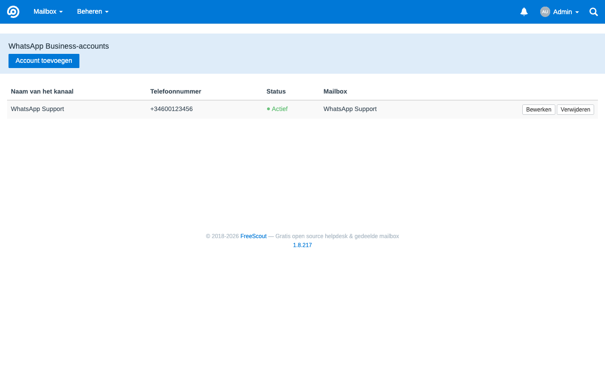
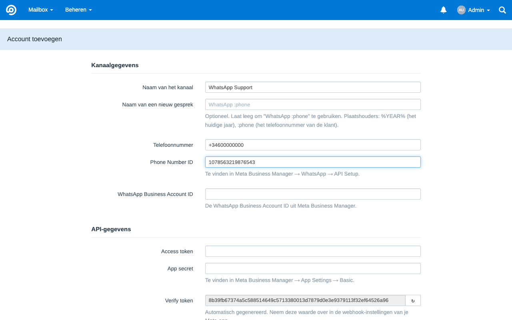
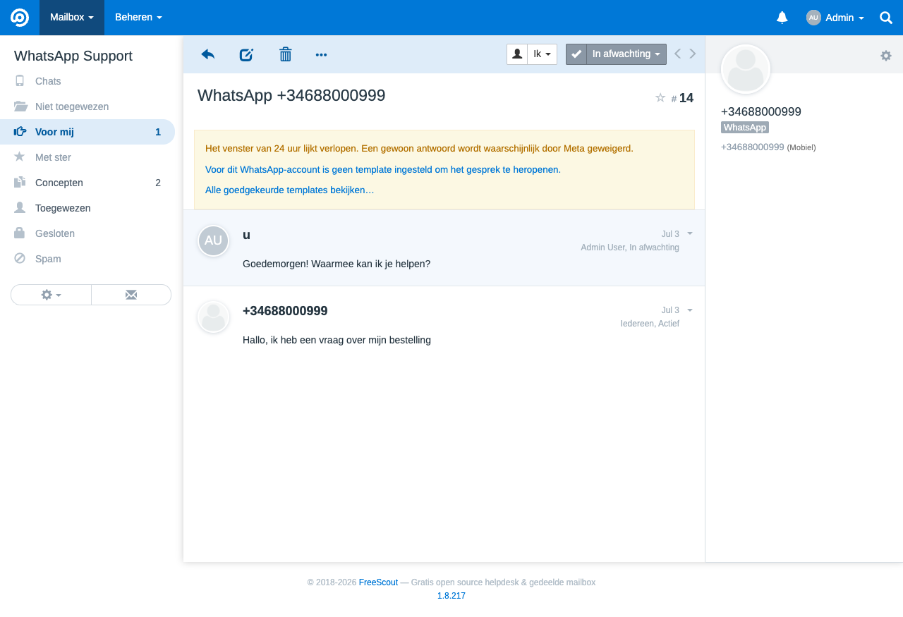
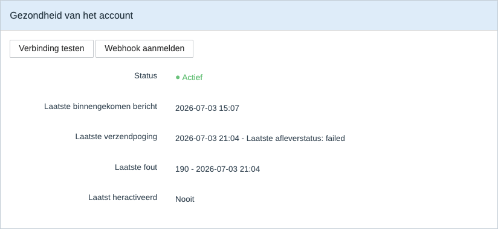
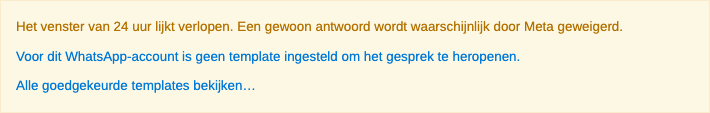

# MetaWhatsApp — WhatsApp Business voor FreeScout via de Meta Cloud API

[Català](README.ca.md) · [English](README.md) · [Castellano](README.es.md) · [Nederlands](README.nl.md)

> **De Engelse README is de bron.** Deze vertaling wordt bijgehouden door de gemeenschap en kan achterlopen. Wijkt deze pagina af van [README.md](README.md), dan geldt het Engels.

FreeScout-module die **WhatsApp Business rechtstreeks met de Meta Cloud API** verbindt, zonder betaalde tussenpartijen zoals 1msg.io of Twilio. Berichten gaan van Meta naar je eigen FreeScout-installatie en nergens anders heen, met volledige zeggenschap over inloggegevens, data en de manier van werken.

Het project is openbaar en draait sinds v1.0 in echte productie. Het groeit mee met wat gebruikers melden in plaats van met een vooraf uitgestippelde routekaart: templates, media, stickers, contacten, locatie- en reactieberichten, bewaking van de verbinding en begeleid heractiveren van een account zijn allemaal ontstaan uit dagelijks gebruik, niet uit een plan vooraf. De module is stabiel, maar nog volop in ontwikkeling — zie [Bekende beperkingen](#bekende-beperkingen) verderop voor de gaten die zo aan het licht kwamen en nog openstaan.

## Belangrijkste eigenschappen

- **Kanaal-eerst**: je richt een WhatsApp-kanaal in, geen e-mailmailbox.
- **Zero-core**: er wordt geen enkel bestand van de FreeScout-core aangepast.
- **Fail-closed**: de webhook weigert elk verzoek zonder geldige HMAC-handtekening.
- **Rechtstreeks naar Meta**: geen gateways van derden.
- **Interface zonder e-mailresten**: op kanaalpagina's verbergt de module de e-mailelementen van de core (de Cc/Bcc-schakelaar, het interne technische adres) zonder gewone e-mailmailboxen te raken.
- **Werkt met FreeScout 1.8.x** op Laravel 5.8 en PHP 8.x.

## Schermafbeeldingen

*Overzicht van ingestelde WhatsApp-kanalen:*



*Een nieuw kanaal toevoegen (het kanaal-eerst-formulier):*



*Een WhatsApp-gesprek zoals een medewerker het ziet, met het kanaallabel dat FreeScout zelf tekent:*



*De verbindingsstatus per account, met de knoppen voor een live verbindingstest en het aanmelden van de webhook:*



*De melding die in een gesprek verschijnt zodra het venster van 24 uur verlopen lijkt:*



## Wat de module wel en niet doet

Wat er nu in zit:

- **Tekstberichten**, inkomend en uitgaand.
- Eén of meer WhatsApp-nummers, elk als een eigen account binnen de module.
- Inkomende berichten maken automatisch een gesprek aan in FreeScout.
- Antwoorden vanuit FreeScout naar WhatsApp, met respect voor het terugneemvenster van de core.
- De statussen `delivered` en `read` worden zo goed als mogelijk bijgehouden in de database van de module. Sinds v1.2.0 zet een `read`-bevestiging van Meta het uitgaande bericht ook op geopend, via de eigen "geopend"-aanduiding van FreeScout.
- Sinds v1.3.0: handmatig herstel van een verlopen venster met een vooraf goedgekeurd HSM-template — zie [Herstel na een verlopen venster](#herstel-na-een-verlopen-venster-v130) verderop.
- Sinds v1.4.0: mediaberichten (afbeelding, video, audio, document). Inkomend worden ze gedownload en als bijlage toegevoegd, afbeeldingen krijgen een miniatuur, en uitgaand kan alleen binnen het open venster van 24 uur — zie [Media](#media-v140) verderop.
- Sinds v1.5.0: inkomende locatie- en reactieberichten (inclusief het aangehaalde bericht) en een paneel met de verbindingsstatus per account (laatste inkomend/uitgaand, laatste fout, knop "Verbinding testen").
- Sinds v1.5.1: de officiële kanaal-ID's van Meta (`103`/`104`).
- Sinds v1.6.0: tot vijf vast ingestelde hersteltemplates per account (naast het enkele template uit v1.3.0), of elk door Meta goedgekeurd template dat live wordt opgehaald met de dynamische keuzelijst; inkomende stickers en gedeelde contactkaarten; zichtbaarheid van bezorgfouten die pas later binnenkomen (er komt een notitie bij als Meta een bericht na acceptatie alsnog als mislukt meldt); automatisch aanmelden van de webhook vanuit het accountformulier, zonder handmatige stap in Meta Business Manager.
- Sinds v1.6.1: begeleid heractiveren van een inactief account, rechtstreeks vanuit "Verbinding testen", met een spoor van wie het wanneer deed op het statuspaneel.
- Sinds v1.7.0: inkomende WhatsApp-opmaak wordt getoond in plaats van letterlijk weergegeven; gesprekken dragen het kanaal, waardoor FreeScouts eigen WhatsApp-label en Chat Mode-knop verschijnen; het laatste bericht van de klant wordt op gelezen gezet zodra een medewerker antwoordt; en een mislukte bezorging heropent het gesprek met een citaat van het bericht dat niet aankwam.

Wat er bewust buiten valt:

- Afbeeldingen of video's omzetten of verkleinen, galerij- of carrouselweergaven.
- Een opslagadapter in de cloud (S3 en dergelijke) voor media — bijlagen gebruiken uitsluitend de bestaande lokale opslag van FreeScout.
- Zichtbare `delivered`/`read`-vinkjes in het gesprek (de `read`-bevestiging zet het bericht alleen op geopend, zie hierboven).
- Chatbots, geavanceerde automatisering of gedeelde multichannel-koppelingen.

## Wat is er nieuw

De release-geschiedenis staat in de [Engelse README](README.md) en op de [Releases-pagina](https://github.com/losimo/freescout-meta-whatsapp/releases).

Die staat bewust niet in deze vertaling. Het is het enige deel dat bij elke release groeit en het wordt in het Engels geschreven, dus een Nederlandse kopie loopt altijd achter. De rest van deze pagina verandert zelden.

## Installatie

Volg de [officiële handleiding van FreeScout voor het installeren van eigen modules](https://github.com/freescout-help-desk/freescout/wiki/FreeScout-Modules#3-installing-custom-modules):

1. Download de module-zip van de [Releases-pagina](https://github.com/losimo/freescout-meta-whatsapp/releases) (of kopieer/symlink de broncode) naar `Modules/MetaWhatsApp` in je FreeScout-installatie.

> **Let op bij handmatig installeren**
>
> Kopieer of symlink je de broncode rechtstreeks in plaats van de zip van de Releases-pagina te gebruiken, draai dan `composer dump-autoload` vanuit de FreeScout-hoofdmap voordat je de module activeert. Dat is nodig zodra je installatie geoptimaliseerde autoloading gebruikt (bijvoorbeeld `composer install --optimize-autoloader`) — anders vindt FreeScout de klassen van de module niet.

2. Ga in FreeScout naar **Beheer → Modules** en activeer **MetaWhatsApp**. FreeScout draait de migraties van de module en wist de cache vanzelf.
3. De module verschijnt onder **Beheer → WhatsApp** voor beheerders.

Werk je liever vanaf de opdrachtregel (bijvoorbeeld op een server zonder toegang tot het modulebeheer), dan zijn dit de gelijkwaardige stappen:

```bash
php artisan module:enable MetaWhatsApp
php artisan module:migrate MetaWhatsApp
php artisan freescout:clear-cache
```

De module maakt twee eigen tabellen aan:

- `meta_whatsapp_accounts`
- `meta_whatsapp_messages`

Er wordt nooit een `ALTER` gedraaid op tabellen van de FreeScout-core.

## Vereisten bij Meta

Voordat je het kanaal in FreeScout instelt, zet je bij [Meta for Developers](https://developers.facebook.com) het minimum klaar:

1. Een **App** van het type Business, met het product **WhatsApp** eraan toegevoegd.
2. Een **telefoonnummer** dat in het WhatsApp-product geregistreerd staat.
3. De volgende waarden:

| Waarde | Waar je hem vindt |
|---|---|
| **Phone Number ID** | App Dashboard → WhatsApp → API Setup |
| **WABA ID** | App Dashboard → WhatsApp → API Setup |
| **Access Token** | Zie de opmerking over het permanente token |
| **App Secret** | App Dashboard → App Settings → Basic |

> **Belangrijk over het token**
>
> Het token op het scherm **API Setup** is tijdelijk en verloopt meestal binnen 24 uur. Maak voor een echte omgeving een permanent **System User token** aan in Meta Business Manager, wijs daar de App en de WABA aan toe, met de rechten:
>
> - `whatsapp_business_messaging`
> - `whatsapp_business_management`

> **Meerdere nummers? Houd ze in dezelfde business portfolio**
>
> Business-scoped user ID's horen bij een portfolio. Iemand die twee van jouw nummers aanschrijft krijgt **één** ID als beide nummers onder dezelfde WABA vallen, en een **ander ID per nummer** als ze in aparte portfolio's zitten. Staan de nummers uit elkaar, dan kan de module die persoon niet als één klant herkennen en werkt het koppelen van contacten hieronder niet zoals je verwacht. Zie [de uitleg van Meta over business-scoped user ID's](https://developers.facebook.com/documentation/business-messaging/whatsapp/business-scoped-user-ids/#business-scoped-user-id).

## Het kanaal instellen

### In FreeScout

Via **Beheer → WhatsApp → Account toevoegen**:

1. Vul de **kanaalnaam** in.
2. Vul het **telefoonnummer** in, in E.164-formaat (`+31...`).
3. Vul **Phone Number ID**, **WABA ID**, **Access Token** en **App Secret** in.
4. Kopieer het automatisch gegenereerde **verify token**.
5. Kopieer de **webhook-URL** die de module toont (die heeft altijd de vorm `https://jouw-domein/meta-whatsapp/webhook` en is voor alle accounts hetzelfde).
6. Kies of je:
   - een nieuwe mailbox laat aanmaken (aanbevolen), of
   - een bestaande, geschikte mailbox koppelt (zonder ingestelde mailservers en niet al aan een ander WhatsApp-account gekoppeld; de keuzelijst toont alleen geldige mailboxen).
7. Sla het account op.

### In Meta

Via **App Dashboard → WhatsApp → Configuration → Webhook**:

1. Plak de webhook-URL van de module in **Callback URL**.
2. Plak het in FreeScout gegenereerde verify token in **Verify Token**.
3. Klik op **Verify and save**.
4. Zet onder **Webhook fields** ten minste het veld **messages** aan.

> **Harde eis**
>
> De webhook-URL moet openbaar bereikbaar zijn over HTTPS, met een geldig certificaat. Meta accepteert geen zelfondertekende certificaten.

Staat alles goed, dan maakt een bericht naar het WhatsApp-nummer een gesprek aan in de gekoppelde mailbox.

## Dagelijks gebruik

- Inkomende berichten maken een nieuw gesprek aan, of komen onder het openstaande gesprek van die klant te staan.
- Een klant wordt herkend aan het telefoonnummer.
- Antwoorden vanuit FreeScout gaan **na de 15 seconden** van het terugneemvenster van de core naar WhatsApp.
- Neemt de medewerker het antwoord binnen die marge terug, dan wordt er niets verstuurd.
- **Interne notities gaan nooit** naar de klant.

### Het venster van 24 uur

De Meta Cloud API staat vrije berichten alleen toe binnen 24 uur na het laatste bericht van de klant.

Antwoord je daarbuiten:

- geeft Meta foutcode `131047`,
- wordt het bericht als mislukt vastgelegd,
- en ontvangt de klant niets.

Sinds v1.3.0 kun je een verlopen venster handmatig herstellen met een vooraf goedgekeurd HSM-template — zie hieronder.

### Herstel na een verlopen venster (v1.3.0)

Lijkt het venster van de klant verlopen, dan verschijnt er in het gesprek een melding met het aanbod om één **vooraf goedgekeurd WhatsApp-template** te versturen, per account ingesteld (naam + taal). Versturen gaat **altijd handmatig**: een medewerker klikt op de knop in die melding, er wordt nooit automatisch een template nagestuurd.

- Er wordt maar **één** template per account ondersteund; er is geen keuzelijst en er zijn geen variabelen of parameters.
- Of de melding verschijnt hangt af van een instelbare **interne drempel** (`template_threshold_minutes`, standaard **1435 minuten**). Die drempel bepaalt alleen vanaf wanneer de module het venster voor de eigen interface als verlopen beschouwt — hij verandert **niets** aan de echte 24-uursregel van Meta. Zie de [documentatie van Meta](https://developers.facebook.com/documentation/business-messaging/whatsapp/messages/send-messages).
- Vlak voor het echte versturen controleert de server het venster opnieuw, en weigert het verzoek als de klant intussen weer geschreven heeft (venster weer open) of als er in de laatste 60 seconden al een template voor hetzelfde gesprek is verstuurd (bescherming tegen dubbelklikken).
- Templateberichten worden **door Meta in rekening gebracht**, net als elk ander HSM-template, los van deze module.

### Ongeldig of verlopen token

Geeft Meta foutcode `190`, dan:

- gaat het account op **Inactief**,
- stopt het kanaal met goed verzenden en ontvangen,
- en moet het access token op het bewerkscherm van het account vernieuwd worden.

### Media (v1.4.0)

Inkomende afbeeldingen, video's, audio en documenten worden opgehaald bij de Meta Cloud API en als gewone FreeScout-bijlage bij het gesprek gezet. Afbeeldingen krijgen daarnaast een miniatuur; andere types verschijnen als een normale downloadbare bijlage (de standaard bestandsregel van FreeScout).

Voor uitgaande media geldt dezelfde regel als voor tekst: het gaat **alleen weg binnen het open venster van 24 uur** (zie hierboven) — er is geen terugvaloptie met een template voor media. Antwoordt een medewerker met bijlagen, dan geldt:

- Er gaat **één WhatsApp-bericht per bijlage** uit (Meta staat niet meer dan één media-object per bericht toe).
- De tekst van het antwoord reist mee als **bijschrift bij de eerste bijlage**, behalve wanneer dat **audio** is (Meta staat geen bijschrift bij audio toe) — dan gaat de tekst als apart tekstbericht.
- Elke bijlage wordt vóór het uploaden getoetst aan de limieten van Meta zelf: **5 MB** voor afbeeldingen, **16 MB** voor video en audio, **100 MB** voor documenten. Te grote bijlagen gaan niet weg en worden als mislukt vastgelegd.

Media wordt opgeslagen met de bestaande lokale bijlage-opslag van FreeScout; er komt geen aparte opslagadapter bij.

## Bekende beperkingen

Deze beperkingen zijn bekend en horen bij de huidige omvang van de module:

- Andere berichttypes dan tekst, media (inclusief stickers), button, locatie, reactie en contacten (bijvoorbeeld `order` of antwoorden op een `interactive`-lijst) worden nog steeds genegeerd: ze komen in het log, niet in het gesprek.
- Inkomende media wordt aan deze kant niet op grootte gecontroleerd, verder dan wat Meta zelf al afdwingt voordat de webhook binnenkomt.
- Geen galerij- of carrouselweergave voor afbeeldingen en video's — elke bijlage staat op een eigen regel of als eigen miniatuur, net als elke andere FreeScout-bijlage.
- Maximaal vijf vast ingestelde templates per account, of elk goedgekeurd template dat live via de dynamische keuzelijst wordt opgehaald (met `{{n}}`-variabelen); de vaste lijst wordt niet automatisch met de catalogus van Meta gesynchroniseerd.
- Het hersteltemplate versturen gaat **altijd handmatig**, door een medewerker vanuit de melding in het gesprek; buiten het venster wordt er niets automatisch opnieuw geprobeerd.
- `delivered` en `read` worden in de database van de module bewaard; alleen `read` is zichtbaar (via de eigen "geopend"-aanduiding) — `delivered` zie je niet in het gesprek.
- Bundelt Meta webhook-gebeurtenissen van **verschillende nummers** in één levering, dan wordt alleen verwerkt wat bij het eerst herkende account hoort; de rest wordt weggegooid met een waarschuwing in het log. In de praktijk levert Meta meestal per nummer een aparte webhook, maar houd er rekening mee als je meerdere nummers onder dezelfde App hebt.
- In chatmodus kan de FreeScout-core door het automatisch opslaan van de editor **lege concepten** in het gesprek achterlaten; die zijn onschadelijk en kun je met de hand weggooien.
- De **technische mailbox** van het kanaal blijft zichtbaar onder **Beheer → Mailboxen**.
- De webhook kent geen eigen snelheidsbegrenzing; de HMAC-handtekening is de belangrijkste drempel.
- Het opzoeken van het `verify_token` tijdens de handshake gebeurt niet in constante tijd.

## Checklist voor livegang

Voordat je van testen naar productie gaat:

1. ☐ Controleer dat de installatie openbaar bereikbaar is over HTTPS.
2. ☐ Gebruik een geldig certificaat.
3. ☐ Maak een permanent **System User token** aan.
4. ☐ Verwijder testaccounts en testgesprekken die je niet meer nodig hebt.
5. ☐ Maak het echte account in de module aan, met de definitieve gegevens.
6. ☐ Stel de echte webhook in bij Meta, met de juiste URL en het juiste verify token.
7. ☐ Controleer dat het abonnement op het veld `messages` actief is.
8. ☐ Stuur een echt bericht naar het nummer en controleer dat het in FreeScout aankomt.
9. ☐ Antwoord vanuit FreeScout binnen het venster van 24 uur en controleer dat het op de telefoon aankomt.
10. ☐ Controleer dat de queue worker onafgebroken draait.
11. ☐ Loop de logs na, na de eerste echte tests.

## Problemen oplossen

| Wat je ziet | Waarschijnlijke oorzaak |
|---|---|
| Meta kan de webhook niet verifiëren | URL niet openbaar bereikbaar, ongeldig certificaat of verkeerd verify token |
| Meta krijgt 403 op webhook-POST's | Onbekende `phone_number_id`, inactief account of ongeldige HMAC-handtekening |
| Berichten komen binnen, antwoorden gaan niet weg | Fout `131047` (venster van 24 uur) of fout `190` (verlopen token) |
| Bij het account staat `⚠ Mailbox ontkoppeld` | De gekoppelde mailbox is verwijderd of niet meer te vinden |
| Er wordt helemaal niets verwerkt | De queue worker ligt stil (`php artisan queue:work`) |
| Een reparatie uit een module-update lijkt niet aan te slaan | De queue worker draait door met oude code in het geheugen. Cron herstarten laadt hem niet opnieuw; draai `php artisan queue:restart` |

Alle logregels van de module beginnen met `[MetaWhatsApp]`.

```bash
grep MetaWhatsApp storage/logs/laravel-$(date +%Y-%m-%d).log
```

## Tests

Draai de testset van de module met:

```bash
vendor/bin/phpunit --no-configuration --bootstrap vendor/autoload.php Modules/MetaWhatsApp/Tests
```

De tests draaien tegen de database van de installatie, met een rollback per test, en laten niets achter.

## Licentie

AGPL-3.0, gelijk aan FreeScout.
